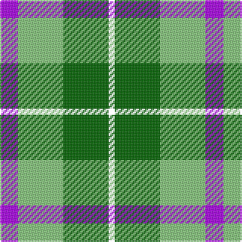

In pattern [BYGK](/patterns/bygk/).

This was sourced from house-of-tartan.  It is a [4 stripes tartan](/stripes/stripes4/).

Original link http://www.house-of-tartan.scotland.net/house/TartanViewjs.asp?colr=Def&tnam=10655

## Thread count
P/12 LG30 G30 W/4

## Palette
Each colour and its ΔE from the base-6 reference it is a variant of.

| Colour | Shade | Base | ΔE (OKLab) |
|---|---|---|---|
| G | <code style="background-color:#006400;">#006400</code> `#006400` | G <code style="background-color:#006400;">#006400</code> | 0.00 |
| LG | <code style="background-color:#86C87C;">#86C87C</code> `#86C87C` | Y <code style="background-color:#E8C000;">#E8C000</code> | 0.13 |
| P | <code style="background-color:#AA00FF;">#AA00FF</code> `#AA00FF` | B <code style="background-color:#2C4084;">#2C4084</code> | 0.29 |

# Sample pattern

ID: /setts/s4/b12y30g30k4-baa00ff-g006400-k000000-y86c87c/
