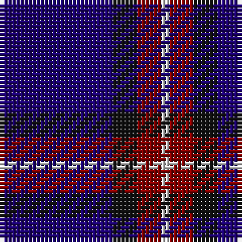

In pattern [BKRW](/patterns/bkrw/).

This was sourced from register-of-tartans.  It is a [4 stripes tartan](/stripes/stripes4/).

Original link https://www.tartanregister.gov.uk/tartanDetails.aspx?ref=5221

## Attestations

This cloth appears in 2 source records; the oldest owns this page.

- undated — Bacon, Blue (register-of-tartans, [record](https://www.tartanregister.gov.uk/tartanDetails.aspx?ref=5221))
- Unknown — Bacon, Blue (Fashion) (tartans-authority, [record](http://www.tartansauthority.com/tartan-ferret/display/3626/))

## Register references

External register numbers recorded for this tartan.

- Scottish Register of Tartans: [5221](https://www.tartanregister.gov.uk/tartanDetails.aspx?ref=5221)
- Scottish Tartans Authority (ITI): 3626

## Thread count
DB/28 K6 DR6 LN/2

## Palette
Each colour and its ΔE from the base-6 reference it is a variant of.

| Colour | Shade | Base | ΔE (OKLab) |
|---|---|---|---|
| DB | <code style="background-color:#1C0070;">#1C0070</code> `#1C0070` | B <code style="background-color:#2A418A;">#2A418A</code> | 0.14 |
| DR | <code style="background-color:#880000;">#880000</code> `#880000` | R <code style="background-color:#CC0000;">#CC0000</code> | 0.15 |
| K | <code style="background-color:#101010;">#101010</code> `#101010` | K <code style="background-color:#000000;">#000000</code> | 0.17 |
| LN | <code style="background-color:#E0E0E0;">#E0E0E0</code> `#E0E0E0` | W <code style="background-color:#F7F7F7;">#F7F7F7</code> | 0.07 |

# Sample pattern

## Nearest tartans

The nearest existing variants by ΔTartan distance.

1. [Oxford University (Corporate)](/setts/s4/b9g16ba59y4~b2c2c80-ba1c0070-g006818-yc4bc68~x2/) — ΔT 0.99
1. [Scottish Nuclear (Corporate)](/setts/s4/r1b9k4w1~b2c2c80-k101010-rc80000-wc0c0c0~x4/) — ΔT 1.19
1. [Mirror (Corporate)](/setts/s4/r5b26k12w2~b2c2c80-k101010-rc80000-wfcfcfc~x4/) — ΔT 1.36
1. [Jon's Theme (Fashion)](/setts/s6/k1y2k3b12k18w1~b2c2c80-k00002c-wfcfcfc-ybc8c00~x2/) — ΔT 1.42
1. [Scottish Nuclear](/setts/s4/r4b32k15w2~b304080-k000000-rc00000-we0e0e0~x2/) — ΔT 1.53
1. [Massachusetts (Unofficial)](/setts/s6/r1b12k5y3b5w1~b1c0070-k101010-rc80000-wc0c0c0-ybc8c00~x4/) — ΔT 1.55
1. [Stradling (Name)](/setts/s6/b40w7b60k10r25y4~b2c2c80-k101010-r880000-we0e0e0-ye8c000/) — ΔT 1.55
1. [Jon's Theme](/setts/s6/k1y2k3b12k18w1~b555b7c-k010542-wffffff-y9e8f00~x2/) — ΔT 1.56
1. [St. Georges, Edgbaston](/setts/s7/r4k21w2k20b21k2b2~b304080-k000030-rc00000-we0e0e0~x2/) — ΔT 1.57
1. [McNiff, Kevin (Personal)](/setts/s4/g20r7b40w2~b2c2c80-g003c14-rc80000-wf8f8f8~x2/) — ΔT 1.66

## Neighbour map

Every grey dot is one of 15726 variants placed by the first two principal components of the ΔTartan feature space (44% of its variance). Red is this tartan; blue dots are its nearest — click one to open its page.

<svg viewBox="0 0 640 380" role="img" style="max-width:100%;height:auto;border:1px solid #e0e0e0;border-radius:4px;display:block" xmlns="http://www.w3.org/2000/svg"><image href="/nn/cloud.v1.png" width="640" height="380"/><a href="/setts/s4/b9g16ba59y4~b2c2c80-ba1c0070-g006818-yc4bc68~x2/"><circle cx="420.1" cy="229.1" r="4" fill="#3465a4"><title>Oxford University (Corporate)</title></circle></a><a href="/setts/s4/r1b9k4w1~b2c2c80-k101010-rc80000-wc0c0c0~x4/"><circle cx="344.3" cy="243.7" r="4" fill="#3465a4"><title>Scottish Nuclear (Corporate)</title></circle></a><a href="/setts/s4/r5b26k12w2~b2c2c80-k101010-rc80000-wfcfcfc~x4/"><circle cx="327.9" cy="227.8" r="4" fill="#3465a4"><title>Mirror (Corporate)</title></circle></a><a href="/setts/s6/k1y2k3b12k18w1~b2c2c80-k00002c-wfcfcfc-ybc8c00~x2/"><circle cx="370.8" cy="193.6" r="4" fill="#3465a4"><title>Jon's Theme (Fashion)</title></circle></a><a href="/setts/s4/r4b32k15w2~b304080-k000000-rc00000-we0e0e0~x2/"><circle cx="343.6" cy="212.3" r="4" fill="#3465a4"><title>Scottish Nuclear</title></circle></a><a href="/setts/s6/r1b12k5y3b5w1~b1c0070-k101010-rc80000-wc0c0c0-ybc8c00~x4/"><circle cx="321.8" cy="199.5" r="4" fill="#3465a4"><title>Massachusetts (Unofficial)</title></circle></a><a href="/setts/s6/b40w7b60k10r25y4~b2c2c80-k101010-r880000-we0e0e0-ye8c000/"><circle cx="384.0" cy="194.6" r="4" fill="#3465a4"><title>Stradling (Name)</title></circle></a><a href="/setts/s6/k1y2k3b12k18w1~b555b7c-k010542-wffffff-y9e8f00~x2/"><circle cx="363.3" cy="187.4" r="4" fill="#3465a4"><title>Jon's Theme</title></circle></a><a href="/setts/s7/r4k21w2k20b21k2b2~b304080-k000030-rc00000-we0e0e0~x2/"><circle cx="344.7" cy="221.0" r="4" fill="#3465a4"><title>St. Georges, Edgbaston</title></circle></a><a href="/setts/s4/g20r7b40w2~b2c2c80-g003c14-rc80000-wf8f8f8~x2/"><circle cx="368.5" cy="220.1" r="4" fill="#3465a4"><title>McNiff, Kevin (Personal)</title></circle></a><circle cx="410.2" cy="225.1" r="5" fill="#c00000"/></svg>

ID: /setts/s4/b14k3r3w1~b1c0070-k101010-r880000-we0e0e0~x2/
