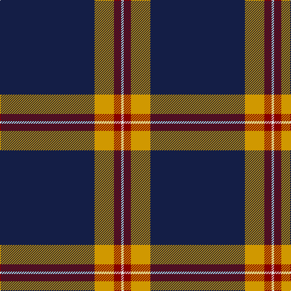

In pattern [BYRW](/patterns/byrw/).

This was sourced from register-of-tartans.  It is a [4 stripes tartan](/stripes/stripes4/).

Original link https://www.tartanregister.gov.uk/tartanDetails.aspx?ref=10631

## Thread count
DB/156 DY32 DR12 LN/4

## Palette
Each colour and its ΔE from the base-6 reference it is a variant of.

| Colour | Shade | Base | ΔE (OKLab) |
|---|---|---|---|
| DB | <code style="background-color:#141E46;">#141E46</code> `#141E46` | B <code style="background-color:#2C4084;">#2C4084</code> | 0.15 |
| DR | <code style="background-color:#880000;">#880000</code> `#880000` | R <code style="background-color:#C80000;">#C80000</code> | 0.14 |
| DY | <code style="background-color:#D09800;">#D09800</code> `#D09800` | Y <code style="background-color:#E8C000;">#E8C000</code> | 0.11 |
| LN | <code style="background-color:#E0E0E0;">#E0E0E0</code> `#E0E0E0` | W <code style="background-color:#F4F4F0;">#F4F4F0</code> | 0.06 |

# Sample pattern

## Nearest tartans

The nearest existing variants by ΔTartan distance.

1. [Norwich University Regimental Tartan Tartan Number: 10631. Earliest known date: 2012 The tartan was designed for use by the Norwich University Pipes and Drums Band primarily in kilts. The blue is from the Corps of Cadets formal attire coatee and the University colors are maroon and gold See products available Copyright © Blair Urquhart, Comrie, 2015](/setts/s4/b156y32r12w4-b242470-r880000-we0e0e0-ye8c000/) — ΔT 0.97
1. [Norwich University (Corporate)](/setts/s4/b156y32r12w4-b2c2c80-r880000-wfcfcfc-yfccc00/) — ΔT 1.28
1. [St. John (Corporate?)](/setts/s5/b67w10y14b10w2-b1c1c50-we0e0e0-ye8c000/) — ΔT 1.45
1. [Montrose Football Club](/setts/s6/w6r13b80w4b2w4-b14283c-rc80000-we0e0e0/) — ΔT 1.46
1. [Special Air Service](/setts/s5/b52ba12g2r2w4-b141e46-ba5c8ca8-g005020-r660000-wf8f4d0/) — ΔT 1.51
1. [East of Scotland Tartan Army](/setts/s6/b40y10b8r20b100w5-b14283c-rc80000-wfcfcfc-ye8c000/) — ΔT 1.52
1. [Auchtermuchty Tartan Army (Corp)](/setts/s6/b160r14w2r14y40b30-b2c2c80-rc80000-we0e0e0-ye8c000/) — ΔT 1.55
1. [Rogues, The (Corporate)](/setts/s4/r6b24k100y6-b5c8ca8-k101010-rc80000-yfccc00/) — ΔT 1.60
1. [Pride of New Zealand, The](/setts/s4/b124k60w1k2-b505050-k000000-we0e0e0/) — ΔT 1.61
1. [Auchtermuchty Tartan Army](/setts/s6/b160r16w2r16y40b30-b2c2c80-rc80000-wffffff-ye8c000/) — ΔT 1.61

## Neighbour map

Every grey dot is one of 15726 variants placed by the first two principal components of the ΔTartan feature space (44% of its variance). Red is this tartan; blue dots are its nearest — click one to open its page.

<svg viewBox="0 0 640 380" role="img" style="max-width:100%;height:auto;border:1px solid #e0e0e0;border-radius:4px;display:block" xmlns="http://www.w3.org/2000/svg"><image href="/nn/cloud.v1.png" width="640" height="380"/><a href="/setts/s4/b156y32r12w4-b242470-r880000-we0e0e0-ye8c000/"><circle cx="507.0" cy="156.6" r="4" fill="#3465a4"><title>Norwich University Regimental Tartan Tartan Number: 10631. Earliest known date: 2012 The tartan was designed for use by the Norwich University Pipes and Drums Band primarily in kilts. The blue is from the Corps of Cadets formal attire coatee and the University colors are maroon and gold See products available Copyright © Blair Urquhart, Comrie, 2015</title></circle></a><a href="/setts/s4/b156y32r12w4-b2c2c80-r880000-wfcfcfc-yfccc00/"><circle cx="502.9" cy="153.2" r="4" fill="#3465a4"><title>Norwich University (Corporate)</title></circle></a><a href="/setts/s5/b67w10y14b10w2-b1c1c50-we0e0e0-ye8c000/"><circle cx="481.8" cy="165.5" r="4" fill="#3465a4"><title>St. John (Corporate?)</title></circle></a><a href="/setts/s6/w6r13b80w4b2w4-b14283c-rc80000-we0e0e0/"><circle cx="522.5" cy="137.0" r="4" fill="#3465a4"><title>Montrose Football Club</title></circle></a><a href="/setts/s5/b52ba12g2r2w4-b141e46-ba5c8ca8-g005020-r660000-wf8f4d0/"><circle cx="450.6" cy="147.1" r="4" fill="#3465a4"><title>Special Air Service</title></circle></a><a href="/setts/s6/b40y10b8r20b100w5-b14283c-rc80000-wfcfcfc-ye8c000/"><circle cx="518.0" cy="180.3" r="4" fill="#3465a4"><title>East of Scotland Tartan Army</title></circle></a><a href="/setts/s6/b160r14w2r14y40b30-b2c2c80-rc80000-we0e0e0-ye8c000/"><circle cx="485.0" cy="124.9" r="4" fill="#3465a4"><title>Auchtermuchty Tartan Army (Corp)</title></circle></a><a href="/setts/s4/r6b24k100y6-b5c8ca8-k101010-rc80000-yfccc00/"><circle cx="455.3" cy="196.0" r="4" fill="#3465a4"><title>Rogues, The (Corporate)</title></circle></a><a href="/setts/s4/b124k60w1k2-b505050-k000000-we0e0e0/"><circle cx="482.5" cy="178.7" r="4" fill="#3465a4"><title>Pride of New Zealand, The</title></circle></a><a href="/setts/s6/b160r16w2r16y40b30-b2c2c80-rc80000-wffffff-ye8c000/"><circle cx="474.5" cy="125.2" r="4" fill="#3465a4"><title>Auchtermuchty Tartan Army</title></circle></a><circle cx="518.8" cy="163.5" r="5" fill="#c00000"/></svg>

ID: /setts/s4/b156y32r12w4-b141e46-r880000-we0e0e0-yd09800/
