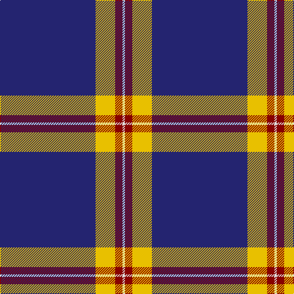

In pattern [BYRW](/patterns/byrw/).

This was sourced from house-of-tartan.  It is a [4 stripes tartan](/stripes/stripes4/).

Original link http://www.house-of-tartan.scotland.net/house/TartanViewjs.asp?colr=Def&tnam=10631

## Thread count
DB/156 Y32 DR12 LN/4

## Palette
Each colour and its ΔE from the base-6 reference it is a variant of.

| Colour | Shade | Base | ΔE (OKLab) |
|---|---|---|---|
| DB | <code style="background-color:#242470;">#242470</code> `#242470` | B <code style="background-color:#2C4084;">#2C4084</code> | 0.08 |
| DR | <code style="background-color:#880000;">#880000</code> `#880000` | R <code style="background-color:#C80000;">#C80000</code> | 0.14 |
| LN | <code style="background-color:#E0E0E0;">#E0E0E0</code> `#E0E0E0` | W <code style="background-color:#F4F4F0;">#F4F4F0</code> | 0.06 |
| Y | <code style="background-color:#E8C000;">#E8C000</code> `#E8C000` | Y <code style="background-color:#E8C000;">#E8C000</code> | 0.00 |

# Sample pattern

ID: /setts/s4/b156y32r12w4-b242470-r880000-we0e0e0-ye8c000/
