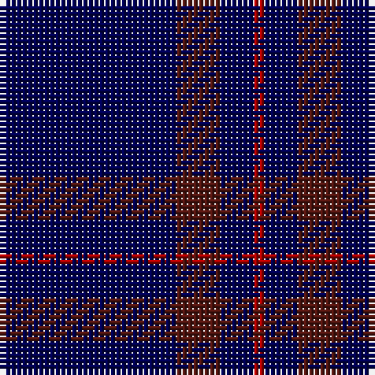

In pattern [BBBR](/patterns/bbbr/).

This was sourced from weddslist.  It is a [4 stripes tartan](/stripes/stripes4/).

Original link http://www.weddslist.com/cgi-bin/tartans/pg.pl?source=tinsel

## Attestations

This cloth appears in 2 source records; the oldest owns this page.

- undated — Elliott (weddslist, [record](http://www.weddslist.com/cgi-bin/tartans/pg.pl?source=tinsel))
- undated — Elliott (weddslist, [record](http://www.weddslist.com/cgi-bin/tartans/pg.pl?source=x))

## Thread count
DB/32 DRa8 DB6 DR/2

## Palette
Each colour and its ΔE from the base-6 reference it is a variant of.

| Colour | Shade | Base | ΔE (OKLab) |
|---|---|---|---|
| DB | <code style="background-color:#000052;">#000052</code> `#000052` | B <code style="background-color:#2A418A;">#2A418A</code> | 0.20 |
| DR | <code style="background-color:#AA0000;">#AA0000</code> `#AA0000` | R <code style="background-color:#CC0000;">#CC0000</code> | 0.07 |
| DRa | <code style="background-color:#521510;">#521510</code> `#521510` | B <code style="background-color:#2A418A;">#2A418A</code> | 0.22 |

# Sample pattern

## Nearest tartans

The nearest existing variants by ΔTartan distance.

1. [Elliot (Clan)](/setts/s4/b44g12b9r3x2~b2c2c80-g604000-r901c38/) — ΔT 1.62
1. [Elliott](/setts/s4/b16r4b3ra1x2~b000064-r900000-rac80000/) — ΔT 1.75
1. [Burnetts & Struth](/setts/s5/b68ba7b16k16y4x2~b14283c-ba5c8ca8-k101010-ya08858/) — ΔT 2.02
1. [Lochaber](/setts/s4/b1ba1b8r1x2~b304080-ba5480b0-rc00000/) — ΔT 2.06
1. [Lochaber #3](/setts/s4/b1ba1b8r1x2~b2c4084-ba3c82af-rdc0000/) — ΔT 2.07
1. [Burnett's & Struth (Corporate)](/setts/s5/b68ba7b16k16y4x2~b24486c-ba1870a4-k101010-ybc8c00/) — ΔT 2.09
1. [Elliot](/setts/s6/b9g12b44g12b9r3x2~b2c2c80-g604000-r901c38/) — ΔT 2.13
1. [Brooks Brothers Tattersall Blue](/setts/s5/r1b9y2b9y1x4~b202060-r880000-ya08858/) — ΔT 2.18
1. [Hebridean (Old..) District Tartan Tartan Number: 414. Earliest known date: pre 2003 The design 'Heather Tartan' has been produced at the request of the Royal Society for Prevention of Cruelty to Children, as the Society's corporate tartan. The colours of the design are taken from the Society's badge and lettrhead. Dark Pink Mix, Light Pink Mix, Kingfisher and Emerald. See products available Copyright © Blair Urquhart, Comrie, 2015](/setts/s7/b10r1b10r2b10r1g2x2~b2c2c80-g006818-rc80000/) — ΔT 2.23
1. [Auchairne (Corporate)](/setts/s6/b11ba7b3ba70w4ba6x2~b1474b4-ba1c1c50-w98c8e8/) — ΔT 2.26

## Neighbour map

Every grey dot is one of 15726 variants placed by the first two principal components of the ΔTartan feature space (44% of its variance). Red is this tartan; blue dots are its nearest — click one to open its page.

<svg viewBox="0 0 640 380" role="img" style="max-width:100%;height:auto;border:1px solid #e0e0e0;border-radius:4px;display:block" xmlns="http://www.w3.org/2000/svg"><image href="/nn/cloud.v1.png" width="640" height="380"/><a href="/setts/s4/b44g12b9r3x2~b2c2c80-g604000-r901c38/"><circle cx="611.3" cy="284.0" r="4" fill="#3465a4"><title>Elliot (Clan)</title></circle></a><a href="/setts/s4/b16r4b3ra1x2~b000064-r900000-rac80000/"><circle cx="552.6" cy="253.1" r="4" fill="#3465a4"><title>Elliott</title></circle></a><a href="/setts/s5/b68ba7b16k16y4x2~b14283c-ba5c8ca8-k101010-ya08858/"><circle cx="549.9" cy="238.9" r="4" fill="#3465a4"><title>Burnetts &amp; Struth</title></circle></a><a href="/setts/s4/b1ba1b8r1x2~b304080-ba5480b0-rc00000/"><circle cx="608.2" cy="285.2" r="4" fill="#3465a4"><title>Lochaber</title></circle></a><a href="/setts/s4/b1ba1b8r1x2~b2c4084-ba3c82af-rdc0000/"><circle cx="589.6" cy="278.2" r="4" fill="#3465a4"><title>Lochaber #3</title></circle></a><a href="/setts/s5/b68ba7b16k16y4x2~b24486c-ba1870a4-k101010-ybc8c00/"><circle cx="546.6" cy="235.0" r="4" fill="#3465a4"><title>Burnett's &amp; Struth (Corporate)</title></circle></a><a href="/setts/s6/b9g12b44g12b9r3x2~b2c2c80-g604000-r901c38/"><circle cx="531.4" cy="260.3" r="4" fill="#3465a4"><title>Elliot</title></circle></a><a href="/setts/s5/r1b9y2b9y1x4~b202060-r880000-ya08858/"><circle cx="542.4" cy="271.6" r="4" fill="#3465a4"><title>Brooks Brothers Tattersall Blue</title></circle></a><a href="/setts/s7/b10r1b10r2b10r1g2x2~b2c2c80-g006818-rc80000/"><circle cx="568.6" cy="262.9" r="4" fill="#3465a4"><title>Hebridean (Old..) District Tartan Tartan Number: 414. Earliest known date: pre 2003 The design 'Heather Tartan' has been produced at the request of the Royal Society for Prevention of Cruelty to Children, as the Society's corporate tartan. The colours of the design are taken from the Society's badge and lettrhead. Dark Pink Mix, Light Pink Mix, Kingfisher and Emerald. See products available Copyright © Blair Urquhart, Comrie, 2015</title></circle></a><a href="/setts/s6/b11ba7b3ba70w4ba6x2~b1474b4-ba1c1c50-w98c8e8/"><circle cx="611.4" cy="199.7" r="4" fill="#3465a4"><title>Auchairne (Corporate)</title></circle></a><circle cx="601.4" cy="276.1" r="5" fill="#c00000"/></svg>

ID: /setts/s4/b16ba4b3r1x2~b000052-ba521510-raa0000/
