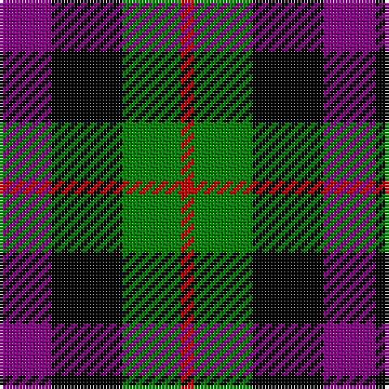

In pattern [BKGR](/patterns/bkgr/).

This was sourced from weddslist.  It is a [4 stripes tartan](/stripes/stripes4/).

Original link http://www.weddslist.com/cgi-bin/tartans/pg.pl?source=sts

## Thread count
P/16 K22 G18 R/4

## Palette
Each colour and its ΔE from the base-6 reference it is a variant of.

| Colour | Shade | Base | ΔE (OKLab) |
|---|---|---|---|
| G | <code style="background-color:#008000;">#008000</code> `#008000` | G <code style="background-color:#006100;">#006100</code> | 0.10 |
| K | <code style="background-color:#000000;">#000000</code> `#000000` | K <code style="background-color:#000000;">#000000</code> | 0.00 |
| P | <code style="background-color:#800080;">#800080</code> `#800080` | B <code style="background-color:#2A418A;">#2A418A</code> | 0.17 |
| R | <code style="background-color:#C00000;">#C00000</code> `#C00000` | R <code style="background-color:#CC0000;">#CC0000</code> | 0.03 |

# Sample pattern

## Nearest tartans

The nearest existing variants by ΔTartan distance.

1. [Wilson's, No 220](/setts/s4/b16k22g18w4-b800080-g008000-k000000-we0e0e0/) — ΔT 0.43
1. [Unnamed, No 60](/setts/s4/b12k10g10r2-b800080-g008000-k000000-rc00000/) — ΔT 0.47
1. [Unidentified, pattern](/setts/s4/b16k20g16r4-b304080-g008000-k000000-rc00000/) — ΔT 0.93
1. [Wilson's No.220](/setts/s4/b20k20g20w4-b740074-g006818-k101010-we0e0e0/) — ΔT 1.09
1. [Tennant](/setts/s4/k36g36b42r8-b401000-g008000-k000000-rc00000/) — ΔT 1.18
1. [Unnamed, No 28](/setts/s4/r12g10k10b2-b5480b0-g008000-k000000-rc00000/) — ΔT 1.20
1. [Denholm (Fashion)](/setts/s5/k10g40k36b40r10-b2c2c80-g006818-k000000-rc80000/) — ΔT 1.22
1. [Denholme](/setts/s5/k4g16k14b16r4-b304080-g008000-k000000-rc00000/) — ΔT 1.23
1. [Wilson's No 220](/setts/s4/b16k22g18w4-b5a008c-g005020-k101010-we0e0e0/) — ΔT 1.26
1. [MacNeil 2](/setts/s6/w4b20k20g18k6w4-b800080-g008000-k000000-we0e0e0/) — ΔT 1.32

## Neighbour map

Every grey dot is one of 15726 variants placed by the first two principal components of the ΔTartan feature space (44% of its variance). Red is this tartan; blue dots are its nearest — click one to open its page.

<svg viewBox="0 0 640 380" role="img" style="max-width:100%;height:auto;border:1px solid #e0e0e0;border-radius:4px;display:block" xmlns="http://www.w3.org/2000/svg"><image href="/nn/cloud.v1.png" width="640" height="380"/><a href="/setts/s4/b16k22g18w4-b800080-g008000-k000000-we0e0e0/"><circle cx="108.6" cy="277.2" r="4" fill="#3465a4"><title>Wilson's, No 220</title></circle></a><a href="/setts/s4/b12k10g10r2-b800080-g008000-k000000-rc00000/"><circle cx="120.8" cy="274.5" r="4" fill="#3465a4"><title>Unnamed, No 60</title></circle></a><a href="/setts/s4/b16k20g16r4-b304080-g008000-k000000-rc00000/"><circle cx="107.1" cy="292.9" r="4" fill="#3465a4"><title>Unidentified, pattern</title></circle></a><a href="/setts/s4/b20k20g20w4-b740074-g006818-k101010-we0e0e0/"><circle cx="111.4" cy="290.8" r="4" fill="#3465a4"><title>Wilson's No.220</title></circle></a><a href="/setts/s4/k36g36b42r8-b401000-g008000-k000000-rc00000/"><circle cx="120.3" cy="292.6" r="4" fill="#3465a4"><title>Tennant</title></circle></a><a href="/setts/s4/r12g10k10b2-b5480b0-g008000-k000000-rc00000/"><circle cx="118.5" cy="270.6" r="4" fill="#3465a4"><title>Unnamed, No 28</title></circle></a><a href="/setts/s5/k10g40k36b40r10-b2c2c80-g006818-k000000-rc80000/"><circle cx="108.1" cy="283.4" r="4" fill="#3465a4"><title>Denholm (Fashion)</title></circle></a><a href="/setts/s5/k4g16k14b16r4-b304080-g008000-k000000-rc00000/"><circle cx="96.4" cy="279.2" r="4" fill="#3465a4"><title>Denholme</title></circle></a><a href="/setts/s4/b16k22g18w4-b5a008c-g005020-k101010-we0e0e0/"><circle cx="140.6" cy="292.3" r="4" fill="#3465a4"><title>Wilson's No 220</title></circle></a><a href="/setts/s6/w4b20k20g18k6w4-b800080-g008000-k000000-we0e0e0/"><circle cx="104.8" cy="239.3" r="4" fill="#3465a4"><title>MacNeil 2</title></circle></a><circle cx="118.3" cy="280.0" r="5" fill="#c00000"/></svg>

ID: /setts/s4/b16k22g18r4-b800080-g008000-k000000-rc00000/
