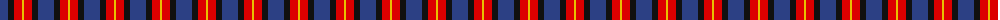

In pattern [BKRY](/patterns/bkry/).

This was sourced from register-of-tartans.  It is a [4 stripes tartan](/stripes/stripes4/).

Original link https://www.tartanregister.gov.uk/tartanDetails.aspx?ref=4218

## Thread count
B/16 K6 R8 Y/2

## Palette
Each colour and its ΔE from the base-6 reference it is a variant of.

| Colour | Shade | Base | ΔE (OKLab) |
|---|---|---|---|
| B | <code style="background-color:#2C4084;">#2C4084</code> `#2C4084` | B <code style="background-color:#2C4084;">#2C4084</code> | 0.00 |
| K | <code style="background-color:#101010;">#101010</code> `#101010` | K <code style="background-color:#000000;">#000000</code> | 0.17 |
| R | <code style="background-color:#DC0000;">#DC0000</code> `#DC0000` | R <code style="background-color:#C80000;">#C80000</code> | 0.04 |
| Y | <code style="background-color:#E8C000;">#E8C000</code> `#E8C000` | Y <code style="background-color:#E8C000;">#E8C000</code> | 0.00 |

# Sample pattern

## Nearest tartans

The nearest existing variants by ΔTartan distance.

1. [Unidentified 27](/setts/s4/b16k6r8y2-b304080-k000000-rc00000-yf0c000/) — ΔT 0.59
1. [Bryson (2000)](/setts/s5/g10b4ba10b20y4-b6c0070-ba1c0070-g006818-ye8c000/) — ΔT 1.12
1. [Edinburgh Bus Company (Corporate)](/setts/s6/b6r4g10r16b24w6-b202060-g006818-rc80000-wfcfcfc/) — ΔT 1.17
1. [Highland Pub Company](/setts/s5/b26k26b26r58y8-b304080-k000000-r900030-yf0c000/) — ΔT 1.20
1. [Nebar (Corporate)](/setts/s4/r96ra44k24b16-b2c2c80-k101010-r888888-ra901c38/) — ΔT 1.21
1. [International Highland Games Fed.](/setts/s4/b104r40g40w24-b2c2c80-g006818-rc80000-we0e0e0/) — ΔT 1.21
1. [Harbison (2015)](/setts/s4/g42b68r28w12-b202060-g146400-rc80000-wffffff/) — ΔT 1.23
1. [University of Notre Dame](/setts/s6/r10b70k50b16y20r10-b2c2c80-k101010-rc80000-yfccc00/) — ΔT 1.24
1. [Laval (Tartan de..) District Tartan Tartan Number: 2120. Earliest known date: 1988 "Purple (Wine red is sample) and blue (Dark blue) are the city's official colours. The symbolize the wealth and the quality of life and the development of a human city. White combines with blue and red to remind us of our French and British origins." (Guy Menard - Communication Services, Laval) See products available Copyright © Blair Urquhart, Comrie, 2015](/setts/s5/b4w4ba16b16w2-b202060-ba680028-we0e0e0/) — ΔT 1.29
1. [Dunbog Primary (School)](/setts/s6/r24b6g10b32y4g4-b000048-g447438-rc80000-ye8c000/) — ΔT 1.29

## Neighbour map

Every grey dot is one of 15726 variants placed by the first two principal components of the ΔTartan feature space (44% of its variance). Red is this tartan; blue dots are its nearest — click one to open its page.

<svg viewBox="0 0 640 380" role="img" style="max-width:100%;height:auto;border:1px solid #e0e0e0;border-radius:4px;display:block" xmlns="http://www.w3.org/2000/svg"><image href="/nn/cloud.v1.png" width="640" height="380"/><a href="/setts/s4/b16k6r8y2-b304080-k000000-rc00000-yf0c000/"><circle cx="226.0" cy="243.3" r="4" fill="#3465a4"><title>Unidentified 27</title></circle></a><a href="/setts/s5/g10b4ba10b20y4-b6c0070-ba1c0070-g006818-ye8c000/"><circle cx="217.5" cy="260.9" r="4" fill="#3465a4"><title>Bryson (2000)</title></circle></a><a href="/setts/s6/b6r4g10r16b24w6-b202060-g006818-rc80000-wfcfcfc/"><circle cx="181.4" cy="231.2" r="4" fill="#3465a4"><title>Edinburgh Bus Company (Corporate)</title></circle></a><a href="/setts/s5/b26k26b26r58y8-b304080-k000000-r900030-yf0c000/"><circle cx="183.6" cy="248.4" r="4" fill="#3465a4"><title>Highland Pub Company</title></circle></a><a href="/setts/s4/r96ra44k24b16-b2c2c80-k101010-r888888-ra901c38/"><circle cx="268.6" cy="257.5" r="4" fill="#3465a4"><title>Nebar (Corporate)</title></circle></a><a href="/setts/s4/b104r40g40w24-b2c2c80-g006818-rc80000-we0e0e0/"><circle cx="194.0" cy="270.5" r="4" fill="#3465a4"><title>International Highland Games Fed.</title></circle></a><a href="/setts/s4/g42b68r28w12-b202060-g146400-rc80000-wffffff/"><circle cx="175.3" cy="266.2" r="4" fill="#3465a4"><title>Harbison (2015)</title></circle></a><a href="/setts/s6/r10b70k50b16y20r10-b2c2c80-k101010-rc80000-yfccc00/"><circle cx="218.9" cy="221.0" r="4" fill="#3465a4"><title>University of Notre Dame</title></circle></a><a href="/setts/s5/b4w4ba16b16w2-b202060-ba680028-we0e0e0/"><circle cx="265.7" cy="243.3" r="4" fill="#3465a4"><title>Laval (Tartan de..) District Tartan Tartan Number: 2120. Earliest known date: 1988 &quot;Purple (Wine red is sample) and blue (Dark blue) are the city's official colours. The symbolize the wealth and the quality of life and the development of a human city. White combines with blue and red to remind us of our French and British origins.&quot; (Guy Menard - Communication Services, Laval) See products available Copyright © Blair Urquhart, Comrie, 2015</title></circle></a><a href="/setts/s6/r24b6g10b32y4g4-b000048-g447438-rc80000-ye8c000/"><circle cx="222.1" cy="210.0" r="4" fill="#3465a4"><title>Dunbog Primary (School)</title></circle></a><circle cx="237.5" cy="246.0" r="5" fill="#c00000"/></svg>

ID: /setts/s4/b16k6r8y2-b2c4084-k101010-rdc0000-ye8c000/
