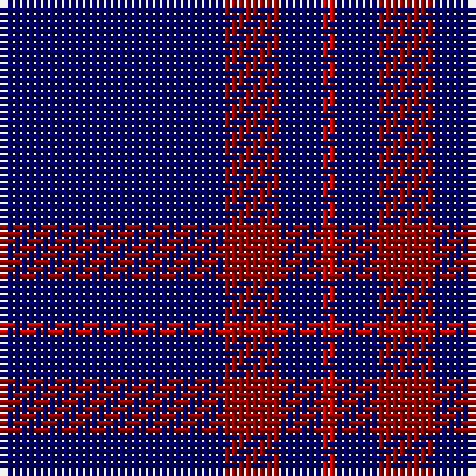

In pattern [BRBR](/patterns/brbr/).

This was sourced from weddslist.  It is a [4 stripes tartan](/stripes/stripes4/).

Original link http://www.weddslist.com/cgi-bin/tartans/pg.pl?source=rb

## Thread count
DB/32 DR8 DB6 R/2

## Palette
Each colour and its ΔE from the base-6 reference it is a variant of.

| Colour | Shade | Base | ΔE (OKLab) |
|---|---|---|---|
| DB | <code style="background-color:#000064;">#000064</code> `#000064` | B <code style="background-color:#2A418A;">#2A418A</code> | 0.18 |
| DR | <code style="background-color:#900000;">#900000</code> `#900000` | R <code style="background-color:#CC0000;">#CC0000</code> | 0.13 |
| R | <code style="background-color:#C80000;">#C80000</code> `#C80000` | R <code style="background-color:#CC0000;">#CC0000</code> | 0.01 |

# Sample pattern

## Nearest tartans

The nearest existing variants by ΔTartan distance.

1. [Brooks Brothers Tattersall Blue](/setts/s5/r1b9y2b9y1~b202060-r880000-ya08858~x4/) — ΔT 1.42
1. [McCallie](/setts/s4/r2k6b33w2~b2c2c80-k101010-rc80000-wfcfcfc~x4/) — ΔT 1.53
1. [Sultan of Qaboo's Air Force](/setts/s6/b24ba6b10ba6b32y3~b1c0070-ba5c8ca8-ye8c000~x2/) — ΔT 1.63
1. [Auchairne (Corporate)](/setts/s6/b11ba7b3ba70w4ba6~b1474b4-ba1c1c50-w98c8e8~x2/) — ΔT 1.66
1. [Lynch](/setts/s6/r3b2r1b18g1b2~b2c2c80-g007c00-rc80000~x4/) — ΔT 1.71
1. [Waugh (Name)](/setts/s5/b100ba10k5ba10r8~b1c0070-ba7098b0-k101010-r980000/) — ΔT 1.73
1. [Elliott](/setts/s4/b16ba4b3r1~b000052-ba521510-raa0000~x2/) — ΔT 1.75
1. [Dollar Academy](/setts/s6/b9k9b9k9b42w5~b2c2c80-k101010-wc0c0c0~x2/) — ΔT 1.77
1. [Gulfmark (Corporate)](/setts/s5/b72ba6b12ba17w6~b2c2c80-ba2888c4-we0e0e0~x2/) — ΔT 1.79
1. [Oxford University](/setts/s6/g16b59y4b59g16ba9~b1c0070-ba2c2c80-g006818-yc4bc68~x2/) — ΔT 1.80

## Neighbour map

Every grey dot is one of 15726 variants placed by the first two principal components of the ΔTartan feature space (44% of its variance). Red is this tartan; blue dots are its nearest — click one to open its page.

<svg viewBox="0 0 640 380" role="img" style="max-width:100%;height:auto;border:1px solid #e0e0e0;border-radius:4px;display:block" xmlns="http://www.w3.org/2000/svg"><image href="/nn/cloud.v1.png" width="640" height="380"/><a href="/setts/s5/r1b9y2b9y1~b202060-r880000-ya08858~x4/"><circle cx="542.4" cy="271.6" r="4" fill="#3465a4"><title>Brooks Brothers Tattersall Blue</title></circle></a><a href="/setts/s4/r2k6b33w2~b2c2c80-k101010-rc80000-wfcfcfc~x4/"><circle cx="505.6" cy="207.6" r="4" fill="#3465a4"><title>McCallie</title></circle></a><a href="/setts/s6/b24ba6b10ba6b32y3~b1c0070-ba5c8ca8-ye8c000~x2/"><circle cx="508.8" cy="256.1" r="4" fill="#3465a4"><title>Sultan of Qaboo's Air Force</title></circle></a><a href="/setts/s6/b11ba7b3ba70w4ba6~b1474b4-ba1c1c50-w98c8e8~x2/"><circle cx="611.4" cy="199.7" r="4" fill="#3465a4"><title>Auchairne (Corporate)</title></circle></a><a href="/setts/s6/r3b2r1b18g1b2~b2c2c80-g007c00-rc80000~x4/"><circle cx="601.0" cy="206.7" r="4" fill="#3465a4"><title>Lynch</title></circle></a><a href="/setts/s5/b100ba10k5ba10r8~b1c0070-ba7098b0-k101010-r980000/"><circle cx="509.9" cy="185.0" r="4" fill="#3465a4"><title>Waugh (Name)</title></circle></a><a href="/setts/s4/b16ba4b3r1~b000052-ba521510-raa0000~x2/"><circle cx="601.4" cy="276.1" r="4" fill="#3465a4"><title>Elliott</title></circle></a><a href="/setts/s6/b9k9b9k9b42w5~b2c2c80-k101010-wc0c0c0~x2/"><circle cx="461.9" cy="257.5" r="4" fill="#3465a4"><title>Dollar Academy</title></circle></a><a href="/setts/s5/b72ba6b12ba17w6~b2c2c80-ba2888c4-we0e0e0~x2/"><circle cx="494.3" cy="234.1" r="4" fill="#3465a4"><title>Gulfmark (Corporate)</title></circle></a><a href="/setts/s6/g16b59y4b59g16ba9~b1c0070-ba2c2c80-g006818-yc4bc68~x2/"><circle cx="452.1" cy="229.7" r="4" fill="#3465a4"><title>Oxford University</title></circle></a><circle cx="552.6" cy="253.1" r="5" fill="#c00000"/></svg>

ID: /setts/s4/b16r4b3ra1~b000064-r900000-rac80000~x2/
