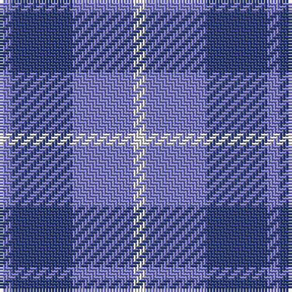

In pattern [BBBW](/stripes/bbbw/).

This was sourced from weddslist.  It is a [4 stripe tartan](/stripes/stripes4/).

Original link http://www.weddslist.com/cgi-bin/tartans/pg.pl?source=sts

## Thread count
B/4 Ba20 B20 LN/4

## Palette
Each colour and the base-6 reference it is a variant of.

| Colour | Shade | Base |
|---|---|---|
| B | <code style="background-color:#8080D0;">#8080D0</code> `oklch(63.4% 0.119 282.5)` <small>#8080D0</small> | B <code style="background-color:#2A418A;">#2A418A</code> |
| Ba | <code style="background-color:#304080;">#304080</code> `oklch(39.4% 0.109 270.2)` <small>#304080</small> | B <code style="background-color:#2A418A;">#2A418A</code> |
| LN | <code style="background-color:#E0E0E0;">#E0E0E0</code> `oklch(90.7% 0.000 89.9)` <small>#E0E0E0</small> | W <code style="background-color:#F7F7F7;">#F7F7F7</code> |

# Sample pattern

## Nearest tartans

The nearest existing variants by ΔTartan distance.

1. [Manx Cornaa (Personal)](/setts/s4/t1db5t5w1~x4/) — ΔT 0.97
1. [Manx Cornaa (Personal)](/setts/s6/db5t5w1t5db5t1~x4/) — ΔT 1.46
1. [Cathro (Name)](/setts/s5/p9b6w1g4p2~x8/) — ΔT 1.49
1. [Langdons](/setts/s7/db2t4w1t4db6t2db2~x4/) — ΔT 1.86
1. [Murdoch, Ellis (Personal)](/setts/s4/p20db25w3k2~x2/) — ΔT 2.05
1. [Omega Delta Sigma, National Veterans](/setts/s4/k15db40k9o10~x2/) — ΔT 2.05
1. [MacCallum High School Corporate Tartan Tartan Number: 1279. Earliest known date: 0 From the J. Rutledge Collection, Belfast. MacCallum High School, Philadelphia See products available Copyright © Blair Urquhart, Comrie, 2015](/setts/s5/o9db3o1db11o1~x6/) — ΔT 2.10
1. [Murray Taylor](/setts/s6/db3t3db16t16db16w3~x2/) — ΔT 2.10
1. [Fong (Personal)](/setts/s4/r21db43dt86lb10/) — ΔT 2.15
1. [Langdons (Corporate)](/setts/s7/t2lb4w1lb4t6lb2t2~x4/) — ΔT 2.16

## Neighbour map

Every grey dot is one of 14299 variants placed by the first two principal components of the ΔTartan feature space (44% of its variance). Red is this tartan; blue dots are its nearest — click one to open its page.

<svg viewBox="0 0 640 380" role="img" style="max-width:100%;height:auto;border:1px solid #e0e0e0;border-radius:4px;display:block" xmlns="http://www.w3.org/2000/svg"><image href="/nn/cloud.v1.png" width="640" height="380"/><a href="/setts/s4/t1db5t5w1~x4/"><circle cx="278.3" cy="295.1" r="4" fill="#3465a4"><title>Manx Cornaa (Personal)</title></circle></a><a href="/setts/s6/db5t5w1t5db5t1~x4/"><circle cx="277.7" cy="304.2" r="4" fill="#3465a4"><title>Manx Cornaa (Personal)</title></circle></a><a href="/setts/s5/p9b6w1g4p2~x8/"><circle cx="270.6" cy="250.8" r="4" fill="#3465a4"><title>Cathro (Name)</title></circle></a><a href="/setts/s7/db2t4w1t4db6t2db2~x4/"><circle cx="271.2" cy="289.7" r="4" fill="#3465a4"><title>Langdons</title></circle></a><a href="/setts/s4/p20db25w3k2~x2/"><circle cx="326.5" cy="238.2" r="4" fill="#3465a4"><title>Murdoch, Ellis (Personal)</title></circle></a><a href="/setts/s4/k15db40k9o10~x2/"><circle cx="311.0" cy="312.0" r="4" fill="#3465a4"><title>Omega Delta Sigma, National Veterans</title></circle></a><a href="/setts/s5/o9db3o1db11o1~x6/"><circle cx="404.3" cy="264.5" r="4" fill="#3465a4"><title>MacCallum High School Corporate Tartan Tartan Number: 1279. Earliest known date: 0 From the J. Rutledge Collection, Belfast. MacCallum High School, Philadelphia See products available Copyright © Blair Urquhart, Comrie, 2015</title></circle></a><a href="/setts/s6/db3t3db16t16db16w3~x2/"><circle cx="323.6" cy="271.7" r="4" fill="#3465a4"><title>Murray Taylor</title></circle></a><a href="/setts/s4/r21db43dt86lb10/"><circle cx="292.0" cy="257.5" r="4" fill="#3465a4"><title>Fong (Personal)</title></circle></a><a href="/setts/s7/t2lb4w1lb4t6lb2t2~x4/"><circle cx="259.5" cy="274.9" r="4" fill="#3465a4"><title>Langdons (Corporate)</title></circle></a><circle cx="294.9" cy="295.0" r="5" fill="#c00000"/></svg>

ID: /setts/s4/b1db5b5w1~x4/
