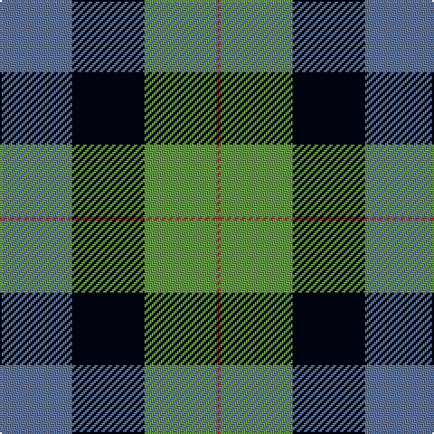

In pattern [BKGR](/patterns/bkgr/).

This was sourced from register-of-tartans.  It is a [4 stripes tartan](/stripes/stripes4/).

Original link https://www.tartanregister.gov.uk/tartanDetails.aspx?ref=10460

## Thread count
B/40 K40 LG40 R/2

## Palette
Each colour and its ΔE from the base-6 reference it is a variant of.

| Colour | Shade | Base | ΔE (OKLab) |
|---|---|---|---|
| B | <code style="background-color:#5F749C;">#5F749C</code> `#5F749C` | B <code style="background-color:#2A418A;">#2A418A</code> | 0.17 |
| K | <code style="background-color:#010512;">#010512</code> `#010512` | K <code style="background-color:#000000;">#000000</code> | 0.12 |
| LG | <code style="background-color:#649848;">#649848</code> `#649848` | G <code style="background-color:#006100;">#006100</code> | 0.20 |
| R | <code style="background-color:#CA2625;">#CA2625</code> `#CA2625` | R <code style="background-color:#CC0000;">#CC0000</code> | 0.02 |

# Sample pattern

## Nearest tartans

The nearest existing variants by ΔTartan distance.

1. [Gunn (2011) Personal Tartan Tartan Number: 10459. Earliest known date: 17th July 2011 This is a variation on the original Gunn tartan, created in memory of the designer's grandfather, William Jesse Gunn and intended principally for the designer and his immediate family. See products available Copyright © Blair Urquhart, Comrie, 2015](/setts/s4/b20k20g20r1x2~b1474b4-g006818-k101010-rc80000/) — ΔT 1.14
1. [MacKirdy](/setts/s5/k2g12k11b12w1x2~b1474b4-g408060-k101010-wfcfcfc/) — ΔT 1.29
1. [Charles-Carberry (Personal)](/setts/s5/g21b10k26w10r1x2~b5f749c-g003c14-k1c1714-rc8002c-wf0e0c8/) — ΔT 1.39
1. [MacKirdy](/setts/s5/k2g12k11b12w1x2~b304080-g008000-k000000-we0e0e0/) — ΔT 1.53
1. [St. Matthews Check (School)](/setts/s5/b2y21b11ba21b1~b1c1c50-ba003c64-ybc8c00/) — ΔT 1.64
1. [Charles-Carberry (Personal)](/setts/s5/g21b10k26y10r1x2~b2c2c80-g003820-k101010-rc80000-yc4bc68/) — ΔT 1.67
1. [Thorntons Law Corporate Tartan Tartan Number: 6862. Earliest known date: 2005 Thorntons WS is a Dundee based solictors, estate agents and investment consultants. See products available Copyright © Blair Urquhart, Comrie, 2015](/setts/s4/b10g10r5w1x2~b1c0070-g00ac94-rc80030-we0e0e0/) — ΔT 1.67
1. [Sinclair of Ulbster](/setts/s6/b12k4g6y1g6k4x8~b1474b4-g006818-k101010-yd8b000/) — ΔT 1.69
1. [New York Fire Department Pipe Band](/setts/s6/k4w1g13k11b11wa3x4~b2c2c80-g006818-k101010-wf8f8f8-waa8ace8/) — ΔT 1.70
1. [Herd Family Tartan Tartan Number: 170. Earliest known date: 1978 Woven for the wedding of William Hurd to Heather Petit. From JCT: STS monitoring committee recorded 1978. In march 2005. STS Record has the application being made by Councillor R J Herd, C.Eng, M.I.C.E., A.M.B.I.M. who had been granted arms by Lord Lyon. See products available Copyright © Blair Urquhart, Comrie, 2015](/setts/s6/b2g12k13w1b13w2x2~b2c2c80-g006818-k101010-we0e0e0/) — ΔT 1.72

## Neighbour map

Every grey dot is one of 15726 variants placed by the first two principal components of the ΔTartan feature space (44% of its variance). Red is this tartan; blue dots are its nearest — click one to open its page.

<svg viewBox="0 0 640 380" role="img" style="max-width:100%;height:auto;border:1px solid #e0e0e0;border-radius:4px;display:block" xmlns="http://www.w3.org/2000/svg"><image href="/nn/cloud.v1.png" width="640" height="380"/><a href="/setts/s4/b20k20g20r1x2~b1474b4-g006818-k101010-rc80000/"><circle cx="198.3" cy="244.1" r="4" fill="#3465a4"><title>Gunn (2011) Personal Tartan Tartan Number: 10459. Earliest known date: 17th July 2011 This is a variation on the original Gunn tartan, created in memory of the designer's grandfather, William Jesse Gunn and intended principally for the designer and his immediate family. See products available Copyright © Blair Urquhart, Comrie, 2015</title></circle></a><a href="/setts/s5/k2g12k11b12w1x2~b1474b4-g408060-k101010-wfcfcfc/"><circle cx="175.6" cy="230.9" r="4" fill="#3465a4"><title>MacKirdy</title></circle></a><a href="/setts/s5/g21b10k26w10r1x2~b5f749c-g003c14-k1c1714-rc8002c-wf0e0c8/"><circle cx="177.3" cy="179.5" r="4" fill="#3465a4"><title>Charles-Carberry (Personal)</title></circle></a><a href="/setts/s5/k2g12k11b12w1x2~b304080-g008000-k000000-we0e0e0/"><circle cx="157.2" cy="227.7" r="4" fill="#3465a4"><title>MacKirdy</title></circle></a><a href="/setts/s5/b2y21b11ba21b1~b1c1c50-ba003c64-ybc8c00/"><circle cx="252.3" cy="212.2" r="4" fill="#3465a4"><title>St. Matthews Check (School)</title></circle></a><a href="/setts/s5/g21b10k26y10r1x2~b2c2c80-g003820-k101010-rc80000-yc4bc68/"><circle cx="195.4" cy="190.3" r="4" fill="#3465a4"><title>Charles-Carberry (Personal)</title></circle></a><a href="/setts/s4/b10g10r5w1x2~b1c0070-g00ac94-rc80030-we0e0e0/"><circle cx="169.3" cy="240.9" r="4" fill="#3465a4"><title>Thorntons Law Corporate Tartan Tartan Number: 6862. Earliest known date: 2005 Thorntons WS is a Dundee based solictors, estate agents and investment consultants. See products available Copyright © Blair Urquhart, Comrie, 2015</title></circle></a><a href="/setts/s6/b12k4g6y1g6k4x8~b1474b4-g006818-k101010-yd8b000/"><circle cx="188.4" cy="235.8" r="4" fill="#3465a4"><title>Sinclair of Ulbster</title></circle></a><a href="/setts/s6/k4w1g13k11b11wa3x4~b2c2c80-g006818-k101010-wf8f8f8-waa8ace8/"><circle cx="150.1" cy="206.2" r="4" fill="#3465a4"><title>New York Fire Department Pipe Band</title></circle></a><a href="/setts/s6/b2g12k13w1b13w2x2~b2c2c80-g006818-k101010-we0e0e0/"><circle cx="184.2" cy="210.9" r="4" fill="#3465a4"><title>Herd Family Tartan Tartan Number: 170. Earliest known date: 1978 Woven for the wedding of William Hurd to Heather Petit. From JCT: STS monitoring committee recorded 1978. In march 2005. STS Record has the application being made by Councillor R J Herd, C.Eng, M.I.C.E., A.M.B.I.M. who had been granted arms by Lord Lyon. See products available Copyright © Blair Urquhart, Comrie, 2015</title></circle></a><circle cx="172.0" cy="228.1" r="5" fill="#c00000"/></svg>

ID: /setts/s4/b20k20g20r1x2~b5f749c-g649848-k010512-rca2625/
