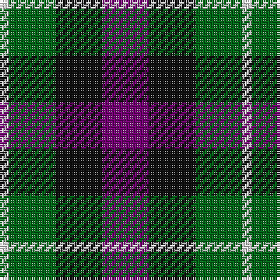

In pattern [BKGW](/patterns/bkgw/).

This was sourced from register-of-tartans.  It is a [4 stripes tartan](/stripes/stripes4/).

Original link https://www.tartanregister.gov.uk/tartanDetails.aspx?ref=4748

## Thread count
LN/4 G20 K20 P/20

## Palette
Each colour and its ΔE from the base-6 reference it is a variant of.

| Colour | Shade | Base | ΔE (OKLab) |
|---|---|---|---|
| DG | <code style="background-color:#003820;">#003820</code> `#003820` | G <code style="background-color:#006400;">#006400</code> | 0.16 |
| DP | <code style="background-color:#500050;">#500050</code> `#500050` | B <code style="background-color:#2C4084;">#2C4084</code> | 0.16 |
| G | <code style="background-color:#006818;">#006818</code> `#006818` | G <code style="background-color:#006400;">#006400</code> | 0.02 |
| K | <code style="background-color:#101010;">#101010</code> `#101010` | K <code style="background-color:#000000;">#000000</code> | 0.17 |
| LN | <code style="background-color:#E0E0E0;">#E0E0E0</code> `#E0E0E0` | W <code style="background-color:#F4F4F0;">#F4F4F0</code> | 0.06 |
| P | <code style="background-color:#740074;">#740074</code> `#740074` | B <code style="background-color:#2C4084;">#2C4084</code> | 0.16 |

# Sample pattern

ID: /setts/s4/b20k20g20w4-b740074-g006818-k101010-we0e0e0/
