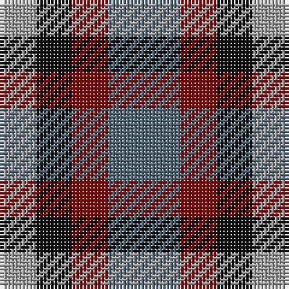

In pattern [BRKY](/patterns/brky/).

This was sourced from tartans-authority.  It is a [4 stripes tartan](/stripes/stripes4/).

Original link http://www.tartansauthority.com/tartan-ferret/display/10086/

## Thread count
N/10 K10 DR10 Na/20

## Palette
Each colour and its ΔE from the base-6 reference it is a variant of.

| Colour | Shade | Base | ΔE (OKLab) |
|---|---|---|---|
| DR | <code style="background-color:#880000;">#880000</code> `#880000` | R <code style="background-color:#C80000;">#C80000</code> | 0.14 |
| K | <code style="background-color:#101010;">#101010</code> `#101010` | K <code style="background-color:#000000;">#000000</code> | 0.17 |
| N | <code style="background-color:#A0A0A0;">#A0A0A0</code> `#A0A0A0` | Y <code style="background-color:#E8C000;">#E8C000</code> | 0.20 |
| Na | <code style="background-color:#506878;">#506878</code> `#506878` | B <code style="background-color:#2C4084;">#2C4084</code> | 0.14 |

# Sample pattern

ID: /setts/s4/b20r10k10y10-b506878-k101010-r880000-ya0a0a0/
