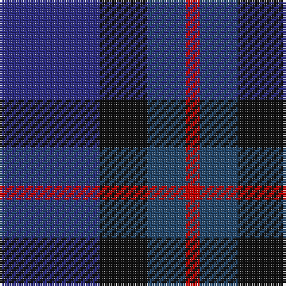

In pattern [BKBR](/patterns/bkbr/).

This was sourced from tartans-authority.  It is a [4 stripes tartan](/stripes/stripes4/).

Original link http://www.tartansauthority.com/tartan-ferret/display/6583/

## Thread count
DB/42 K20 B16 R/6

## Palette
Each colour and its ΔE from the base-6 reference it is a variant of.

| Colour | Shade | Base | ΔE (OKLab) |
|---|---|---|---|
| B | <code style="background-color:#24486C;">#24486C</code> `#24486C` | B <code style="background-color:#2A418A;">#2A418A</code> | 0.06 |
| DB | <code style="background-color:#2C2C84;">#2C2C84</code> `#2C2C84` | B <code style="background-color:#2A418A;">#2A418A</code> | 0.05 |
| K | <code style="background-color:#101010;">#101010</code> `#101010` | K <code style="background-color:#000000;">#000000</code> | 0.17 |
| R | <code style="background-color:#C80000;">#C80000</code> `#C80000` | R <code style="background-color:#CC0000;">#CC0000</code> | 0.01 |

# Sample pattern

## Nearest tartans

The nearest existing variants by ΔTartan distance.

1. [Bryson](/setts/s5/b8r3ba29bb29b4~b3c82af-ba2c4084-bb141e46-rdc0000~x2/) — ΔT 1.40
1. [Cathro](/setts/s5/b9ba6w1g4b2~b5a008c-ba2c4084-g003c14-we0e0e0~x4/) — ΔT 1.40
1. [Rose, Danny and Hanna (Personal)](/setts/s5/y11b19ba38r7k7~b2c2c80-ba14283c-k101010-r880000-y48a4c0~x2/) — ΔT 1.68
1. [Saorsa](/setts/s7/b18g24k3ba6b2ba5b18~b440044-ba001a99-g003c14-k000000~x2/) — ΔT 1.73
1. [Hutchesons' Grammar (Corporate)](/setts/s6/b8r4ba30bb30ra3bb4~b5c8ca8-ba2c2c80-bb14283c-r888888-rac80000~x2/) — ΔT 1.83
1. [Campbell, Sir Walter Scott](/setts/s6/k2g8b2k9ba7k2~b2c4084-ba5a008c-g005020-k101010~x2/) — ΔT 1.84
1. [Harbour Town Hilton Head, The](/setts/s6/b3g11b3ba11b18y3~b003c64-ba680028-g006818-ya08858~x2/) — ΔT 1.84
1. [Daks (Blue)](/setts/s8/g3b6ba2y2ba11b2ba2g3~b2c2c80-ba202060-g604000-ya08858~x2/) — ΔT 1.85
1. [The Harbour Town, Hilton Head](/setts/s6/k3g11k3b11k18r3~b600030-g004010-k000030-r906030~x2/) — ΔT 1.85
1. [Unidentified no. 54](/setts/s6/b2g6b6ba5b1ba2~b080848-ba280032-g005020~x2/) — ΔT 1.90

## Neighbour map

Every grey dot is one of 15726 variants placed by the first two principal components of the ΔTartan feature space (44% of its variance). Red is this tartan; blue dots are its nearest — click one to open its page.

<svg viewBox="0 0 640 380" role="img" style="max-width:100%;height:auto;border:1px solid #e0e0e0;border-radius:4px;display:block" xmlns="http://www.w3.org/2000/svg"><image href="/nn/cloud.v1.png" width="640" height="380"/><a href="/setts/s5/b8r3ba29bb29b4~b3c82af-ba2c4084-bb141e46-rdc0000~x2/"><circle cx="280.9" cy="253.1" r="4" fill="#3465a4"><title>Bryson</title></circle></a><a href="/setts/s5/b9ba6w1g4b2~b5a008c-ba2c4084-g003c14-we0e0e0~x4/"><circle cx="286.0" cy="258.6" r="4" fill="#3465a4"><title>Cathro</title></circle></a><a href="/setts/s5/y11b19ba38r7k7~b2c2c80-ba14283c-k101010-r880000-y48a4c0~x2/"><circle cx="216.3" cy="256.2" r="4" fill="#3465a4"><title>Rose, Danny and Hanna (Personal)</title></circle></a><a href="/setts/s7/b18g24k3ba6b2ba5b18~b440044-ba001a99-g003c14-k000000~x2/"><circle cx="333.3" cy="240.2" r="4" fill="#3465a4"><title>Saorsa</title></circle></a><a href="/setts/s6/b8r4ba30bb30ra3bb4~b5c8ca8-ba2c2c80-bb14283c-r888888-rac80000~x2/"><circle cx="277.2" cy="218.8" r="4" fill="#3465a4"><title>Hutchesons' Grammar (Corporate)</title></circle></a><a href="/setts/s6/k2g8b2k9ba7k2~b2c4084-ba5a008c-g005020-k101010~x2/"><circle cx="221.3" cy="286.5" r="4" fill="#3465a4"><title>Campbell, Sir Walter Scott</title></circle></a><a href="/setts/s6/b3g11b3ba11b18y3~b003c64-ba680028-g006818-ya08858~x2/"><circle cx="275.8" cy="270.3" r="4" fill="#3465a4"><title>Harbour Town Hilton Head, The</title></circle></a><a href="/setts/s8/g3b6ba2y2ba11b2ba2g3~b2c2c80-ba202060-g604000-ya08858~x2/"><circle cx="303.3" cy="268.2" r="4" fill="#3465a4"><title>Daks (Blue)</title></circle></a><a href="/setts/s6/k3g11k3b11k18r3~b600030-g004010-k000030-r906030~x2/"><circle cx="265.5" cy="269.0" r="4" fill="#3465a4"><title>The Harbour Town, Hilton Head</title></circle></a><a href="/setts/s6/b2g6b6ba5b1ba2~b080848-ba280032-g005020~x2/"><circle cx="287.4" cy="320.8" r="4" fill="#3465a4"><title>Unidentified no. 54</title></circle></a><circle cx="299.4" cy="295.1" r="5" fill="#c00000"/></svg>

ID: /setts/s4/b21k10ba8r3~b2c2c84-ba24486c-k101010-rc80000~x2/
