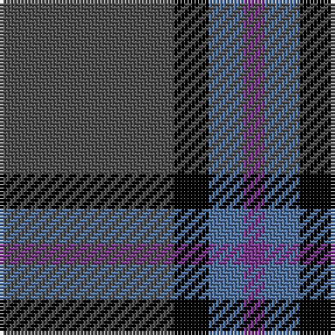

In pattern [BBKB](/patterns/bbkb/).

This was sourced from register-of-tartans.  It is a [4 stripes tartan](/stripes/stripes4/).

Original link https://www.tartanregister.gov.uk/tartanDetails.aspx?ref=10342

## Thread count
N/50 K10 B10 P/6

## Palette
Each colour and its ΔE from the base-6 reference it is a variant of.

| Colour | Shade | Base | ΔE (OKLab) |
|---|---|---|---|
| B | <code style="background-color:#50729F;">#50729F</code> `#50729F` | B <code style="background-color:#2A418A;">#2A418A</code> | 0.15 |
| K | <code style="background-color:#000000;">#000000</code> `#000000` | K <code style="background-color:#000000;">#000000</code> | 0.00 |
| N | <code style="background-color:#4F4F4F;">#4F4F4F</code> `#4F4F4F` | B <code style="background-color:#2A418A;">#2A418A</code> | 0.13 |
| P | <code style="background-color:#7A378B;">#7A378B</code> `#7A378B` | B <code style="background-color:#2A418A;">#2A418A</code> | 0.13 |

# Sample pattern

## Nearest tartans

The nearest existing variants by ΔTartan distance.

1. [Connaught Green](/setts/s6/r1b12g5b2g4w1x2~b202060-g5c6428-ra00000-wc0c0c0/) — ΔT 1.33
1. [Brotherhood of the Kilt](/setts/s5/k10g4k1b2r1x10~b7884a8-g505420-k101010-rc80000/) — ΔT 1.38
1. [Mackay (Blue)](/setts/s6/b1k3b1k3b8r1x8~b506878-k101010-rc80000/) — ΔT 1.45
1. [Cameron Hunting](/setts/s6/b15r5b30ba32b4y3x2~b4c3428-ba1474b4-rc80000-yd09800/) — ΔT 1.50
1. [Scottish Nuclear (Corporate)](/setts/s4/r1b9k4w1x4~b2c2c80-k101010-rc80000-wc0c0c0/) — ΔT 1.54
1. [Lord Willy's (Corporate)](/setts/s4/b10k2ba2bb1x5~b5c5c5c-ba2c2c80-bb780078-k101010/) — ΔT 1.55
1. [Dege, of Saville Row](/setts/s6/r11b1r3ba1b9ra1x4~b000050-ba304080-r806050-rac00000/) — ΔT 1.58
1. [Open Championship, The](/setts/s5/g1b2ba5b11y1x4~b141e46-ba2c4084-g005020-ye8c000/) — ΔT 1.60
1. [Hector James](/setts/s5/r2g11b27g5ra2x2~b304080-g008000-r806050-rac00000/) — ΔT 1.61
1. [Cameron Hunting Brown Clan Tartan Tartan Number: 1745. Earliest known date: 1916 Nothing See products available Copyright © Blair Urquhart, Comrie, 2015](/setts/s6/g15r5g30b32g4y3x2~b2c2c80-g604000-rc80000-ye8c000/) — ΔT 1.61

## Neighbour map

Every grey dot is one of 15726 variants placed by the first two principal components of the ΔTartan feature space (44% of its variance). Red is this tartan; blue dots are its nearest — click one to open its page.

<svg viewBox="0 0 640 380" role="img" style="max-width:100%;height:auto;border:1px solid #e0e0e0;border-radius:4px;display:block" xmlns="http://www.w3.org/2000/svg"><image href="/nn/cloud.v1.png" width="640" height="380"/><a href="/setts/s6/r1b12g5b2g4w1x2~b202060-g5c6428-ra00000-wc0c0c0/"><circle cx="351.5" cy="217.6" r="4" fill="#3465a4"><title>Connaught Green</title></circle></a><a href="/setts/s5/k10g4k1b2r1x10~b7884a8-g505420-k101010-rc80000/"><circle cx="355.1" cy="227.6" r="4" fill="#3465a4"><title>Brotherhood of the Kilt</title></circle></a><a href="/setts/s6/b1k3b1k3b8r1x8~b506878-k101010-rc80000/"><circle cx="360.1" cy="247.1" r="4" fill="#3465a4"><title>Mackay (Blue)</title></circle></a><a href="/setts/s6/b15r5b30ba32b4y3x2~b4c3428-ba1474b4-rc80000-yd09800/"><circle cx="347.4" cy="231.0" r="4" fill="#3465a4"><title>Cameron Hunting</title></circle></a><a href="/setts/s4/r1b9k4w1x4~b2c2c80-k101010-rc80000-wc0c0c0/"><circle cx="344.3" cy="243.7" r="4" fill="#3465a4"><title>Scottish Nuclear (Corporate)</title></circle></a><a href="/setts/s4/b10k2ba2bb1x5~b5c5c5c-ba2c2c80-bb780078-k101010/"><circle cx="450.9" cy="254.6" r="4" fill="#3465a4"><title>Lord Willy's (Corporate)</title></circle></a><a href="/setts/s6/r11b1r3ba1b9ra1x4~b000050-ba304080-r806050-rac00000/"><circle cx="327.0" cy="208.5" r="4" fill="#3465a4"><title>Dege, of Saville Row</title></circle></a><a href="/setts/s5/g1b2ba5b11y1x4~b141e46-ba2c4084-g005020-ye8c000/"><circle cx="422.2" cy="244.0" r="4" fill="#3465a4"><title>Open Championship, The</title></circle></a><a href="/setts/s5/r2g11b27g5ra2x2~b304080-g008000-r806050-rac00000/"><circle cx="376.7" cy="220.3" r="4" fill="#3465a4"><title>Hector James</title></circle></a><a href="/setts/s6/g15r5g30b32g4y3x2~b2c2c80-g604000-rc80000-ye8c000/"><circle cx="354.7" cy="231.9" r="4" fill="#3465a4"><title>Cameron Hunting Brown Clan Tartan Tartan Number: 1745. Earliest known date: 1916 Nothing See products available Copyright © Blair Urquhart, Comrie, 2015</title></circle></a><circle cx="392.3" cy="246.8" r="5" fill="#c00000"/></svg>

ID: /setts/s4/b25k5ba5bb3x2~b4f4f4f-ba50729f-bb7a378b-k000000/
