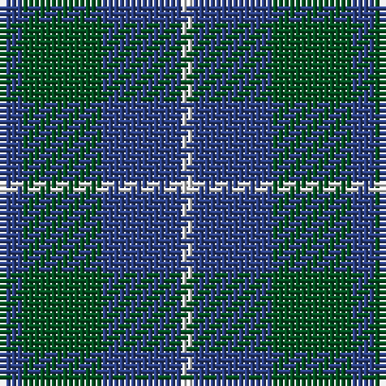

In pattern [BGBW](/patterns/bgbw/).

This was sourced from register-of-tartans.  It is a [4 stripes tartan](/stripes/stripes4/).

Original link https://www.tartanregister.gov.uk/tartanDetails.aspx?ref=4332

## Thread count
B/4 G14 B14 LN/2

## Palette
Each colour and its ΔE from the base-6 reference it is a variant of.

| Colour | Shade | Base | ΔE (OKLab) |
|---|---|---|---|
| B | <code style="background-color:#2C4084;">#2C4084</code> `#2C4084` | B <code style="background-color:#2A418A;">#2A418A</code> | 0.01 |
| G | <code style="background-color:#005020;">#005020</code> `#005020` | G <code style="background-color:#006100;">#006100</code> | 0.07 |
| LN | <code style="background-color:#E0E0E0;">#E0E0E0</code> `#E0E0E0` | W <code style="background-color:#F7F7F7;">#F7F7F7</code> | 0.07 |

# Sample pattern

## Nearest tartans

The nearest existing variants by ΔTartan distance.

1. [Hamilton Hunting](/setts/s5/b11g2b15g18w2~b2c4084-g005020-we0e0e0~x2/) — ΔT 0.82
1. [Ferguson - 1930 (Old)](/setts/s3/g17r2b15~b2c2c80-g006818-rc80000~x2/) — ΔT 1.00
1. [Hamilton Hunting Clan Tartan Tartan Number: 139. Earliest known date: pre 2003 Sample presented to the Scottish Tartans Society by Wiebe Stodel. See products available Copyright © Blair Urquhart, Comrie, 2015](/setts/s5/b5g2b5g8w1~b2c2c80-g006818-we0e0e0~x8/) — ΔT 1.15
1. [Omega Delta Sigma, National Veterans Fraternity](/setts/s4/k15b40k9r10~b003c64-k101010-r888888~x2/) — ΔT 1.18
1. [Unnamed No 78](/setts/s4/b2g7b7w1~b304080-g008000-we0e0e0~x2/) — ΔT 1.29
1. [Hamilton, hunting](/setts/s5/b11g2b15g18w2~b304080-g008000-we0e0e0~x2/) — ΔT 1.30
1. [Ferguson](/setts/s3/b6g5r1~b2c4084-g005020-rdc0000~x4/) — ΔT 1.31
1. [Ferguson](/setts/s3/b6g5r1~b304080-g008000-rc00000~x4/) — ΔT 1.32
1. [Unidentified #4](/setts/s4/g14r3b9ba2~b2c4084-ba3c82af-g005020-rdc0000~x2/) — ΔT 1.46
1. [Wilson's No 62, (Ferguson)](/setts/s3/b13r2g13~b304080-g008000-rc00000~x2/) — ΔT 1.48

## Neighbour map

Every grey dot is one of 15726 variants placed by the first two principal components of the ΔTartan feature space (44% of its variance). Red is this tartan; blue dots are its nearest — click one to open its page.

<svg viewBox="0 0 640 380" role="img" style="max-width:100%;height:auto;border:1px solid #e0e0e0;border-radius:4px;display:block" xmlns="http://www.w3.org/2000/svg"><image href="/nn/cloud.v1.png" width="640" height="380"/><a href="/setts/s5/b11g2b15g18w2~b2c4084-g005020-we0e0e0~x2/"><circle cx="363.5" cy="286.3" r="4" fill="#3465a4"><title>Hamilton Hunting</title></circle></a><a href="/setts/s3/g17r2b15~b2c2c80-g006818-rc80000~x2/"><circle cx="324.4" cy="311.0" r="4" fill="#3465a4"><title>Ferguson - 1930 (Old)</title></circle></a><a href="/setts/s5/b5g2b5g8w1~b2c2c80-g006818-we0e0e0~x8/"><circle cx="286.2" cy="283.7" r="4" fill="#3465a4"><title>Hamilton Hunting Clan Tartan Tartan Number: 139. Earliest known date: pre 2003 Sample presented to the Scottish Tartans Society by Wiebe Stodel. See products available Copyright © Blair Urquhart, Comrie, 2015</title></circle></a><a href="/setts/s4/k15b40k9r10~b003c64-k101010-r888888~x2/"><circle cx="316.5" cy="316.8" r="4" fill="#3465a4"><title>Omega Delta Sigma, National Veterans Fraternity</title></circle></a><a href="/setts/s4/b2g7b7w1~b304080-g008000-we0e0e0~x2/"><circle cx="301.4" cy="287.5" r="4" fill="#3465a4"><title>Unnamed No 78</title></circle></a><a href="/setts/s5/b11g2b15g18w2~b304080-g008000-we0e0e0~x2/"><circle cx="325.8" cy="269.4" r="4" fill="#3465a4"><title>Hamilton, hunting</title></circle></a><a href="/setts/s3/b6g5r1~b2c4084-g005020-rdc0000~x4/"><circle cx="329.1" cy="338.6" r="4" fill="#3465a4"><title>Ferguson</title></circle></a><a href="/setts/s3/b6g5r1~b304080-g008000-rc00000~x4/"><circle cx="291.0" cy="322.3" r="4" fill="#3465a4"><title>Ferguson</title></circle></a><a href="/setts/s4/g14r3b9ba2~b2c4084-ba3c82af-g005020-rdc0000~x2/"><circle cx="289.9" cy="279.0" r="4" fill="#3465a4"><title>Unidentified #4</title></circle></a><a href="/setts/s3/b13r2g13~b304080-g008000-rc00000~x2/"><circle cx="286.2" cy="318.5" r="4" fill="#3465a4"><title>Wilson's No 62, (Ferguson)</title></circle></a><circle cx="330.5" cy="300.7" r="5" fill="#c00000"/></svg>

ID: /setts/s4/b2g7b7w1~b2c4084-g005020-we0e0e0~x2/
