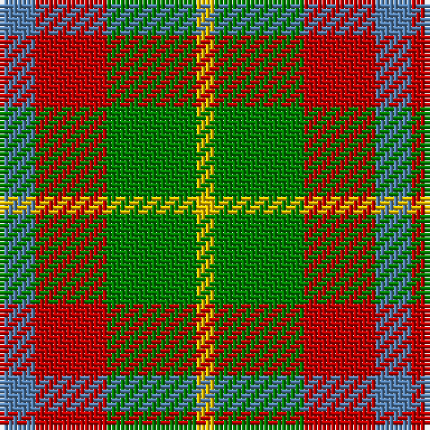

In pattern [BRGY](/patterns/brgy/).

This was sourced from weddslist.  It is a [4 stripes tartan](/stripes/stripes4/).

Original link http://www.weddslist.com/cgi-bin/tartans/pg.pl?source=sts

## Thread count
B/8 R16 G20 Y/4

## Palette
Each colour and its ΔE from the base-6 reference it is a variant of.

| Colour | Shade | Base | ΔE (OKLab) |
|---|---|---|---|
| B | <code style="background-color:#5480B0;">#5480B0</code> `#5480B0` | B <code style="background-color:#2A418A;">#2A418A</code> | 0.19 |
| G | <code style="background-color:#008000;">#008000</code> `#008000` | G <code style="background-color:#006100;">#006100</code> | 0.10 |
| R | <code style="background-color:#C00000;">#C00000</code> `#C00000` | R <code style="background-color:#CC0000;">#CC0000</code> | 0.03 |
| Y | <code style="background-color:#F0C000;">#F0C000</code> `#F0C000` | Y <code style="background-color:#F2BF00;">#F2BF00</code> | 0.00 |

# Sample pattern

## Nearest tartans

The nearest existing variants by ΔTartan distance.

1. [Wilson's No.203](/setts/s4/b2r4g5y1x4~b2888c4-g006818-rc80000-ye8c000/) — ΔT 0.42
1. [Delroeux (Personal)](/setts/s4/b3g6y1r3x10~b2c2c80-g006818-rc80000-yfccc00/) — ΔT 1.19
1. [Wilson's No.195](/setts/s4/r5g7k2b1x4~b2888c4-g006818-k101010-rc80000/) — ΔT 1.30
1. [Wild Mustard Dreams](/setts/s5/y17ya17y17g26b5x2~b2c2c80-g006818-ydc943c-yafccc00/) — ΔT 1.31
1. [Londonderry, County (District)](/setts/s7/r6k2g12y8r5k2g3x4~g006434-k101010-rb84c00-ybc8c00/) — ΔT 1.47
1. [Creek Indian Nation](/setts/s5/b2g4y1b1r2x12~b2c2c80-g006818-rc80000-ye8c000/) — ΔT 1.48
1. [Wilson's, No 179](/setts/s5/g6y1r1b2r2x4~b5480b0-g008000-rc00000-yf0c000/) — ΔT 1.48
1. [Wilson's No.188](/setts/s4/g2r4g2b1x4~b2888c4-g006818-rc80000/) — ΔT 1.50
1. [Unidentified, Silk Plaid](/setts/s5/b7r8g15y6ga3x10~b304080-g008000-ga908000-rf07040-yffe000/) — ΔT 1.52
1. [MacKinnon, dress](/setts/s4/g9r7w7ra1x4~g008000-r703000-rac00000-we0e0e0/) — ΔT 1.52

## Neighbour map

Every grey dot is one of 15726 variants placed by the first two principal components of the ΔTartan feature space (44% of its variance). Red is this tartan; blue dots are its nearest — click one to open its page.

<svg viewBox="0 0 640 380" role="img" style="max-width:100%;height:auto;border:1px solid #e0e0e0;border-radius:4px;display:block" xmlns="http://www.w3.org/2000/svg"><image href="/nn/cloud.v1.png" width="640" height="380"/><a href="/setts/s4/b2r4g5y1x4~b2888c4-g006818-rc80000-ye8c000/"><circle cx="176.0" cy="277.5" r="4" fill="#3465a4"><title>Wilson's No.203</title></circle></a><a href="/setts/s4/b3g6y1r3x10~b2c2c80-g006818-rc80000-yfccc00/"><circle cx="192.8" cy="270.2" r="4" fill="#3465a4"><title>Delroeux (Personal)</title></circle></a><a href="/setts/s4/r5g7k2b1x4~b2888c4-g006818-k101010-rc80000/"><circle cx="231.2" cy="259.5" r="4" fill="#3465a4"><title>Wilson's No.195</title></circle></a><a href="/setts/s5/y17ya17y17g26b5x2~b2c2c80-g006818-ydc943c-yafccc00/"><circle cx="144.8" cy="274.2" r="4" fill="#3465a4"><title>Wild Mustard Dreams</title></circle></a><a href="/setts/s7/r6k2g12y8r5k2g3x4~g006434-k101010-rb84c00-ybc8c00/"><circle cx="183.4" cy="245.1" r="4" fill="#3465a4"><title>Londonderry, County (District)</title></circle></a><a href="/setts/s5/b2g4y1b1r2x12~b2c2c80-g006818-rc80000-ye8c000/"><circle cx="142.1" cy="273.4" r="4" fill="#3465a4"><title>Creek Indian Nation</title></circle></a><a href="/setts/s5/g6y1r1b2r2x4~b5480b0-g008000-rc00000-yf0c000/"><circle cx="243.6" cy="242.5" r="4" fill="#3465a4"><title>Wilson's, No 179</title></circle></a><a href="/setts/s4/g2r4g2b1x4~b2888c4-g006818-rc80000/"><circle cx="239.4" cy="315.0" r="4" fill="#3465a4"><title>Wilson's No.188</title></circle></a><a href="/setts/s5/b7r8g15y6ga3x10~b304080-g008000-ga908000-rf07040-yffe000/"><circle cx="96.0" cy="245.4" r="4" fill="#3465a4"><title>Unidentified, Silk Plaid</title></circle></a><a href="/setts/s4/g9r7w7ra1x4~g008000-r703000-rac00000-we0e0e0/"><circle cx="147.5" cy="249.1" r="4" fill="#3465a4"><title>MacKinnon, dress</title></circle></a><circle cx="179.6" cy="278.4" r="5" fill="#c00000"/></svg>

ID: /setts/s4/b2r4g5y1x4~b5480b0-g008000-rc00000-yf0c000/
