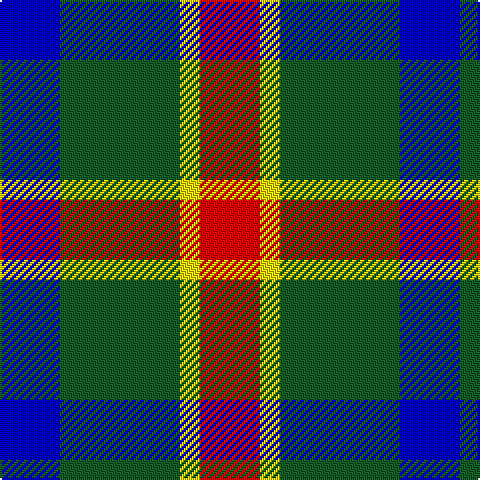

In pattern [BGYR](/patterns/bgyr/).

This was sourced from register-of-tartans.  It is a [4 stripes tartan](/stripes/stripes4/).

Original link https://www.tartanregister.gov.uk/tartanDetails.aspx?ref=10654

## Thread count
B/30 G60 Y10 R/30

## Palette
Each colour and its ΔE from the base-6 reference it is a variant of.

| Colour | Shade | Base | ΔE (OKLab) |
|---|---|---|---|
| B | <code style="background-color:#0000CD;">#0000CD</code> `#0000CD` | B <code style="background-color:#2C4084;">#2C4084</code> | 0.15 |
| G | <code style="background-color:#125D24;">#125D24</code> `#125D24` | G <code style="background-color:#006400;">#006400</code> | 0.04 |
| R | <code style="background-color:#FF0000;">#FF0000</code> `#FF0000` | R <code style="background-color:#C80000;">#C80000</code> | 0.11 |
| Y | <code style="background-color:#FFE600;">#FFE600</code> `#FFE600` | Y <code style="background-color:#E8C000;">#E8C000</code> | 0.10 |

# Sample pattern

ID: /setts/s4/b30g60y10r30-b0000cd-g125d24-rff0000-yffe600/
