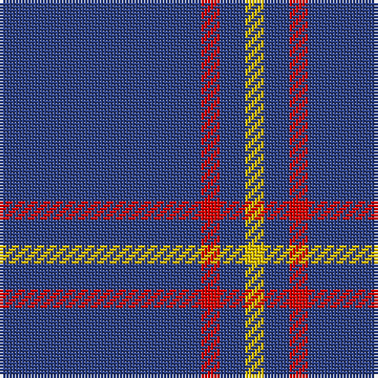

In pattern [BRBY](/patterns/brby/).

This was sourced from register-of-tartans.  It is a [4 stripes tartan](/stripes/stripes4/).

Original link https://www.tartanregister.gov.uk/tartanDetails.aspx?ref=2590

## Register references

External register numbers recorded for this tartan.

- Scottish Register of Tartans: [2590](https://www.tartanregister.gov.uk/tartanDetails.aspx?ref=2590)
- Scottish Tartans World Register: 487

## Thread count
B/64 R6 B8 Y/6

## Palette
Each colour and its ΔE from the base-6 reference it is a variant of.

| Colour | Shade | Base | ΔE (OKLab) |
|---|---|---|---|
| B | <code style="background-color:#2C4084;">#2C4084</code> `#2C4084` | B <code style="background-color:#2A418A;">#2A418A</code> | 0.01 |
| R | <code style="background-color:#DC0000;">#DC0000</code> `#DC0000` | R <code style="background-color:#CC0000;">#CC0000</code> | 0.03 |
| Y | <code style="background-color:#E8C000;">#E8C000</code> `#E8C000` | Y <code style="background-color:#F2BF00;">#F2BF00</code> | 0.02 |

# Sample pattern

## Nearest tartans

The nearest existing variants by ΔTartan distance.

1. [MacLaine of Lochbuie](/setts/s4/b32r3b4y3~b304080-rc00000-yf0c000~x2/) — ΔT 0.20
1. [Gem](/setts/s4/b140r11b14y11~b202060-rc80000-ye8c000/) — ΔT 1.03
1. [Westfield (Corporate?)](/setts/s4/b102y11b14w11~b003c64-we0e0e0-yeca4a4/) — ΔT 1.20
1. [Brooks Brothers Tattersall Blue](/setts/s5/r1b9y2b9y1~b202060-r880000-ya08858~x4/) — ΔT 1.55
1. [Lynch](/setts/s6/r3b2r1b18g1b2~b2c2c80-g007c00-rc80000~x4/) — ΔT 1.72
1. [Coinean Dubh](/setts/s4/b50k12b21w5~b003c64-k101010-wffffff~x2/) — ΔT 1.89
1. [Pearson](/setts/s5/y6b28ba2b28g1~b303070-ba441800-g8c7038-ye8c000~x2/) — ΔT 1.90
1. [Volunteer Lifesaving Corps (Corp.)](/setts/s5/r5w4k4b80w4~b38409c-k101010-rc80000-wf8f8f8~x2/) — ΔT 1.94
1. [Lochaber #3](/setts/s4/b1ba1b8r1~b2c4084-ba3c82af-rdc0000~x2/) — ΔT 1.97
1. [Steffen, Morris (Personal)](/setts/s6/b35w4b10r3ra3r3~b2c2c80-r901c38-rac80000-we0e0e0~x4/) — ΔT 1.98

## Neighbour map

Every grey dot is one of 15726 variants placed by the first two principal components of the ΔTartan feature space (44% of its variance). Red is this tartan; blue dots are its nearest — click one to open its page.

<svg viewBox="0 0 640 380" role="img" style="max-width:100%;height:auto;border:1px solid #e0e0e0;border-radius:4px;display:block" xmlns="http://www.w3.org/2000/svg"><image href="/nn/cloud.v1.png" width="640" height="380"/><a href="/setts/s4/b32r3b4y3~b304080-rc00000-yf0c000~x2/"><circle cx="594.6" cy="246.5" r="4" fill="#3465a4"><title>MacLaine of Lochbuie</title></circle></a><a href="/setts/s4/b140r11b14y11~b202060-rc80000-ye8c000/"><circle cx="614.4" cy="237.4" r="4" fill="#3465a4"><title>Gem</title></circle></a><a href="/setts/s4/b102y11b14w11~b003c64-we0e0e0-yeca4a4/"><circle cx="538.5" cy="247.1" r="4" fill="#3465a4"><title>Westfield (Corporate?)</title></circle></a><a href="/setts/s5/r1b9y2b9y1~b202060-r880000-ya08858~x4/"><circle cx="542.4" cy="271.6" r="4" fill="#3465a4"><title>Brooks Brothers Tattersall Blue</title></circle></a><a href="/setts/s6/r3b2r1b18g1b2~b2c2c80-g007c00-rc80000~x4/"><circle cx="601.0" cy="206.7" r="4" fill="#3465a4"><title>Lynch</title></circle></a><a href="/setts/s4/b50k12b21w5~b003c64-k101010-wffffff~x2/"><circle cx="506.3" cy="279.9" r="4" fill="#3465a4"><title>Coinean Dubh</title></circle></a><a href="/setts/s5/y6b28ba2b28g1~b303070-ba441800-g8c7038-ye8c000~x2/"><circle cx="589.7" cy="201.5" r="4" fill="#3465a4"><title>Pearson</title></circle></a><a href="/setts/s5/r5w4k4b80w4~b38409c-k101010-rc80000-wf8f8f8~x2/"><circle cx="560.0" cy="168.1" r="4" fill="#3465a4"><title>Volunteer Lifesaving Corps (Corp.)</title></circle></a><a href="/setts/s4/b1ba1b8r1~b2c4084-ba3c82af-rdc0000~x2/"><circle cx="589.6" cy="278.2" r="4" fill="#3465a4"><title>Lochaber #3</title></circle></a><a href="/setts/s6/b35w4b10r3ra3r3~b2c2c80-r901c38-rac80000-we0e0e0~x4/"><circle cx="493.1" cy="199.4" r="4" fill="#3465a4"><title>Steffen, Morris (Personal)</title></circle></a><circle cx="589.3" cy="244.9" r="5" fill="#c00000"/></svg>

ID: /setts/s4/b32r3b4y3~b2c4084-rdc0000-ye8c000~x2/
