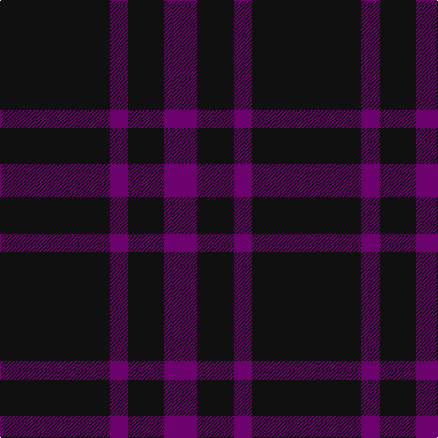

In pattern [BKBK](/patterns/bkbk/).

This was sourced from tartans-authority.  It is a [4 stripes tartan](/stripes/stripes4/).

Original link http://www.tartansauthority.com/tartan-ferret/display/5417/

## Thread count
K/120 P20 K40 P/36

## Palette
Each colour and its ΔE from the base-6 reference it is a variant of.

| Colour | Shade | Base | ΔE (OKLab) |
|---|---|---|---|
| K | <code style="background-color:#101010;">#101010</code> `#101010` | K <code style="background-color:#000000;">#000000</code> | 0.17 |
| P | <code style="background-color:#6C006C;">#6C006C</code> `#6C006C` | B <code style="background-color:#2C4084;">#2C4084</code> | 0.15 |

# Sample pattern

ID: /setts/s4/b36k40b20k120-b6c006c-k101010/
