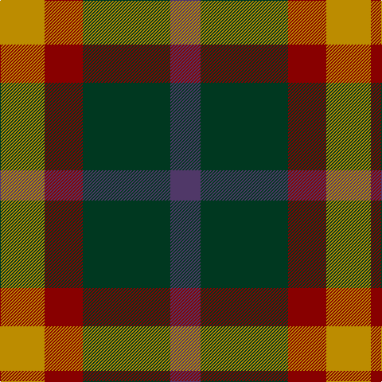

In pattern [BGRY](/patterns/bgry/).

This was sourced from tartans-authority.  It is a [4 stripes tartan](/stripes/stripes4/).

Original link http://www.tartansauthority.com/tartan-ferret/display/8099/

## Thread count
DY/56 DR48 DG110 N/38

## Palette
Each colour and its ΔE from the base-6 reference it is a variant of.

| Colour | Shade | Base | ΔE (OKLab) |
|---|---|---|---|
| DG | <code style="background-color:#003820;">#003820</code> `#003820` | G <code style="background-color:#006400;">#006400</code> | 0.16 |
| DR | <code style="background-color:#880000;">#880000</code> `#880000` | R <code style="background-color:#C80000;">#C80000</code> | 0.14 |
| DY | <code style="background-color:#BC8C00;">#BC8C00</code> `#BC8C00` | Y <code style="background-color:#E8C000;">#E8C000</code> | 0.16 |
| N | <code style="background-color:#503868;">#503868</code> `#503868` | B <code style="background-color:#2C4084;">#2C4084</code> | 0.07 |

# Sample pattern

ID: /setts/s4/b38g110r48y56-b503868-g003820-r880000-ybc8c00/
