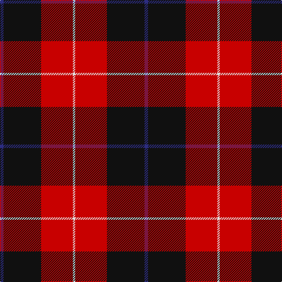

In pattern [BKRW](/patterns/bkrw/).

This was sourced from register-of-tartans.  It is a [4 stripes tartan](/stripes/stripes4/).

Original link https://www.tartanregister.gov.uk/tartanDetails.aspx?ref=4086

## Attestations

This cloth appears in 2 source records; the oldest owns this page.

- 01/01/2005 — Templar Grand Priory USA (register-of-tartans, [record](https://www.tartanregister.gov.uk/tartanDetails.aspx?ref=4086))
- 2005 Jan. — Templar Grand Priory USA (Corporate) (tartans-authority, [record](http://www.tartansauthority.com/tartan-ferret/display/6503/))

## Thread count
DB/6 K64 R54 LN/4

## Palette
Each colour and its ΔE from the base-6 reference it is a variant of.

| Colour | Shade | Base | ΔE (OKLab) |
|---|---|---|---|
| DB | <code style="background-color:#2C2C80;">#2C2C80</code> `#2C2C80` | B <code style="background-color:#2A418A;">#2A418A</code> | 0.06 |
| K | <code style="background-color:#101010;">#101010</code> `#101010` | K <code style="background-color:#000000;">#000000</code> | 0.17 |
| LN | <code style="background-color:#E0E0E0;">#E0E0E0</code> `#E0E0E0` | W <code style="background-color:#F7F7F7;">#F7F7F7</code> | 0.07 |
| R | <code style="background-color:#C80000;">#C80000</code> `#C80000` | R <code style="background-color:#CC0000;">#CC0000</code> | 0.01 |

# Sample pattern

## Nearest tartans

The nearest existing variants by ΔTartan distance.

1. [Billy Apple](/setts/s4/g1r8k13y1~g006818-k101010-rc80000-yfccc00~x6/) — ΔT 0.79
1. [Skinner](/setts/s4/b1r16k16y1~b304080-k000000-rc00000-yf0c000~x4/) — ΔT 1.01
1. [Cetoloni (Personal)](/setts/s6/b1r12k6y1k6b1~b2c2c80-k101010-rc80000-ye8c000~x4/) — ΔT 1.09
1. [Ramsay Red Clan Tartan Tartan Number: 1238. Earliest known date: 1842 Ramsay was one of the names adopted by members of the Clan MacGregor when their own was proscribed. It is not surprising then that an early MacGregor sett was used as a basis for the Ramsay tartan. It is possible that the tartan was in existance long before the earliest recorded date given. See products available Copyright © Blair Urquhart, Comrie, 2015](/setts/s6/r5ra2r30k28w2k4~k101010-rc80000-raa00048-we0e0e0~x2/) — ΔT 1.13
1. [Wormeck (2013) Germany](/setts/s5/b4y4r33k30w2~b271b86-k120a01-ra90725-wf7f1e8-yebaa57~x2/) — ΔT 1.18
1. [MacIver](/setts/s5/k16r2k2r12w1~k101010-rdc0000-we0e0e0~x2/) — ΔT 1.20
1. [Skinner (Name)](/setts/s4/b1r8k8y1~b2c2c80-k101010-rc80000-yd09800~x4/) — ΔT 1.23
1. [Fraser](/setts/s6/r2b12r2g12r24w1~b000050-g003000-rc00000-we0e0e0~x2/) — ΔT 1.24
1. [Oklahoma State University (Corporate](/setts/s4/r80k52w7ra12~k101010-rd04804-ra888888-we0e0e0/) — ΔT 1.24
1. [Brodie (Clan)](/setts/s6/k2r16k8y1k8r2~k101010-rc80000-yd8b000~x4/) — ΔT 1.33

## Neighbour map

Every grey dot is one of 15726 variants placed by the first two principal components of the ΔTartan feature space (44% of its variance). Red is this tartan; blue dots are its nearest — click one to open its page.

<svg viewBox="0 0 640 380" role="img" style="max-width:100%;height:auto;border:1px solid #e0e0e0;border-radius:4px;display:block" xmlns="http://www.w3.org/2000/svg"><image href="/nn/cloud.v1.png" width="640" height="380"/><a href="/setts/s4/g1r8k13y1~g006818-k101010-rc80000-yfccc00~x6/"><circle cx="331.3" cy="212.2" r="4" fill="#3465a4"><title>Billy Apple</title></circle></a><a href="/setts/s4/b1r16k16y1~b304080-k000000-rc00000-yf0c000~x4/"><circle cx="298.0" cy="199.0" r="4" fill="#3465a4"><title>Skinner</title></circle></a><a href="/setts/s6/b1r12k6y1k6b1~b2c2c80-k101010-rc80000-ye8c000~x4/"><circle cx="272.4" cy="191.3" r="4" fill="#3465a4"><title>Cetoloni (Personal)</title></circle></a><a href="/setts/s6/r5ra2r30k28w2k4~k101010-rc80000-raa00048-we0e0e0~x2/"><circle cx="325.0" cy="173.8" r="4" fill="#3465a4"><title>Ramsay Red Clan Tartan Tartan Number: 1238. Earliest known date: 1842 Ramsay was one of the names adopted by members of the Clan MacGregor when their own was proscribed. It is not surprising then that an early MacGregor sett was used as a basis for the Ramsay tartan. It is possible that the tartan was in existance long before the earliest recorded date given. See products available Copyright © Blair Urquhart, Comrie, 2015</title></circle></a><a href="/setts/s5/b4y4r33k30w2~b271b86-k120a01-ra90725-wf7f1e8-yebaa57~x2/"><circle cx="266.7" cy="166.9" r="4" fill="#3465a4"><title>Wormeck (2013) Germany</title></circle></a><a href="/setts/s5/k16r2k2r12w1~k101010-rdc0000-we0e0e0~x2/"><circle cx="359.6" cy="202.3" r="4" fill="#3465a4"><title>MacIver</title></circle></a><a href="/setts/s4/b1r8k8y1~b2c2c80-k101010-rc80000-yd09800~x4/"><circle cx="257.7" cy="233.0" r="4" fill="#3465a4"><title>Skinner (Name)</title></circle></a><a href="/setts/s6/r2b12r2g12r24w1~b000050-g003000-rc00000-we0e0e0~x2/"><circle cx="321.1" cy="165.0" r="4" fill="#3465a4"><title>Fraser</title></circle></a><a href="/setts/s4/r80k52w7ra12~k101010-rd04804-ra888888-we0e0e0/"><circle cx="289.0" cy="211.9" r="4" fill="#3465a4"><title>Oklahoma State University (Corporate</title></circle></a><a href="/setts/s6/k2r16k8y1k8r2~k101010-rc80000-yd8b000~x4/"><circle cx="340.6" cy="204.2" r="4" fill="#3465a4"><title>Brodie (Clan)</title></circle></a><circle cx="314.6" cy="204.6" r="5" fill="#c00000"/></svg>

ID: /setts/s4/b3k32r27w2~b2c2c80-k101010-rc80000-we0e0e0~x2/
