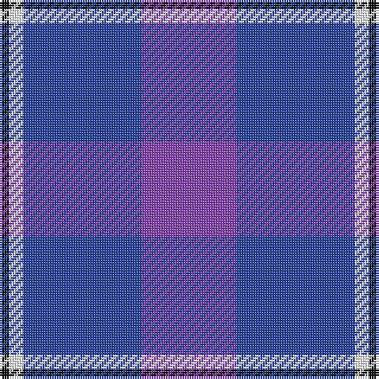

In pattern [BBWK](/patterns/bbwk/).

This was sourced from register-of-tartans.  It is a [4 stripes tartan](/stripes/stripes4/).

Original link https://www.tartanregister.gov.uk/tartanDetails.aspx?ref=5368

## Thread count
K/4 W6 B50 LP/40

## Palette
Each colour and its ΔE from the base-6 reference it is a variant of.

| Colour | Shade | Base | ΔE (OKLab) |
|---|---|---|---|
| B | <code style="background-color:#28429F;">#28429F</code> `#28429F` | B <code style="background-color:#2A418A;">#2A418A</code> | 0.03 |
| K | <code style="background-color:#101010;">#101010</code> `#101010` | K <code style="background-color:#000000;">#000000</code> | 0.17 |
| LP | <code style="background-color:#8642AF;">#8642AF</code> `#8642AF` | B <code style="background-color:#2A418A;">#2A418A</code> | 0.16 |
| W | <code style="background-color:#FFFFFF;">#FFFFFF</code> `#FFFFFF` | W <code style="background-color:#F7F7F7;">#F7F7F7</code> | 0.02 |

# Sample pattern

## Nearest tartans

The nearest existing variants by ΔTartan distance.

1. [Murdoch, Ellis (Personal)](/setts/s4/b40ba50w6k4-b780078-ba3838a4-k101010-we0e0e0/) — ΔT 0.86
1. [Cathro (Name)](/setts/s5/b72ba48w8g32b16-b9050d8-ba1474b4-g006818-we0e0e0/) — ΔT 1.45
1. [Cathro](/setts/s5/b36ba24w4g16b8-b5a008c-ba2c4084-g003c14-we0e0e0/) — ΔT 1.48
1. [Joker, The](/setts/s6/b36k4b8k12ba24y2-b1474b4-ba780078-k101010-yd87c00/) — ΔT 1.72
1. [Fong (Personal)](/setts/s4/r21b43ba86w10-b1c0070-ba003c64-rc8002c-we8ccb8/) — ΔT 1.81
1. [MacNeil - 1994 (Personal)](/setts/s5/b60k24ba24k4w6-b3850c8-ba003c64-k101010-wfcfcfc/) — ΔT 1.83
1. [McIntosh, Georgina (Personal)](/setts/s6/b108w12g24w12ba48r12-b9050d8-ba2c2c80-g006818-rc80000-w98c8e8/) — ΔT 1.87
1. [Joker Fancy Tartan Tartan Number: 6769. Earliest known date: 2005 I have a photo of a fabric swatch that I am trying to match as close as possible. I have been commissioned to make a life size mannequin of Jack Nicholson as the Joker and he wore plaid/tartan pants. I could send you some photos through email and possibly you could help me. Thanks, Andy Garringer USA, January 2008. (96 threads @ 40 epi heavyweight = 2.5 inch repeat) See products available Copyright © Blair Urquhart, Comrie, 2015](/setts/s6/b22k2b6k10ba18y2-b1870a4-ba4c0470-k101010-yd87c00/) — ΔT 1.89
1. [Ewell Castle School](/setts/s6/b16w4b72ba72r4ba16-b1474b4-ba202060-rc80000-wfcfcfc/) — ΔT 1.90
1. [Gilt Edge (Corporate)](/setts/s5/b6ba4bb62b68w4-b202060-ba2c2c80-bb2888c4-we0e0e0/) — ΔT 1.90

## Neighbour map

Every grey dot is one of 15726 variants placed by the first two principal components of the ΔTartan feature space (44% of its variance). Red is this tartan; blue dots are its nearest — click one to open its page.

<svg viewBox="0 0 640 380" role="img" style="max-width:100%;height:auto;border:1px solid #e0e0e0;border-radius:4px;display:block" xmlns="http://www.w3.org/2000/svg"><image href="/nn/cloud.v1.png" width="640" height="380"/><a href="/setts/s4/b40ba50w6k4-b780078-ba3838a4-k101010-we0e0e0/"><circle cx="340.1" cy="237.9" r="4" fill="#3465a4"><title>Murdoch, Ellis (Personal)</title></circle></a><a href="/setts/s5/b72ba48w8g32b16-b9050d8-ba1474b4-g006818-we0e0e0/"><circle cx="268.6" cy="247.1" r="4" fill="#3465a4"><title>Cathro (Name)</title></circle></a><a href="/setts/s5/b36ba24w4g16b8-b5a008c-ba2c4084-g003c14-we0e0e0/"><circle cx="285.9" cy="258.4" r="4" fill="#3465a4"><title>Cathro</title></circle></a><a href="/setts/s6/b36k4b8k12ba24y2-b1474b4-ba780078-k101010-yd87c00/"><circle cx="303.5" cy="196.0" r="4" fill="#3465a4"><title>Joker, The</title></circle></a><a href="/setts/s4/r21b43ba86w10-b1c0070-ba003c64-rc8002c-we8ccb8/"><circle cx="290.0" cy="254.4" r="4" fill="#3465a4"><title>Fong (Personal)</title></circle></a><a href="/setts/s5/b60k24ba24k4w6-b3850c8-ba003c64-k101010-wfcfcfc/"><circle cx="276.5" cy="207.9" r="4" fill="#3465a4"><title>MacNeil - 1994 (Personal)</title></circle></a><a href="/setts/s6/b108w12g24w12ba48r12-b9050d8-ba2c2c80-g006818-rc80000-w98c8e8/"><circle cx="245.8" cy="184.1" r="4" fill="#3465a4"><title>McIntosh, Georgina (Personal)</title></circle></a><a href="/setts/s6/b22k2b6k10ba18y2-b1870a4-ba4c0470-k101010-yd87c00/"><circle cx="260.5" cy="224.4" r="4" fill="#3465a4"><title>Joker Fancy Tartan Tartan Number: 6769. Earliest known date: 2005 I have a photo of a fabric swatch that I am trying to match as close as possible. I have been commissioned to make a life size mannequin of Jack Nicholson as the Joker and he wore plaid/tartan pants. I could send you some photos through email and possibly you could help me. Thanks, Andy Garringer USA, January 2008. (96 threads @ 40 epi heavyweight = 2.5 inch repeat) See products available Copyright © Blair Urquhart, Comrie, 2015</title></circle></a><a href="/setts/s6/b16w4b72ba72r4ba16-b1474b4-ba202060-rc80000-wfcfcfc/"><circle cx="341.6" cy="199.4" r="4" fill="#3465a4"><title>Ewell Castle School</title></circle></a><a href="/setts/s5/b6ba4bb62b68w4-b202060-ba2c2c80-bb2888c4-we0e0e0/"><circle cx="342.0" cy="198.0" r="4" fill="#3465a4"><title>Gilt Edge (Corporate)</title></circle></a><circle cx="324.1" cy="234.2" r="5" fill="#c00000"/></svg>

ID: /setts/s4/b40ba50w6k4-b8642af-ba28429f-k101010-wffffff/
