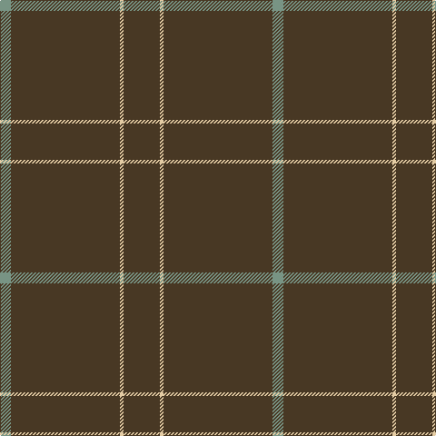

In pattern [BYBG](/patterns/bybg/).

This was sourced from register-of-tartans.  It is a [4 stripes tartan](/stripes/stripes4/).

Original link https://www.tartanregister.gov.uk/tartanDetails.aspx?ref=3299

## Thread count
LG/12 T120 LR4 T/40

## Palette
Each colour and its ΔE from the base-6 reference it is a variant of.

| Colour | Shade | Base | ΔE (OKLab) |
|---|---|---|---|
| LG | <code style="background-color:#789484;">#789484</code> `#789484` | G <code style="background-color:#006400;">#006400</code> | 0.23 |
| LR | <code style="background-color:#E4CCA4;">#E4CCA4</code> `#E4CCA4` | Y <code style="background-color:#E8C000;">#E8C000</code> | 0.12 |
| T | <code style="background-color:#483824;">#483824</code> `#483824` | B <code style="background-color:#2C4084;">#2C4084</code> | 0.16 |

# Sample pattern

ID: /setts/s4/b40y4b120g12-b483824-g789484-ye4cca4/
