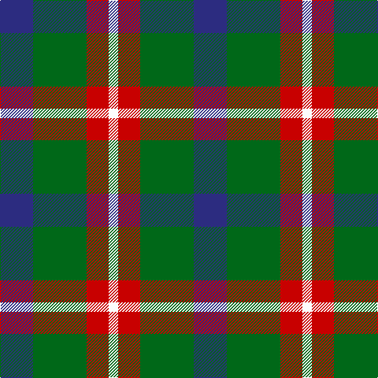

In pattern [BGRW](/patterns/bgrw/).

This was sourced from tartans-authority.  It is a [4 stripes tartan](/stripes/stripes4/).

Original link http://www.tartansauthority.com/tartan-ferret/display/11268/

## Thread count
DB/42 G68 R28 W/12

## Palette
Each colour and its ΔE from the base-6 reference it is a variant of.

| Colour | Shade | Base | ΔE (OKLab) |
|---|---|---|---|
| DB | <code style="background-color:#2C2C80;">#2C2C80</code> `#2C2C80` | B <code style="background-color:#2C4084;">#2C4084</code> | 0.05 |
| G | <code style="background-color:#006818;">#006818</code> `#006818` | G <code style="background-color:#006400;">#006400</code> | 0.02 |
| R | <code style="background-color:#C80000;">#C80000</code> `#C80000` | R <code style="background-color:#C80000;">#C80000</code> | 0.00 |
| W | <code style="background-color:#FCFCFC;">#FCFCFC</code> `#FCFCFC` | W <code style="background-color:#F4F4F0;">#F4F4F0</code> | 0.03 |

# Sample pattern

## Nearest tartans

The nearest existing variants by ΔTartan distance.

1. [Delroeux, John Michael (Personal)](/setts/s4/b30g60y10r30-b0000cd-g125d24-rff0000-yffe600/) — ΔT 0.57
1. [Delroeux (Personal)](/setts/s4/b30g60y10r30-b2c2c80-g006818-rc80000-yfccc00/) — ΔT 0.64
1. [Harbison (2015)](/setts/s4/g42b68r28w12-b202060-g146400-rc80000-wffffff/) — ΔT 0.82
1. [Creek Indian Nation](/setts/s5/b24g48y12b12r24-b2c2c80-g006818-rc80000-ye8c000/) — ΔT 0.93
1. [Delroeux, John Michael Name Tartan Tartan Number: 10654. Earliest known date: 25/06/1985 Designed by Jean Michael Delroeux to show his affinity with Scotland. Colours: red, yellow and blue appear in the Delroeux coat of arms; green is for the landscapes of Scotland. See products available Copyright © Blair Urquhart, Comrie, 2015](/setts/s4/b30g60y10r30-b0000cd-g008b00-rff0000-yffe600/) — ΔT 0.97
1. [Thompson, Dress (Clan)](/setts/s4/r12ra64k64w12-k101010-r880000-ra888888-wc0c0c0/) — ΔT 1.08
1. [MacNab 7](/setts/s4/g30r6b22ba4-b800080-ba5480b0-g008000-rc00000/) — ΔT 1.18
1. [Loganair](/setts/s4/r10ra64k62w10-k101010-r880000-ra888888-we0e0e0/) — ΔT 1.24
1. [Waterloo](/setts/s6/g6ga12k12g8r2g2-g789484-ga003820-k101010-rc80000/) — ΔT 1.25
1. [Oban Grey](/setts/s5/k16w12k16g36r4-g808080-k101010-rdc0000-we0e0e0/) — ΔT 1.25

## Neighbour map

Every grey dot is one of 15726 variants placed by the first two principal components of the ΔTartan feature space (44% of its variance). Red is this tartan; blue dots are its nearest — click one to open its page.

<svg viewBox="0 0 640 380" role="img" style="max-width:100%;height:auto;border:1px solid #e0e0e0;border-radius:4px;display:block" xmlns="http://www.w3.org/2000/svg"><image href="/nn/cloud.v1.png" width="640" height="380"/><a href="/setts/s4/b30g60y10r30-b0000cd-g125d24-rff0000-yffe600/"><circle cx="170.5" cy="258.1" r="4" fill="#3465a4"><title>Delroeux, John Michael (Personal)</title></circle></a><a href="/setts/s4/b30g60y10r30-b2c2c80-g006818-rc80000-yfccc00/"><circle cx="194.5" cy="269.1" r="4" fill="#3465a4"><title>Delroeux (Personal)</title></circle></a><a href="/setts/s4/g42b68r28w12-b202060-g146400-rc80000-wffffff/"><circle cx="175.3" cy="266.2" r="4" fill="#3465a4"><title>Harbison (2015)</title></circle></a><a href="/setts/s5/b24g48y12b12r24-b2c2c80-g006818-rc80000-ye8c000/"><circle cx="143.7" cy="273.0" r="4" fill="#3465a4"><title>Creek Indian Nation</title></circle></a><a href="/setts/s4/b30g60y10r30-b0000cd-g008b00-rff0000-yffe600/"><circle cx="163.1" cy="255.6" r="4" fill="#3465a4"><title>Delroeux, John Michael Name Tartan Tartan Number: 10654. Earliest known date: 25/06/1985 Designed by Jean Michael Delroeux to show his affinity with Scotland. Colours: red, yellow and blue appear in the Delroeux coat of arms; green is for the landscapes of Scotland. See products available Copyright © Blair Urquhart, Comrie, 2015</title></circle></a><a href="/setts/s4/r12ra64k64w12-k101010-r880000-ra888888-wc0c0c0/"><circle cx="191.9" cy="253.9" r="4" fill="#3465a4"><title>Thompson, Dress (Clan)</title></circle></a><a href="/setts/s4/g30r6b22ba4-b800080-ba5480b0-g008000-rc00000/"><circle cx="251.6" cy="248.0" r="4" fill="#3465a4"><title>MacNab 7</title></circle></a><a href="/setts/s4/r10ra64k62w10-k101010-r880000-ra888888-we0e0e0/"><circle cx="209.3" cy="242.1" r="4" fill="#3465a4"><title>Loganair</title></circle></a><a href="/setts/s6/g6ga12k12g8r2g2-g789484-ga003820-k101010-rc80000/"><circle cx="155.3" cy="252.6" r="4" fill="#3465a4"><title>Waterloo</title></circle></a><a href="/setts/s5/k16w12k16g36r4-g808080-k101010-rdc0000-we0e0e0/"><circle cx="186.4" cy="225.1" r="4" fill="#3465a4"><title>Oban Grey</title></circle></a><circle cx="177.9" cy="268.2" r="5" fill="#c00000"/></svg>

ID: /setts/s4/b42g68r28w12-b2c2c80-g006818-rc80000-wfcfcfc/
