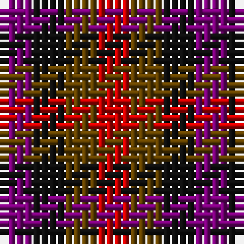

In pattern [BKGR](/patterns/bkgr/).

This was sourced from tartans-authority.  It is a [4 stripes tartan](/stripes/stripes4/).

Original link http://www.tartansauthority.com/tartan-ferret/display/5972/

## Thread count
P/4 K4 T4 R/4

## Palette
Each colour and its ΔE from the base-6 reference it is a variant of.

| Colour | Shade | Base | ΔE (OKLab) |
|---|---|---|---|
| K | <code style="background-color:#101010;">#101010</code> `#101010` | K <code style="background-color:#000000;">#000000</code> | 0.17 |
| P | <code style="background-color:#780078;">#780078</code> `#780078` | B <code style="background-color:#2C4084;">#2C4084</code> | 0.16 |
| R | <code style="background-color:#C80000;">#C80000</code> `#C80000` | R <code style="background-color:#C80000;">#C80000</code> | 0.00 |
| T | <code style="background-color:#604000;">#604000</code> `#604000` | G <code style="background-color:#006400;">#006400</code> | 0.14 |

# Sample pattern

## Nearest tartans

The nearest existing variants by ΔTartan distance.

1. [Ballindalloch Check](/setts/s5/b8r8b8r8g8-b4c0c28-g004c00-ra0783c/) — ΔT 2.40
1. [Highland Princess, The](/setts/s5/b30g30y22r34ra30-b1870a4-g006818-rc80000-rac04094-yd87c00/) — ΔT 2.44
1. [Antonello (Personal)](/setts/s6/b24g24b24r24ba24k24-b202060-ba2888c4-g006818-k101010-rc80000/) — ΔT 2.57
1. [Wilson's No.185](/setts/s3/k22g18b20-b780078-g006818-k101010/) — ΔT 2.57
1. [Algarve](/setts/s4/b20w20r20g20-b2c2c80-g285800-rc80000-we0e0e0/) — ΔT 2.60
1. [Wilson's No.204](/setts/s3/k22g18r20-g006818-k101010-rc80000/) — ΔT 2.61
1. [Usa](/setts/s3/b4y4r4-b000052-raa0000-yaaaaaa/) — ΔT 2.64
1. [Highland Princess, The](/setts/s5/b30g30r22ra34rb30-b1870a4-g289c18-re86000-rac80000-rbec34c4/) — ΔT 2.67
1. [Mothers Pride](/setts/s3/r40b40y40-b304080-rc00000-yf0c000/) — ΔT 2.84
1. [Dacre Estate Check](/setts/s3/k14w14r14-k101010-r800028-wf0e0c4/) — ΔT 2.92

## Neighbour map

Every grey dot is one of 15726 variants placed by the first two principal components of the ΔTartan feature space (44% of its variance). Red is this tartan; blue dots are its nearest — click one to open its page.

<svg viewBox="0 0 640 380" role="img" style="max-width:100%;height:auto;border:1px solid #e0e0e0;border-radius:4px;display:block" xmlns="http://www.w3.org/2000/svg"><image href="/nn/cloud.v1.png" width="640" height="380"/><a href="/setts/s5/b8r8b8r8g8-b4c0c28-g004c00-ra0783c/"><circle cx="71.8" cy="366.0" r="4" fill="#3465a4"><title>Ballindalloch Check</title></circle></a><a href="/setts/s5/b30g30y22r34ra30-b1870a4-g006818-rc80000-rac04094-yd87c00/"><circle cx="14.0" cy="357.1" r="4" fill="#3465a4"><title>Highland Princess, The</title></circle></a><a href="/setts/s6/b24g24b24r24ba24k24-b202060-ba2888c4-g006818-k101010-rc80000/"><circle cx="14.0" cy="366.0" r="4" fill="#3465a4"><title>Antonello (Personal)</title></circle></a><a href="/setts/s3/k22g18b20-b780078-g006818-k101010/"><circle cx="80.7" cy="366.0" r="4" fill="#3465a4"><title>Wilson's No.185</title></circle></a><a href="/setts/s4/b20w20r20g20-b2c2c80-g285800-rc80000-we0e0e0/"><circle cx="14.0" cy="366.0" r="4" fill="#3465a4"><title>Algarve</title></circle></a><a href="/setts/s3/k22g18r20-g006818-k101010-rc80000/"><circle cx="67.9" cy="366.0" r="4" fill="#3465a4"><title>Wilson's No.204</title></circle></a><a href="/setts/s3/b4y4r4-b000052-raa0000-yaaaaaa/"><circle cx="14.0" cy="366.0" r="4" fill="#3465a4"><title>Usa</title></circle></a><a href="/setts/s5/b30g30r22ra34rb30-b1870a4-g289c18-re86000-rac80000-rbec34c4/"><circle cx="14.0" cy="344.5" r="4" fill="#3465a4"><title>Highland Princess, The</title></circle></a><a href="/setts/s3/r40b40y40-b304080-rc00000-yf0c000/"><circle cx="14.0" cy="366.0" r="4" fill="#3465a4"><title>Mothers Pride</title></circle></a><a href="/setts/s3/k14w14r14-k101010-r800028-wf0e0c4/"><circle cx="14.0" cy="366.0" r="4" fill="#3465a4"><title>Dacre Estate Check</title></circle></a><circle cx="14.0" cy="366.0" r="5" fill="#c00000"/></svg>

ID: /setts/s4/b4k4g4r4-b780078-g604000-k101010-rc80000/
