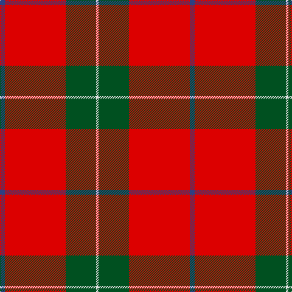

In pattern [BRGW](/patterns/brgw/).

This was sourced from register-of-tartans.  It is a [4 stripes tartan](/stripes/stripes4/).

Original link https://www.tartanregister.gov.uk/tartanDetails.aspx?ref=4310

## Thread count
B/8 R100 G50 LN/4

## Palette
Each colour and its ΔE from the base-6 reference it is a variant of.

| Colour | Shade | Base | ΔE (OKLab) |
|---|---|---|---|
| B | <code style="background-color:#2C4084;">#2C4084</code> `#2C4084` | B <code style="background-color:#2A418A;">#2A418A</code> | 0.01 |
| G | <code style="background-color:#005020;">#005020</code> `#005020` | G <code style="background-color:#006100;">#006100</code> | 0.07 |
| LN | <code style="background-color:#E0E0E0;">#E0E0E0</code> `#E0E0E0` | W <code style="background-color:#F7F7F7;">#F7F7F7</code> | 0.07 |
| R | <code style="background-color:#DC0000;">#DC0000</code> `#DC0000` | R <code style="background-color:#CC0000;">#CC0000</code> | 0.03 |

# Sample pattern

## Nearest tartans

The nearest existing variants by ΔTartan distance.

1. [Unidentified, Locket](/setts/s4/b4r50g25w2~b304080-g008000-rc00000-we0e0e0~x2/) — ΔT 0.70
1. [Greig (Personal)](/setts/s6/r60k2w3g20r10g20~g003820-k101010-rc80000-we0e0e0~x2/) — ΔT 1.03
1. [MacGregor](/setts/s6/r35g16r5g5w2k3~g005020-k101010-rdc0000-we0e0e0~x2/) — ΔT 1.07
1. [MacGregor #3](/setts/s6/r36g18r4g6k1w2~g005020-k101010-rdc0000-we0e0e0~x2/) — ΔT 1.12
1. [Broberg (Scania) (Personal)](/setts/s4/r80b40k5y6~b5c8ca8-k101010-ra00000-yd09800/) — ΔT 1.20
1. [MacLaine of Lochbuie](/setts/s4/r32g8w4y1~g004c00-rc80000-wd0d0d0-yffc800/) — ΔT 1.22
1. [MacGregor](/setts/s6/r36g18r4g6k1w2~g004c00-k000000-rc80000-wd0d0d0~x2/) — ΔT 1.23
1. [MacGregor #4](/setts/s6/r41g19r7g8k1w3~g006818-k101010-rc80000-wfcfcfc~x2/) — ΔT 1.26
1. [MacGregor Clan Tartan Tartan Number: 1526. Earliest known date: 1815 A sample of this tartan can be seen in the Cockburn Collection (1810-20) in the Mitchell library in Glasgow. MacGregor is one of the patterns labelled in 1815 in General Cockburn's hand writing. The same pattern is recorded by Wilson in the Key pattern book dating 1819 under the name 'MacGregor Murray Tartan'. Logan (1831) calls it simply 'MacGregor'. There is also a certified MacGregor tartan (for undress) called 'Rob Roy', a simple red and black check. See products available Copyright © Blair Urquhart, Comrie, 2015](/setts/s6/r36g18r4g6k1w2~g006818-k101010-rc80000-we0e0e0~x2/) — ΔT 1.28
1. [MacKintosh #2](/setts/s6/r68b18r9g34r9b3~b2c4084-g005020-rdc0000~x2/) — ΔT 1.28

## Neighbour map

Every grey dot is one of 15726 variants placed by the first two principal components of the ΔTartan feature space (44% of its variance). Red is this tartan; blue dots are its nearest — click one to open its page.

<svg viewBox="0 0 640 380" role="img" style="max-width:100%;height:auto;border:1px solid #e0e0e0;border-radius:4px;display:block" xmlns="http://www.w3.org/2000/svg"><image href="/nn/cloud.v1.png" width="640" height="380"/><a href="/setts/s4/b4r50g25w2~b304080-g008000-rc00000-we0e0e0~x2/"><circle cx="420.4" cy="185.7" r="4" fill="#3465a4"><title>Unidentified, Locket</title></circle></a><a href="/setts/s6/r60k2w3g20r10g20~g003820-k101010-rc80000-we0e0e0~x2/"><circle cx="419.9" cy="155.5" r="4" fill="#3465a4"><title>Greig (Personal)</title></circle></a><a href="/setts/s6/r35g16r5g5w2k3~g005020-k101010-rdc0000-we0e0e0~x2/"><circle cx="388.0" cy="165.8" r="4" fill="#3465a4"><title>MacGregor</title></circle></a><a href="/setts/s6/r36g18r4g6k1w2~g005020-k101010-rdc0000-we0e0e0~x2/"><circle cx="422.5" cy="139.2" r="4" fill="#3465a4"><title>MacGregor #3</title></circle></a><a href="/setts/s4/r80b40k5y6~b5c8ca8-k101010-ra00000-yd09800/"><circle cx="406.8" cy="206.3" r="4" fill="#3465a4"><title>Broberg (Scania) (Personal)</title></circle></a><a href="/setts/s4/r32g8w4y1~g004c00-rc80000-wd0d0d0-yffc800/"><circle cx="492.2" cy="162.6" r="4" fill="#3465a4"><title>MacLaine of Lochbuie</title></circle></a><a href="/setts/s6/r36g18r4g6k1w2~g004c00-k000000-rc80000-wd0d0d0~x2/"><circle cx="426.3" cy="143.7" r="4" fill="#3465a4"><title>MacGregor</title></circle></a><a href="/setts/s6/r41g19r7g8k1w3~g006818-k101010-rc80000-wfcfcfc~x2/"><circle cx="428.9" cy="142.0" r="4" fill="#3465a4"><title>MacGregor #4</title></circle></a><a href="/setts/s6/r36g18r4g6k1w2~g006818-k101010-rc80000-we0e0e0~x2/"><circle cx="431.6" cy="145.2" r="4" fill="#3465a4"><title>MacGregor Clan Tartan Tartan Number: 1526. Earliest known date: 1815 A sample of this tartan can be seen in the Cockburn Collection (1810-20) in the Mitchell library in Glasgow. MacGregor is one of the patterns labelled in 1815 in General Cockburn's hand writing. The same pattern is recorded by Wilson in the Key pattern book dating 1819 under the name 'MacGregor Murray Tartan'. Logan (1831) calls it simply 'MacGregor'. There is also a certified MacGregor tartan (for undress) called 'Rob Roy', a simple red and black check. See products available Copyright © Blair Urquhart, Comrie, 2015</title></circle></a><a href="/setts/s6/r68b18r9g34r9b3~b2c4084-g005020-rdc0000~x2/"><circle cx="413.3" cy="184.8" r="4" fill="#3465a4"><title>MacKintosh #2</title></circle></a><circle cx="415.5" cy="180.3" r="5" fill="#c00000"/></svg>

ID: /setts/s4/b4r50g25w2~b2c4084-g005020-rdc0000-we0e0e0~x2/
