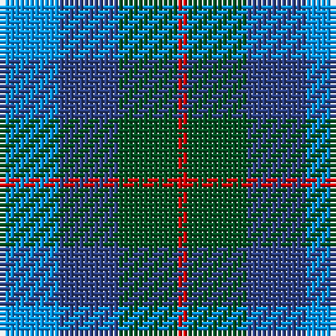

This page is one **sett** — a single exact thread-count. It belongs to the [tartan](/tartans/b6db6dg6r1/)
(the same proportion at any scale), whose colour order is pattern [BBGR](/stripes/bbgr/).

Sourced from register-of-tartans.  It is a [4 stripe tartan](/stripes/stripes4/).

Original link https://www.tartanregister.gov.uk/tartanDetails.aspx?ref=4325

## Register references

External register numbers recorded for this tartan.

- Scottish Register of Tartans: [4325](https://www.tartanregister.gov.uk/tartanDetails.aspx?ref=4325)
- Scottish Tartans World Register: 1897

## Thread count
B/12 Ba12 G12 R/2

## Palette

Palette: <strong>Tartan Register</strong>
<table><thead><tr><th>Colour</th><th>Threads</th><th>Shade</th><th>Base</th><th>OKLCh</th></tr></thead><tbody><tr><td>B/</td><td style="text-align:right;font-variant-numeric:tabular-nums">12</td><td><code style="background-color:#0596FA;">#0596FA</code> <small style="color:#888">#0596FA</small></td><td>B <code style="background-color:#2A418A;">#2A418A</code></td><td><small style="color:#888">oklch(66.0% 0.180 248.9)</small></td></tr><tr><td>Ba</td><td style="text-align:right;font-variant-numeric:tabular-nums">12</td><td><code style="background-color:#2C4084;">#2C4084</code> <small style="color:#888">#2C4084</small></td><td>B <code style="background-color:#2A418A;">#2A418A</code></td><td><small style="color:#888">oklch(39.4% 0.117 268.3)</small></td></tr><tr><td>G</td><td style="text-align:right;font-variant-numeric:tabular-nums">12</td><td><code style="background-color:#005020;">#005020</code> <small style="color:#888">#005020</small></td><td>G <code style="background-color:#006100;">#006100</code></td><td><small style="color:#888">oklch(37.7% 0.105 149.6)</small></td></tr><tr><td>R/</td><td style="text-align:right;font-variant-numeric:tabular-nums">2</td><td><code style="background-color:#DC0000;">#DC0000</code> <small style="color:#888">#DC0000</small></td><td>R <code style="background-color:#CC0000;">#CC0000</code></td><td><small style="color:#888">oklch(56.2% 0.230 29.2)</small></td></tr></tbody></table>

# Sample pattern

## Nearest tartans

The nearest existing variants by ΔTartan distance, with this tartan at the top so the swatches line up against it.

ΔTartan

Tartan

Sett

—

<a href="/ttd/edit/#slug=b6db6dg6r1~x2">Unidentified No 40</a> <a class="nn-out" href="/setts/s4/b6db6dg6r1~x2/" title="open its dictionary page">↗</a>

0.87

<a href="/ttd/edit/#slug=b6db6g6r1~x2">Unnamed No 40</a> <a class="nn-out" href="/setts/s4/b6db6g6r1~x2/" title="open its dictionary page">↗</a>

0.91

<a href="/ttd/edit/#slug=t6db6g6r1~x2">Norwich No.040</a> <a class="nn-out" href="/setts/s4/t6db6g6r1~x2/" title="open its dictionary page">↗</a>

1.51

<a href="/ttd/edit/#slug=b3k2b8db8g8db2~x2">Black Watch (Pendleton)</a> <a class="nn-out" href="/setts/s6/b3k2b8db8g8db2~x2/" title="open its dictionary page">↗</a>

1.63

<a href="/ttd/edit/#slug=b3k4b4g9k2~x4">Falconer</a> <a class="nn-out" href="/setts/s5/b3k4b4g9k2~x4/" title="open its dictionary page">↗</a>

1.72

<a href="/ttd/edit/#slug=db3g11t2db11b6g3~x2">Unnamed, No 29</a> <a class="nn-out" href="/setts/s6/db3g11t2db11b6g3~x2/" title="open its dictionary page">↗</a>

1.75

<a href="/ttd/edit/#slug=r9b6dt13b21o18w4~x2">Fox-Eves Wedding (Personal)</a> <a class="nn-out" href="/setts/s6/r9b6dt13b21o18w4~x2/" title="open its dictionary page">↗</a>

1.75

<a href="/ttd/edit/#slug=dg3b6db11t2dg11db3~x2">Unidentified No 29</a> <a class="nn-out" href="/setts/s6/dg3b6db11t2dg11db3~x2/" title="open its dictionary page">↗</a>

1.79

<a href="/ttd/edit/#slug=n14r4n14t15db13w3~x2">Blue</a> <a class="nn-out" href="/setts/s6/n14r4n14t15db13w3~x2/" title="open its dictionary page">↗</a>

1.81

<a href="/ttd/edit/#slug=g7k6b7k1b2~x2">Campbell of Glenlyon</a> <a class="nn-out" href="/setts/s5/g7k6b7k1b2~x2/" title="open its dictionary page">↗</a>

1.81

<a href="/ttd/edit/#slug=g7k6b7k1b2~x4">Campbell of Glenlyon Check (Clan)</a> <a class="nn-out" href="/setts/s5/g7k6b7k1b2~x4/" title="open its dictionary page">↗</a>

## Neighbour map

Every grey dot is one of 14359 variants placed by the first two principal components of the ΔTartan feature space (44% of its variance). Red is this tartan; blue dots are its nearest — click one to open its page.

<svg viewBox="0 0 640 380" role="img" style="max-width:100%;height:auto;border:1px solid #e0e0e0;border-radius:4px;display:block" xmlns="http://www.w3.org/2000/svg"><image href="/nn/cloud.v1.png" width="640" height="380"/><a href="/setts/s4/b6db6g6r1~x2/"><circle cx="147.5" cy="297.8" r="4" fill="#3465a4"><title>Unnamed No 40</title></circle></a><a href="/setts/s4/t6db6g6r1~x2/"><circle cx="154.5" cy="304.6" r="4" fill="#3465a4"><title>Norwich No.040</title></circle></a><a href="/setts/s6/b3k2b8db8g8db2~x2/"><circle cx="130.0" cy="283.0" r="4" fill="#3465a4"><title>Black Watch (Pendleton)</title></circle></a><a href="/setts/s5/b3k4b4g9k2~x4/"><circle cx="180.5" cy="297.1" r="4" fill="#3465a4"><title>Falconer</title></circle></a><a href="/setts/s6/db3g11t2db11b6g3~x2/"><circle cx="198.5" cy="274.3" r="4" fill="#3465a4"><title>Unnamed, No 29</title></circle></a><a href="/setts/s6/r9b6dt13b21o18w4~x2/"><circle cx="131.6" cy="258.5" r="4" fill="#3465a4"><title>Fox-Eves Wedding (Personal)</title></circle></a><a href="/setts/s6/dg3b6db11t2dg11db3~x2/"><circle cx="212.9" cy="285.9" r="4" fill="#3465a4"><title>Unidentified No 29</title></circle></a><a href="/setts/s6/n14r4n14t15db13w3~x2/"><circle cx="148.0" cy="263.4" r="4" fill="#3465a4"><title>Blue</title></circle></a><a href="/setts/s5/g7k6b7k1b2~x2/"><circle cx="204.4" cy="290.5" r="4" fill="#3465a4"><title>Campbell of Glenlyon</title></circle></a><a href="/setts/s5/g7k6b7k1b2~x4/"><circle cx="204.4" cy="290.5" r="4" fill="#3465a4"><title>Campbell of Glenlyon Check (Clan)</title></circle></a><circle cx="139.6" cy="299.7" r="5" fill="#c00000"/></svg>

ID: /setts/s4/b6db6dg6r1~x2/
