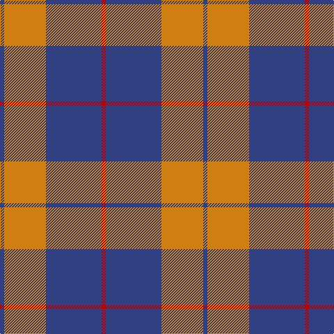

In pattern [BYBR](/patterns/bybr/).

This was sourced from weddslist.  It is a [4 stripes tartan](/stripes/stripes4/).

Original link http://www.weddslist.com/cgi-bin/tartans/pg.pl?source=sts

## Thread count
B/6 O60 B80 R/6

## Palette
Each colour and its ΔE from the base-6 reference it is a variant of.

| Colour | Shade | Base | ΔE (OKLab) |
|---|---|---|---|
| B | <code style="background-color:#304080;">#304080</code> `#304080` | B <code style="background-color:#2C4084;">#2C4084</code> | 0.01 |
| O | <code style="background-color:#D08010;">#D08010</code> `#D08010` | Y <code style="background-color:#E8C000;">#E8C000</code> | 0.17 |
| R | <code style="background-color:#C00000;">#C00000</code> `#C00000` | R <code style="background-color:#C80000;">#C80000</code> | 0.02 |

# Sample pattern

## Nearest tartans

The nearest existing variants by ΔTartan distance.

1. [Wilson's No.081](/setts/s3/b20g24y2-b780078-g408060-ye8c000/) — ΔT 1.26
1. [Fraser of Boblainy, Hugh](/setts/s5/b4r56g28b28r4-b2c2c80-g006818-rc85858/) — ΔT 1.34
1. [MacQueen variant](/setts/s6/b4r14b4r14b44y4-b2c4084-rdc0000-ye8c000/) — ΔT 1.41
1. [Flynn](/setts/s6/r116k44r16k34ra10k28-k101010-r888888-rac8002c/) — ΔT 1.44
1. [Sligo](/setts/s6/b100ba8b24ba46y8ba8-b5480b0-ba401000-yf0c000/) — ΔT 1.44
1. [MacQueen, variant](/setts/s6/b4r14b4r14b44y4-b304080-rc00000-yf0c000/) — ΔT 1.45
1. [Latin](/setts/s6/b6y18b6y18b40r6-b2c2c80-rc8002c-ybc8c00/) — ΔT 1.49
1. [Coronation](/setts/s7/b22w2r24b12r2b12w2-b304080-rc00000-we0e0e0/) — ΔT 1.55
1. [Hamilton, (Red)](/setts/s5/b12r2b12r18w2-b304080-rc00000-we0e0e0/) — ΔT 1.56
1. [Thunderlord (Celtic Group, USA)](/setts/s4/b124w22k8g34-b3f4441-g50818e-k120a01-wf7f1e8/) — ΔT 1.56

## Neighbour map

Every grey dot is one of 15726 variants placed by the first two principal components of the ΔTartan feature space (44% of its variance). Red is this tartan; blue dots are its nearest — click one to open its page.

<svg viewBox="0 0 640 380" role="img" style="max-width:100%;height:auto;border:1px solid #e0e0e0;border-radius:4px;display:block" xmlns="http://www.w3.org/2000/svg"><image href="/nn/cloud.v1.png" width="640" height="380"/><a href="/setts/s3/b20g24y2-b780078-g408060-ye8c000/"><circle cx="344.4" cy="273.9" r="4" fill="#3465a4"><title>Wilson's No.081</title></circle></a><a href="/setts/s5/b4r56g28b28r4-b2c2c80-g006818-rc85858/"><circle cx="317.1" cy="223.2" r="4" fill="#3465a4"><title>Fraser of Boblainy, Hugh</title></circle></a><a href="/setts/s6/b4r14b4r14b44y4-b2c4084-rdc0000-ye8c000/"><circle cx="394.4" cy="206.8" r="4" fill="#3465a4"><title>MacQueen variant</title></circle></a><a href="/setts/s6/r116k44r16k34ra10k28-k101010-r888888-rac8002c/"><circle cx="320.5" cy="215.2" r="4" fill="#3465a4"><title>Flynn</title></circle></a><a href="/setts/s6/b100ba8b24ba46y8ba8-b5480b0-ba401000-yf0c000/"><circle cx="399.5" cy="206.1" r="4" fill="#3465a4"><title>Sligo</title></circle></a><a href="/setts/s6/b4r14b4r14b44y4-b304080-rc00000-yf0c000/"><circle cx="407.3" cy="213.8" r="4" fill="#3465a4"><title>MacQueen, variant</title></circle></a><a href="/setts/s6/b6y18b6y18b40r6-b2c2c80-rc8002c-ybc8c00/"><circle cx="305.6" cy="240.3" r="4" fill="#3465a4"><title>Latin</title></circle></a><a href="/setts/s7/b22w2r24b12r2b12w2-b304080-rc00000-we0e0e0/"><circle cx="378.4" cy="217.4" r="4" fill="#3465a4"><title>Coronation</title></circle></a><a href="/setts/s5/b12r2b12r18w2-b304080-rc00000-we0e0e0/"><circle cx="333.5" cy="250.6" r="4" fill="#3465a4"><title>Hamilton, (Red)</title></circle></a><a href="/setts/s4/b124w22k8g34-b3f4441-g50818e-k120a01-wf7f1e8/"><circle cx="387.1" cy="204.9" r="4" fill="#3465a4"><title>Thunderlord (Celtic Group, USA)</title></circle></a><circle cx="371.8" cy="229.6" r="5" fill="#c00000"/></svg>

ID: /setts/s4/b6y60b80r6-b304080-rc00000-yd08010/
