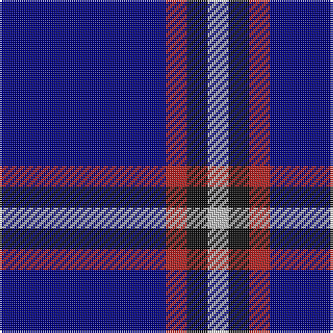

In pattern [BRKW](/patterns/brkw/).

This was sourced from register-of-tartans.  It is a [4 stripes tartan](/stripes/stripes4/).

Original link https://www.tartanregister.gov.uk/tartanDetails.aspx?ref=10086

## Thread count
DB/80 R10 K10 N/10

## Palette
Each colour and its ΔE from the base-6 reference it is a variant of.

| Colour | Shade | Base | ΔE (OKLab) |
|---|---|---|---|
| DB | <code style="background-color:#000080;">#000080</code> `#000080` | B <code style="background-color:#2C4084;">#2C4084</code> | 0.14 |
| K | <code style="background-color:#101010;">#101010</code> `#101010` | K <code style="background-color:#000000;">#000000</code> | 0.17 |
| N | <code style="background-color:#BEBEBE;">#BEBEBE</code> `#BEBEBE` | W <code style="background-color:#F4F4F0;">#F4F4F0</code> | 0.16 |
| R | <code style="background-color:#B22222;">#B22222</code> `#B22222` | R <code style="background-color:#C80000;">#C80000</code> | 0.04 |

# Sample pattern

## Nearest tartans

The nearest existing variants by ΔTartan distance.

1. [Lochcarron (1985)](/setts/s5/b96w8k16b8r8-b000064-k000000-rc80000-wc8c8c8/) — ΔT 1.26
1. [Steffen, Markus (Personal)](/setts/s6/b140w16b40r12ra12r12-b00009c-r8b1c62-rab0171f-wffffff/) — ΔT 1.57
1. [McCallie](/setts/s4/r8k24b132w8-b2c2c80-k101010-rc80000-wfcfcfc/) — ΔT 1.58
1. [Oxford University (Corporate)](/setts/s4/b18g32ba118y8-b2c2c80-ba1c0070-g006818-yc4bc68/) — ΔT 1.61
1. [Dollar Academy (1930s) (Corporate)](/setts/s6/b18k18b18k18b84w10-b2c2c80-k101010-we0e0e0/) — ΔT 1.61
1. [Bacon, Blue](/setts/s4/b28k6r6w2-b1c0070-k101010-r880000-we0e0e0/) — ΔT 1.68
1. [Dollar, Academy](/setts/s6/b18k18b18k18b84w10-b304080-k000000-we0e0e0/) — ΔT 1.70
1. [Waugh](/setts/s5/b100g10k5g10r8-b000080-g65909a-k000000-rb22222/) — ΔT 1.73
1. [Gulfmark (Corporate)](/setts/s5/b144ba12b24ba34w12-b2c2c80-ba2888c4-we0e0e0/) — ΔT 1.76
1. [Waugh (Name)](/setts/s5/b100y10k5y10r8-b1c0070-k101010-r980000-y7098b0/) — ΔT 1.81

## Neighbour map

Every grey dot is one of 15726 variants placed by the first two principal components of the ΔTartan feature space (44% of its variance). Red is this tartan; blue dots are its nearest — click one to open its page.

<svg viewBox="0 0 640 380" role="img" style="max-width:100%;height:auto;border:1px solid #e0e0e0;border-radius:4px;display:block" xmlns="http://www.w3.org/2000/svg"><image href="/nn/cloud.v1.png" width="640" height="380"/><a href="/setts/s5/b96w8k16b8r8-b000064-k000000-rc80000-wc8c8c8/"><circle cx="473.1" cy="201.8" r="4" fill="#3465a4"><title>Lochcarron (1985)</title></circle></a><a href="/setts/s6/b140w16b40r12ra12r12-b00009c-r8b1c62-rab0171f-wffffff/"><circle cx="464.3" cy="191.2" r="4" fill="#3465a4"><title>Steffen, Markus (Personal)</title></circle></a><a href="/setts/s4/r8k24b132w8-b2c2c80-k101010-rc80000-wfcfcfc/"><circle cx="506.2" cy="202.3" r="4" fill="#3465a4"><title>McCallie</title></circle></a><a href="/setts/s4/b18g32ba118y8-b2c2c80-ba1c0070-g006818-yc4bc68/"><circle cx="420.2" cy="225.9" r="4" fill="#3465a4"><title>Oxford University (Corporate)</title></circle></a><a href="/setts/s6/b18k18b18k18b84w10-b2c2c80-k101010-we0e0e0/"><circle cx="447.4" cy="246.7" r="4" fill="#3465a4"><title>Dollar Academy (1930s) (Corporate)</title></circle></a><a href="/setts/s4/b28k6r6w2-b1c0070-k101010-r880000-we0e0e0/"><circle cx="410.6" cy="221.3" r="4" fill="#3465a4"><title>Bacon, Blue</title></circle></a><a href="/setts/s6/b18k18b18k18b84w10-b304080-k000000-we0e0e0/"><circle cx="415.6" cy="234.0" r="4" fill="#3465a4"><title>Dollar, Academy</title></circle></a><a href="/setts/s5/b100g10k5g10r8-b000080-g65909a-k000000-rb22222/"><circle cx="497.9" cy="180.8" r="4" fill="#3465a4"><title>Waugh</title></circle></a><a href="/setts/s5/b144ba12b24ba34w12-b2c2c80-ba2888c4-we0e0e0/"><circle cx="495.2" cy="229.5" r="4" fill="#3465a4"><title>Gulfmark (Corporate)</title></circle></a><a href="/setts/s5/b100y10k5y10r8-b1c0070-k101010-r980000-y7098b0/"><circle cx="509.8" cy="180.0" r="4" fill="#3465a4"><title>Waugh (Name)</title></circle></a><circle cx="421.1" cy="230.3" r="5" fill="#c00000"/></svg>

ID: /setts/s4/b80r10k10w10-b000080-k101010-rb22222-wbebebe/
