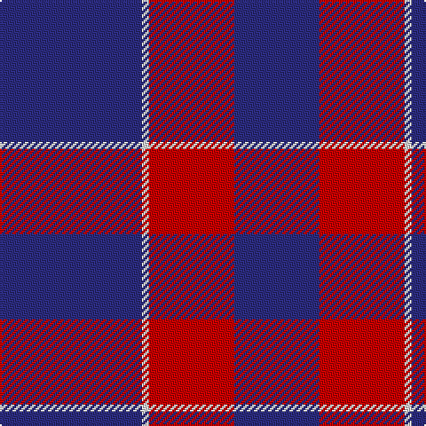

In pattern [BRWB](/patterns/brwb/).

This was sourced from tartans-authority.  It is a [4 stripes tartan](/stripes/stripes4/).

Original link http://www.tartansauthority.com/tartan-ferret/display/7282/

## Thread count
DB/80 LN4 R48 DB/48

## Palette
Each colour and its ΔE from the base-6 reference it is a variant of.

| Colour | Shade | Base | ΔE (OKLab) |
|---|---|---|---|
| DB | <code style="background-color:#2C2C80;">#2C2C80</code> `#2C2C80` | B <code style="background-color:#2A418A;">#2A418A</code> | 0.06 |
| LN | <code style="background-color:#E0E0E0;">#E0E0E0</code> `#E0E0E0` | W <code style="background-color:#F7F7F7;">#F7F7F7</code> | 0.07 |
| R | <code style="background-color:#C80000;">#C80000</code> `#C80000` | R <code style="background-color:#CC0000;">#CC0000</code> | 0.01 |

# Sample pattern

## Nearest tartans

The nearest existing variants by ΔTartan distance.

1. [Mother's Pride](/setts/s4/b40y4b40r40-b1c0070-r880000-yd09800/) — ΔT 1.59
1. [Unidentified Plaid #10](/setts/s7/b54r10b54r6b6r60b46-b2c4084-rdc0000/) — ΔT 1.93
1. [South Australian Pipes & Drums (Corp](/setts/s6/b120y12b22r50b22y12-b2c2c80-rc80000-ye8c000/) — ΔT 2.09
1. [Unidentified Plaid 7](/setts/s7/b54r10b54r6b6r60b46-b304080-rc00000/) — ΔT 2.12
1. [BC Corps of Commissionaires, The](/setts/s7/b48w4r12w4r12w4b24-b202060-ra00000-wc0c0c0/) — ΔT 2.17
1. [Coronation](/setts/s7/b22w2r24b12r2b12w2-b304080-rc00000-we0e0e0/) — ΔT 2.19
1. [Coronation (1936) #2](/setts/s7/b44w4r48b24r4b24w4-b2c2c80-rc80000-wfcfcfc/) — ΔT 2.20
1. [Orlando Fire Department (Corporate)](/setts/s9/b48y4r64b4r4b56r12b56y4-b2c2c80-rc80000-ye8c000/) — ΔT 2.20
1. [Highland Spring (1988) (Corporate)](/setts/s4/b12g4b36r12-b440044-g006818-rc80000/) — ΔT 2.22
1. [Graham Grey - 1820 (Fashion?)](/setts/s4/b100k36b40w8-b5c5c5c-k101010-wfcfcfc/) — ΔT 2.22

## Neighbour map

Every grey dot is one of 15726 variants placed by the first two principal components of the ΔTartan feature space (44% of its variance). Red is this tartan; blue dots are its nearest — click one to open its page.

<svg viewBox="0 0 640 380" role="img" style="max-width:100%;height:auto;border:1px solid #e0e0e0;border-radius:4px;display:block" xmlns="http://www.w3.org/2000/svg"><image href="/nn/cloud.v1.png" width="640" height="380"/><a href="/setts/s4/b40y4b40r40-b1c0070-r880000-yd09800/"><circle cx="394.4" cy="294.5" r="4" fill="#3465a4"><title>Mother's Pride</title></circle></a><a href="/setts/s7/b54r10b54r6b6r60b46-b2c4084-rdc0000/"><circle cx="438.6" cy="256.4" r="4" fill="#3465a4"><title>Unidentified Plaid #10</title></circle></a><a href="/setts/s6/b120y12b22r50b22y12-b2c2c80-rc80000-ye8c000/"><circle cx="410.3" cy="215.1" r="4" fill="#3465a4"><title>South Australian Pipes &amp; Drums (Corp</title></circle></a><a href="/setts/s7/b54r10b54r6b6r60b46-b304080-rc00000/"><circle cx="460.8" cy="267.4" r="4" fill="#3465a4"><title>Unidentified Plaid 7</title></circle></a><a href="/setts/s7/b48w4r12w4r12w4b24-b202060-ra00000-wc0c0c0/"><circle cx="405.7" cy="207.4" r="4" fill="#3465a4"><title>BC Corps of Commissionaires, The</title></circle></a><a href="/setts/s7/b22w2r24b12r2b12w2-b304080-rc00000-we0e0e0/"><circle cx="378.4" cy="217.4" r="4" fill="#3465a4"><title>Coronation</title></circle></a><a href="/setts/s7/b44w4r48b24r4b24w4-b2c2c80-rc80000-wfcfcfc/"><circle cx="361.5" cy="209.6" r="4" fill="#3465a4"><title>Coronation (1936) #2</title></circle></a><a href="/setts/s9/b48y4r64b4r4b56r12b56y4-b2c2c80-rc80000-ye8c000/"><circle cx="419.6" cy="190.0" r="4" fill="#3465a4"><title>Orlando Fire Department (Corporate)</title></circle></a><a href="/setts/s4/b12g4b36r12-b440044-g006818-rc80000/"><circle cx="504.7" cy="273.8" r="4" fill="#3465a4"><title>Highland Spring (1988) (Corporate)</title></circle></a><a href="/setts/s4/b100k36b40w8-b5c5c5c-k101010-wfcfcfc/"><circle cx="482.5" cy="259.7" r="4" fill="#3465a4"><title>Graham Grey - 1820 (Fashion?)</title></circle></a><circle cx="461.6" cy="251.1" r="5" fill="#c00000"/></svg>

ID: /setts/s4/b80w4r48b48-b2c2c80-rc80000-we0e0e0/
