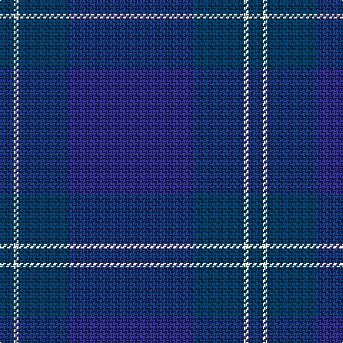

In pattern [BBWB](/patterns/bbwb/).

This was sourced from register-of-tartans.  It is a [4 stripes tartan](/stripes/stripes4/).

Original link https://www.tartanregister.gov.uk/tartanDetails.aspx?ref=3748

## Thread count
DB/10 LN3 DB35 DBa/88

## Palette
Each colour and its ΔE from the base-6 reference it is a variant of.

| Colour | Shade | Base | ΔE (OKLab) |
|---|---|---|---|
| DB | <code style="background-color:#003C64;">#003C64</code> `#003C64` | B <code style="background-color:#2C4084;">#2C4084</code> | 0.07 |
| DBa | <code style="background-color:#2C2C80;">#2C2C80</code> `#2C2C80` | B <code style="background-color:#2C4084;">#2C4084</code> | 0.05 |
| LN | <code style="background-color:#E0E0E0;">#E0E0E0</code> `#E0E0E0` | W <code style="background-color:#F4F4F0;">#F4F4F0</code> | 0.06 |

# Sample pattern

## Nearest tartans

The nearest existing variants by ΔTartan distance.

1. [Scottish Tourist Board (1990) Corporate Tartan Tartan Number: 2099. Earliest known date: 1990 This is in fact the second Scottish Tourist Board tartan and was designed in Navy, White and Blue in keeping with the new logo adopted this year by the Scottish Tourist Board. This supercedes the first tartan which was designed many years ago and reflected different colourings. See products available Copyright © Blair Urquhart, Comrie, 2015](/setts/s4/b88ba35w3ba10-b2c2c80-ba202060-we0e0e0/) — ΔT 0.61
1. [Mackaw (Corporate)](/setts/s4/r4b70ba70y2-b2c2c80-ba202060-rc80000-yfccc00/) — ΔT 1.81
1. [Deighan (Edinburgh)](/setts/s5/b8k86ka40b14g4-b1b1b1b-g696969-k01002c-ka101010/) — ΔT 2.74
1. [US Navy Edzell](/setts/s6/b104ba16w8ba66r3ba16-b003c64-ba2c2c80-rc80000-we0e0e0/) — ΔT 2.91
1. [Edzell U.S. Navy Regimental Tartan Tartan Number: 81. Earliest known date: pre 2003 Designed by Mr Arthur MacKie See products available Copyright © Blair Urquhart, Comrie, 2015](/setts/s6/b104ba16w8ba66r3ba16-b202060-ba2c2c80-rc80000-we0e0e0/) — ΔT 2.92
1. [S.C.O.T.S. U.S.A. Tartan Tartan Number: 82. Earliest known date: 1988 S = Scarlet. Based on the Earl of St Andrews tartan. S.C.O.T.S. is a U.S. nationwide network of travel agents promoting tourism in Scotland. See products available Copyright © Blair Urquhart, Comrie, 2015](/setts/s6/b110ba36w6ba4r4ba12-b2c2c80-ba202060-rc8002c-we0e0e0/) — ΔT 2.95
1. [MacKerrell of Hillhouse Htg Family Tartan Tartan Number: 1758. Earliest known date: 1975 A MacKerral tartan was recorded by the Scottish Tartans Society in 1975. The Lyon Court Books contain the note "Wefted in scarlet", referring to an unusual feature, that of replacing the yellow warp stripe with red in the weft. The name, MacKerrell or MacKerral, was recorded in Ayrshire in the 12th century. See products available Copyright © Blair Urquhart, Comrie, 2015](/setts/s6/b56ba98y6ba98b56w8-b2c2c80-ba202060-we0e0e0-ye8c000/) — ΔT 2.98
1. [Dauphinee, Andrew Hunter (Personal)](/setts/s9/r6b64ba4b6ba8b4ba32w2ba2-b3c4359-ba172d60-ra00000-wf8f4d0/) — ΔT 3.02
1. [Hector, James (Corporate)](/setts/s5/b4g22ba54g16r4-b441800-ba003c64-g003820-r880000/) — ΔT 3.04
1. [Tern House](/setts/s7/g23b3k8b4g4b56ga8-b141e46-g003820-ga604000-k101010/) — ΔT 3.07

## Neighbour map

Every grey dot is one of 15726 variants placed by the first two principal components of the ΔTartan feature space (44% of its variance). Red is this tartan; blue dots are its nearest — click one to open its page.

<svg viewBox="0 0 640 380" role="img" style="max-width:100%;height:auto;border:1px solid #e0e0e0;border-radius:4px;display:block" xmlns="http://www.w3.org/2000/svg"><image href="/nn/cloud.v1.png" width="640" height="380"/><a href="/setts/s4/b88ba35w3ba10-b2c2c80-ba202060-we0e0e0/"><circle cx="614.9" cy="292.2" r="4" fill="#3465a4"><title>Scottish Tourist Board (1990) Corporate Tartan Tartan Number: 2099. Earliest known date: 1990 This is in fact the second Scottish Tourist Board tartan and was designed in Navy, White and Blue in keeping with the new logo adopted this year by the Scottish Tourist Board. This supercedes the first tartan which was designed many years ago and reflected different colourings. See products available Copyright © Blair Urquhart, Comrie, 2015</title></circle></a><a href="/setts/s4/r4b70ba70y2-b2c2c80-ba202060-rc80000-yfccc00/"><circle cx="508.6" cy="266.0" r="4" fill="#3465a4"><title>Mackaw (Corporate)</title></circle></a><a href="/setts/s5/b8k86ka40b14g4-b1b1b1b-g696969-k01002c-ka101010/"><circle cx="528.2" cy="283.2" r="4" fill="#3465a4"><title>Deighan (Edinburgh)</title></circle></a><a href="/setts/s6/b104ba16w8ba66r3ba16-b003c64-ba2c2c80-rc80000-we0e0e0/"><circle cx="453.2" cy="215.5" r="4" fill="#3465a4"><title>US Navy Edzell</title></circle></a><a href="/setts/s6/b104ba16w8ba66r3ba16-b202060-ba2c2c80-rc80000-we0e0e0/"><circle cx="455.0" cy="214.6" r="4" fill="#3465a4"><title>Edzell U.S. Navy Regimental Tartan Tartan Number: 81. Earliest known date: pre 2003 Designed by Mr Arthur MacKie See products available Copyright © Blair Urquhart, Comrie, 2015</title></circle></a><a href="/setts/s6/b110ba36w6ba4r4ba12-b2c2c80-ba202060-rc8002c-we0e0e0/"><circle cx="526.6" cy="203.8" r="4" fill="#3465a4"><title>S.C.O.T.S. U.S.A. Tartan Tartan Number: 82. Earliest known date: 1988 S = Scarlet. Based on the Earl of St Andrews tartan. S.C.O.T.S. is a U.S. nationwide network of travel agents promoting tourism in Scotland. See products available Copyright © Blair Urquhart, Comrie, 2015</title></circle></a><a href="/setts/s6/b56ba98y6ba98b56w8-b2c2c80-ba202060-we0e0e0-ye8c000/"><circle cx="452.6" cy="270.6" r="4" fill="#3465a4"><title>MacKerrell of Hillhouse Htg Family Tartan Tartan Number: 1758. Earliest known date: 1975 A MacKerral tartan was recorded by the Scottish Tartans Society in 1975. The Lyon Court Books contain the note &quot;Wefted in scarlet&quot;, referring to an unusual feature, that of replacing the yellow warp stripe with red in the weft. The name, MacKerrell or MacKerral, was recorded in Ayrshire in the 12th century. See products available Copyright © Blair Urquhart, Comrie, 2015</title></circle></a><a href="/setts/s9/r6b64ba4b6ba8b4ba32w2ba2-b3c4359-ba172d60-ra00000-wf8f4d0/"><circle cx="524.3" cy="190.1" r="4" fill="#3465a4"><title>Dauphinee, Andrew Hunter (Personal)</title></circle></a><a href="/setts/s5/b4g22ba54g16r4-b441800-ba003c64-g003820-r880000/"><circle cx="488.1" cy="293.4" r="4" fill="#3465a4"><title>Hector, James (Corporate)</title></circle></a><a href="/setts/s7/g23b3k8b4g4b56ga8-b141e46-g003820-ga604000-k101010/"><circle cx="522.5" cy="248.1" r="4" fill="#3465a4"><title>Tern House</title></circle></a><circle cx="608.1" cy="289.5" r="5" fill="#c00000"/></svg>

ID: /setts/s4/b88ba35w3ba10-b2c2c80-ba003c64-we0e0e0/
