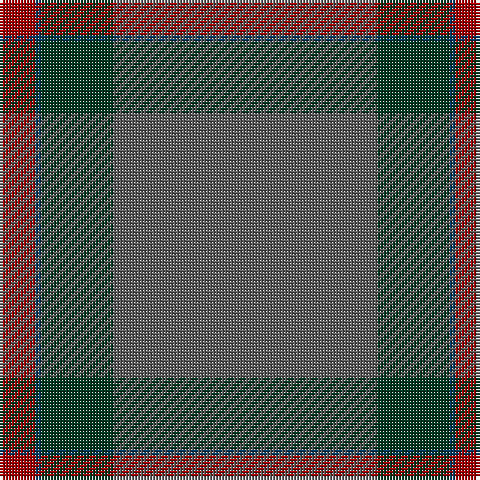

In pattern [BGBR](/patterns/bgbr/).

This was sourced from tartans-authority.  It is a [4 stripes tartan](/stripes/stripes4/).

Original link http://www.tartansauthority.com/tartan-ferret/display/10331/

## Thread count
DR/12 DB2 DG24 N/88

## Palette
Each colour and its ΔE from the base-6 reference it is a variant of.

| Colour | Shade | Base | ΔE (OKLab) |
|---|---|---|---|
| DB | <code style="background-color:#003C64;">#003C64</code> `#003C64` | B <code style="background-color:#2C4084;">#2C4084</code> | 0.07 |
| DG | <code style="background-color:#003820;">#003820</code> `#003820` | G <code style="background-color:#006400;">#006400</code> | 0.16 |
| DR | <code style="background-color:#A00000;">#A00000</code> `#A00000` | R <code style="background-color:#C80000;">#C80000</code> | 0.09 |
| N | <code style="background-color:#5C5C5C;">#5C5C5C</code> `#5C5C5C` | B <code style="background-color:#2C4084;">#2C4084</code> | 0.14 |

# Sample pattern

## Nearest tartans

The nearest existing variants by ΔTartan distance.

1. [Heslop Lurdenlaw by Kelso](/setts/s4/b88g24ga2r12-b1e2025-g23321b-ga43a5a0-ra32d18/) — ΔT 1.53
1. [MacAndrew Hunting (Name)](/setts/s6/g144k16g8ga32g14r4-g5c6428-ga604000-k101010-r888888/) — ΔT 1.96
1. [Unidentified #44](/setts/s7/b26k6b40g140b40g60w6-b2c4084-g503c14-k101010-we0e0e0/) — ΔT 2.01
1. [Norsemen (Corporate)](/setts/s6/b130k4b8y4b20r48-b506880-k101010-r880000-ya0a0a0/) — ΔT 2.03
1. [Highland Greenford (Personal)](/setts/s4/g100ga50y4b12-b440044-g5c6428-ga604000-yc4bc68/) — ΔT 2.14
1. [Orkney Slate (Fashion)](/setts/s8/b8r74w8b42r11ba2r16b4-b5c5c5c-ba440044-r888888-wc0c0c0/) — ΔT 2.16
1. [Orkney Slate (Corporate)](/setts/s8/b8r74w8b42r11ba2r16b4-b5c5c5c-ba780078-r888888-wc0c0c0/) — ΔT 2.21
1. [Miramichi](/setts/s5/g62y2g36b36r2-b1c0070-g003820-r880000-yd09800/) — ΔT 2.28
1. [Lloyd (Welsh Name)](/setts/s5/b40r2b20g19ba2-b003c64-ba202060-g006818-r888888/) — ΔT 2.33
1. [Ballantyne (Personal)](/setts/s5/g120ga26g18r16y8-g787878-ga006818-r880000-ye8c000/) — ΔT 2.42

## Neighbour map

Every grey dot is one of 15726 variants placed by the first two principal components of the ΔTartan feature space (44% of its variance). Red is this tartan; blue dots are its nearest — click one to open its page.

<svg viewBox="0 0 640 380" role="img" style="max-width:100%;height:auto;border:1px solid #e0e0e0;border-radius:4px;display:block" xmlns="http://www.w3.org/2000/svg"><image href="/nn/cloud.v1.png" width="640" height="380"/><a href="/setts/s4/b88g24ga2r12-b1e2025-g23321b-ga43a5a0-ra32d18/"><circle cx="593.8" cy="229.0" r="4" fill="#3465a4"><title>Heslop Lurdenlaw by Kelso</title></circle></a><a href="/setts/s6/g144k16g8ga32g14r4-g5c6428-ga604000-k101010-r888888/"><circle cx="626.0" cy="197.8" r="4" fill="#3465a4"><title>MacAndrew Hunting (Name)</title></circle></a><a href="/setts/s7/b26k6b40g140b40g60w6-b2c4084-g503c14-k101010-we0e0e0/"><circle cx="479.6" cy="212.6" r="4" fill="#3465a4"><title>Unidentified #44</title></circle></a><a href="/setts/s6/b130k4b8y4b20r48-b506880-k101010-r880000-ya0a0a0/"><circle cx="578.1" cy="179.7" r="4" fill="#3465a4"><title>Norsemen (Corporate)</title></circle></a><a href="/setts/s4/g100ga50y4b12-b440044-g5c6428-ga604000-yc4bc68/"><circle cx="504.4" cy="250.5" r="4" fill="#3465a4"><title>Highland Greenford (Personal)</title></circle></a><a href="/setts/s8/b8r74w8b42r11ba2r16b4-b5c5c5c-ba440044-r888888-wc0c0c0/"><circle cx="521.8" cy="183.5" r="4" fill="#3465a4"><title>Orkney Slate (Fashion)</title></circle></a><a href="/setts/s8/b8r74w8b42r11ba2r16b4-b5c5c5c-ba780078-r888888-wc0c0c0/"><circle cx="527.4" cy="185.9" r="4" fill="#3465a4"><title>Orkney Slate (Corporate)</title></circle></a><a href="/setts/s5/g62y2g36b36r2-b1c0070-g003820-r880000-yd09800/"><circle cx="535.2" cy="235.8" r="4" fill="#3465a4"><title>Miramichi</title></circle></a><a href="/setts/s5/b40r2b20g19ba2-b003c64-ba202060-g006818-r888888/"><circle cx="540.4" cy="256.9" r="4" fill="#3465a4"><title>Lloyd (Welsh Name)</title></circle></a><a href="/setts/s5/g120ga26g18r16y8-g787878-ga006818-r880000-ye8c000/"><circle cx="527.3" cy="219.9" r="4" fill="#3465a4"><title>Ballantyne (Personal)</title></circle></a><circle cx="584.4" cy="216.1" r="5" fill="#c00000"/></svg>

ID: /setts/s4/b88g24ba2r12-b5c5c5c-ba003c64-g003820-ra00000/
