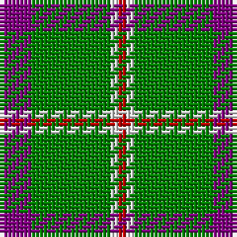

In pattern [BGWR](/patterns/bgwr/).

This was sourced from weddslist.  It is a [4 stripes tartan](/stripes/stripes4/).

Original link http://www.weddslist.com/cgi-bin/tartans/pg.pl?source=sts

## Thread count
P/8 G20 LN2 R/2

## Palette
Each colour and its ΔE from the base-6 reference it is a variant of.

| Colour | Shade | Base | ΔE (OKLab) |
|---|---|---|---|
| G | <code style="background-color:#008000;">#008000</code> `#008000` | G <code style="background-color:#006100;">#006100</code> | 0.10 |
| LN | <code style="background-color:#E0E0E0;">#E0E0E0</code> `#E0E0E0` | W <code style="background-color:#F7F7F7;">#F7F7F7</code> | 0.07 |
| P | <code style="background-color:#800080;">#800080</code> `#800080` | B <code style="background-color:#2A418A;">#2A418A</code> | 0.17 |
| R | <code style="background-color:#C00000;">#C00000</code> `#C00000` | R <code style="background-color:#CC0000;">#CC0000</code> | 0.03 |

# Sample pattern

## Nearest tartans

The nearest existing variants by ΔTartan distance.

1. [Wilson's, No 192](/setts/s4/b8g20r2y2-b800080-g008000-rc00000-yf0c000/) — ΔT 0.26
1. [Wilson's No.189](/setts/s4/b8g20r2w2-b440044-g006818-rc80000-wfcfcfc/) — ΔT 0.66
1. [Wilson's No.192](/setts/s4/b8g20r2y2-b440044-g006818-rc80000-ye8c000/) — ΔT 0.80
1. [Sugell (Name?)](/setts/s4/g72r25y8w5-g006818-rc80000-we0e0e0-ye8c000/) — ΔT 1.13
1. [Bacon, Green (Fashion)](/setts/s4/g28k6r6y4-g006818-k101010-r880000-yb8b8b8/) — ΔT 1.21
1. [Wilson's No.140](/setts/s4/k4y2g14b2-b5c8ca8-g006818-k101010-ye8c000/) — ΔT 1.30
1. [Wilson's No.174](/setts/s4/b2ba8g20y2-b2888c4-ba202060-g006818-ye8c000/) — ΔT 1.36
1. [Colonial Marine (Aliens Legacy)](/setts/s4/g112ga26y26w10-g008b45-ga5c4033-we6e6fa-yffc125/) — ΔT 1.39
1. [Sir Billi (Corporate)](/setts/s6/r16g24w10k22g84k6-g347400-k101010-rc80000-wf4f8c8/) — ΔT 1.40
1. [Thunderlord (Celtic Group, USA)](/setts/s4/b124w22k8ba34-b3f4441-ba50818e-k120a01-wf7f1e8/) — ΔT 1.42

## Neighbour map

Every grey dot is one of 15726 variants placed by the first two principal components of the ΔTartan feature space (44% of its variance). Red is this tartan; blue dots are its nearest — click one to open its page.

<svg viewBox="0 0 640 380" role="img" style="max-width:100%;height:auto;border:1px solid #e0e0e0;border-radius:4px;display:block" xmlns="http://www.w3.org/2000/svg"><image href="/nn/cloud.v1.png" width="640" height="380"/><a href="/setts/s4/b8g20r2y2-b800080-g008000-rc00000-yf0c000/"><circle cx="347.8" cy="221.9" r="4" fill="#3465a4"><title>Wilson's, No 192</title></circle></a><a href="/setts/s4/b8g20r2w2-b440044-g006818-rc80000-wfcfcfc/"><circle cx="342.5" cy="223.3" r="4" fill="#3465a4"><title>Wilson's No.189</title></circle></a><a href="/setts/s4/b8g20r2y2-b440044-g006818-rc80000-ye8c000/"><circle cx="356.7" cy="229.4" r="4" fill="#3465a4"><title>Wilson's No.192</title></circle></a><a href="/setts/s4/g72r25y8w5-g006818-rc80000-we0e0e0-ye8c000/"><circle cx="392.3" cy="207.6" r="4" fill="#3465a4"><title>Sugell (Name?)</title></circle></a><a href="/setts/s4/g28k6r6y4-g006818-k101010-r880000-yb8b8b8/"><circle cx="346.8" cy="248.5" r="4" fill="#3465a4"><title>Bacon, Green (Fashion)</title></circle></a><a href="/setts/s4/k4y2g14b2-b5c8ca8-g006818-k101010-ye8c000/"><circle cx="336.5" cy="246.1" r="4" fill="#3465a4"><title>Wilson's No.140</title></circle></a><a href="/setts/s4/b2ba8g20y2-b2888c4-ba202060-g006818-ye8c000/"><circle cx="361.0" cy="238.7" r="4" fill="#3465a4"><title>Wilson's No.174</title></circle></a><a href="/setts/s4/g112ga26y26w10-g008b45-ga5c4033-we6e6fa-yffc125/"><circle cx="364.1" cy="223.2" r="4" fill="#3465a4"><title>Colonial Marine (Aliens Legacy)</title></circle></a><a href="/setts/s6/r16g24w10k22g84k6-g347400-k101010-rc80000-wf4f8c8/"><circle cx="372.8" cy="191.5" r="4" fill="#3465a4"><title>Sir Billi (Corporate)</title></circle></a><a href="/setts/s4/b124w22k8ba34-b3f4441-ba50818e-k120a01-wf7f1e8/"><circle cx="387.1" cy="204.9" r="4" fill="#3465a4"><title>Thunderlord (Celtic Group, USA)</title></circle></a><circle cx="342.9" cy="220.0" r="5" fill="#c00000"/></svg>

ID: /setts/s4/b8g20w2r2-b800080-g008000-rc00000-we0e0e0/
