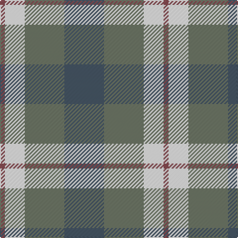

In pattern [BGWR](/patterns/bgwr/).

This was sourced from register-of-tartans.  It is a [4 stripes tartan](/stripes/stripes4/).

Original link https://www.tartanregister.gov.uk/tartanDetails.aspx?ref=10258

## Thread count
LT/5 W20 Na40 N/40

## Palette
Each colour and its ΔE from the base-6 reference it is a variant of.

| Colour | Shade | Base | ΔE (OKLab) |
|---|---|---|---|
| LT | <code style="background-color:#874C52;">#874C52</code> `#874C52` | R <code style="background-color:#CC0000;">#CC0000</code> | 0.15 |
| N | <code style="background-color:#465665;">#465665</code> `#465665` | B <code style="background-color:#2A418A;">#2A418A</code> | 0.11 |
| Na | <code style="background-color:#6E7766;">#6E7766</code> `#6E7766` | G <code style="background-color:#006100;">#006100</code> | 0.18 |
| W | <code style="background-color:#FFFFFF;">#FFFFFF</code> `#FFFFFF` | W <code style="background-color:#F7F7F7;">#F7F7F7</code> | 0.02 |

# Sample pattern

## Nearest tartans

The nearest existing variants by ΔTartan distance.

1. [Louisburg](/setts/s4/r22y10w3b8~b1c0070-r888888-wf8f8f8-ye8c000~x2/) — ΔT 1.43
1. [Harbison (2015)](/setts/s4/b21g34r14w6~b2c2c80-g006818-rc80000-wfcfcfc~x2/) — ΔT 1.46
1. [Hebridean 4](/setts/s5/b1ba7r3g7r1~b5480b0-ba304080-g008000-rc00000~x2/) — ΔT 1.52
1. [Unnamed No 40](/setts/s4/b6ba6g6r1~b8080d0-ba304080-g008000-rc00000~x2/) — ΔT 1.53
1. [Thistle and Kudzu Scottish Society](/setts/s4/b6y15g15w2~baa00ff-g006400-wffffff-y86c87c~x2/) — ΔT 1.54
1. [Delroeux, John Michael (Personal)](/setts/s4/b3g6y1r3~b0000cd-g125d24-rff0000-yffe600~x10/) — ΔT 1.57
1. [Tilburg (District)](/setts/s5/b9y9b9ba23r3~b1c1c50-ba1c6894-rc80000-yc8c44c~x2/) — ΔT 1.57
1. [MacNab 7](/setts/s4/g15r3b11ba2~b800080-ba5480b0-g008000-rc00000~x2/) — ΔT 1.59
1. [MacKinnon Dress](/setts/s4/g9ga7w7r1~g005020-ga482800-rdc0000-we0e0e0~x4/) — ΔT 1.61
1. [Delroeux (Personal)](/setts/s4/b3g6y1r3~b2c2c80-g006818-rc80000-yfccc00~x10/) — ΔT 1.64

## Neighbour map

Every grey dot is one of 15726 variants placed by the first two principal components of the ΔTartan feature space (44% of its variance). Red is this tartan; blue dots are its nearest — click one to open its page.

<svg viewBox="0 0 640 380" role="img" style="max-width:100%;height:auto;border:1px solid #e0e0e0;border-radius:4px;display:block" xmlns="http://www.w3.org/2000/svg"><image href="/nn/cloud.v1.png" width="640" height="380"/><a href="/setts/s4/r22y10w3b8~b1c0070-r888888-wf8f8f8-ye8c000~x2/"><circle cx="217.8" cy="239.3" r="4" fill="#3465a4"><title>Louisburg</title></circle></a><a href="/setts/s4/b21g34r14w6~b2c2c80-g006818-rc80000-wfcfcfc~x2/"><circle cx="176.1" cy="269.6" r="4" fill="#3465a4"><title>Harbison (2015)</title></circle></a><a href="/setts/s5/b1ba7r3g7r1~b5480b0-ba304080-g008000-rc00000~x2/"><circle cx="198.6" cy="247.4" r="4" fill="#3465a4"><title>Hebridean 4</title></circle></a><a href="/setts/s4/b6ba6g6r1~b8080d0-ba304080-g008000-rc00000~x2/"><circle cx="144.6" cy="292.2" r="4" fill="#3465a4"><title>Unnamed No 40</title></circle></a><a href="/setts/s4/b6y15g15w2~baa00ff-g006400-wffffff-y86c87c~x2/"><circle cx="159.9" cy="247.3" r="4" fill="#3465a4"><title>Thistle and Kudzu Scottish Society</title></circle></a><a href="/setts/s4/b3g6y1r3~b0000cd-g125d24-rff0000-yffe600~x10/"><circle cx="168.5" cy="260.1" r="4" fill="#3465a4"><title>Delroeux, John Michael (Personal)</title></circle></a><a href="/setts/s5/b9y9b9ba23r3~b1c1c50-ba1c6894-rc80000-yc8c44c~x2/"><circle cx="191.6" cy="245.3" r="4" fill="#3465a4"><title>Tilburg (District)</title></circle></a><a href="/setts/s4/g15r3b11ba2~b800080-ba5480b0-g008000-rc00000~x2/"><circle cx="250.4" cy="249.6" r="4" fill="#3465a4"><title>MacNab 7</title></circle></a><a href="/setts/s4/g9ga7w7r1~g005020-ga482800-rdc0000-we0e0e0~x4/"><circle cx="141.0" cy="249.8" r="4" fill="#3465a4"><title>MacKinnon Dress</title></circle></a><a href="/setts/s4/b3g6y1r3~b2c2c80-g006818-rc80000-yfccc00~x10/"><circle cx="192.8" cy="270.2" r="4" fill="#3465a4"><title>Delroeux (Personal)</title></circle></a><circle cx="178.2" cy="255.5" r="5" fill="#c00000"/></svg>

ID: /setts/s4/b8g8w4r1~b465665-g6e7766-r874c52-wffffff~x5/
