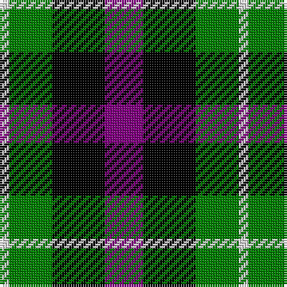

In pattern [BKGW](/patterns/bkgw/).

This was sourced from weddslist.  It is a [4 stripes tartan](/stripes/stripes4/).

Original link http://www.weddslist.com/cgi-bin/tartans/pg.pl?source=sts

## Thread count
LN/4 G18 K22 P/16

## Palette
Each colour and its ΔE from the base-6 reference it is a variant of.

| Colour | Shade | Base | ΔE (OKLab) |
|---|---|---|---|
| G | <code style="background-color:#008000;">#008000</code> `#008000` | G <code style="background-color:#006100;">#006100</code> | 0.10 |
| K | <code style="background-color:#000000;">#000000</code> `#000000` | K <code style="background-color:#000000;">#000000</code> | 0.00 |
| LN | <code style="background-color:#E0E0E0;">#E0E0E0</code> `#E0E0E0` | W <code style="background-color:#F7F7F7;">#F7F7F7</code> | 0.07 |
| P | <code style="background-color:#800080;">#800080</code> `#800080` | B <code style="background-color:#2A418A;">#2A418A</code> | 0.17 |

# Sample pattern

## Nearest tartans

The nearest existing variants by ΔTartan distance.

1. [Wilson's, No 159](/setts/s4/b8k11g9r2~b800080-g008000-k000000-rc00000~x2/) — ΔT 0.44
1. [Unnamed, No 60](/setts/s4/b6k5g5r1~b800080-g008000-k000000-rc00000~x2/) — ΔT 0.66
1. [Unidentified, pattern](/setts/s4/b4k5g4r1~b304080-g008000-k000000-rc00000~x4/) — ΔT 0.82
1. [Denholme](/setts/s5/k2g8k7b8r2~b304080-g008000-k000000-rc00000~x2/) — ΔT 1.13
1. [Wilson's No.220](/setts/s4/b5k5g5w1~b740074-g006818-k101010-we0e0e0~x4/) — ΔT 1.15
1. [MacNeil 2](/setts/s6/w2b10k10g9k3w2~b800080-g008000-k000000-we0e0e0~x2/) — ΔT 1.22
1. [Denholm (Fashion)](/setts/s5/k5g20k18b20r5~b2c2c80-g006818-k000000-rc80000~x2/) — ΔT 1.24
1. [Wilson's, No 194](/setts/s6/b3w1k3g5r1k3~b800080-g008000-k000000-rc00000-we0e0e0~x2/) — ΔT 1.30
1. [Unnamed, No 28](/setts/s4/r6g5k5b1~b5480b0-g008000-k000000-rc00000~x2/) — ΔT 1.33
1. [Lennie](/setts/s6/g2b8k9ba2g10k2~b800080-ba5480b0-g008000-k000000~x2/) — ΔT 1.33

## Neighbour map

Every grey dot is one of 15726 variants placed by the first two principal components of the ΔTartan feature space (44% of its variance). Red is this tartan; blue dots are its nearest — click one to open its page.

<svg viewBox="0 0 640 380" role="img" style="max-width:100%;height:auto;border:1px solid #e0e0e0;border-radius:4px;display:block" xmlns="http://www.w3.org/2000/svg"><image href="/nn/cloud.v1.png" width="640" height="380"/><a href="/setts/s4/b8k11g9r2~b800080-g008000-k000000-rc00000~x2/"><circle cx="116.3" cy="281.8" r="4" fill="#3465a4"><title>Wilson's, No 159</title></circle></a><a href="/setts/s4/b6k5g5r1~b800080-g008000-k000000-rc00000~x2/"><circle cx="118.9" cy="276.1" r="4" fill="#3465a4"><title>Unnamed, No 60</title></circle></a><a href="/setts/s4/b4k5g4r1~b304080-g008000-k000000-rc00000~x4/"><circle cx="105.1" cy="294.1" r="4" fill="#3465a4"><title>Unidentified, pattern</title></circle></a><a href="/setts/s5/k2g8k7b8r2~b304080-g008000-k000000-rc00000~x2/"><circle cx="94.8" cy="280.1" r="4" fill="#3465a4"><title>Denholme</title></circle></a><a href="/setts/s4/b5k5g5w1~b740074-g006818-k101010-we0e0e0~x4/"><circle cx="109.6" cy="291.4" r="4" fill="#3465a4"><title>Wilson's No.220</title></circle></a><a href="/setts/s6/w2b10k10g9k3w2~b800080-g008000-k000000-we0e0e0~x2/"><circle cx="103.6" cy="240.9" r="4" fill="#3465a4"><title>MacNeil 2</title></circle></a><a href="/setts/s5/k5g20k18b20r5~b2c2c80-g006818-k000000-rc80000~x2/"><circle cx="106.7" cy="284.1" r="4" fill="#3465a4"><title>Denholm (Fashion)</title></circle></a><a href="/setts/s6/b3w1k3g5r1k3~b800080-g008000-k000000-rc00000-we0e0e0~x2/"><circle cx="81.7" cy="239.4" r="4" fill="#3465a4"><title>Wilson's, No 194</title></circle></a><a href="/setts/s4/r6g5k5b1~b5480b0-g008000-k000000-rc00000~x2/"><circle cx="116.3" cy="272.2" r="4" fill="#3465a4"><title>Unnamed, No 28</title></circle></a><a href="/setts/s6/g2b8k9ba2g10k2~b800080-ba5480b0-g008000-k000000~x2/"><circle cx="123.5" cy="245.8" r="4" fill="#3465a4"><title>Lennie</title></circle></a><circle cx="106.5" cy="279.1" r="5" fill="#c00000"/></svg>

ID: /setts/s4/b8k11g9w2~b800080-g008000-k000000-we0e0e0~x2/
