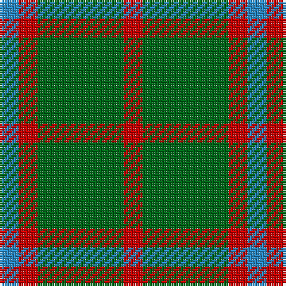

In pattern [BRGR](/patterns/brgr/).

This was sourced from register-of-tartans.  It is a [4 stripes tartan](/stripes/stripes4/).

Original link https://www.tartanregister.gov.uk/tartanDetails.aspx?ref=4743

## Thread count
B/8 R8 G36 R/8

## Palette
Each colour and its ΔE from the base-6 reference it is a variant of.

| Colour | Shade | Base | ΔE (OKLab) |
|---|---|---|---|
| B | <code style="background-color:#2888C4;">#2888C4</code> `#2888C4` | B <code style="background-color:#2C4084;">#2C4084</code> | 0.21 |
| DG | <code style="background-color:#003820;">#003820</code> `#003820` | G <code style="background-color:#006400;">#006400</code> | 0.16 |
| G | <code style="background-color:#006818;">#006818</code> `#006818` | G <code style="background-color:#006400;">#006400</code> | 0.02 |
| LG | <code style="background-color:#789484;">#789484</code> `#789484` | G <code style="background-color:#006400;">#006400</code> | 0.23 |
| R | <code style="background-color:#C80000;">#C80000</code> `#C80000` | R <code style="background-color:#C80000;">#C80000</code> | 0.00 |
| Ra | <code style="background-color:#C80000;">#C80000</code> `#C80000` | R <code style="background-color:#C80000;">#C80000</code> | 0.00 |

# Sample pattern

## Nearest tartans

The nearest existing variants by ΔTartan distance.

1. [Romsdal](/setts/s5/g44b10r8b10r6-b1c1c1c-g006818-rc80000/) — ΔT 1.25
1. [Confederate Cavalry (Military)](/setts/s6/g4ga28g16ga6g24y4-g003820-ga8c7038-yd09800/) — ΔT 1.36
1. [Romsdal District Tartan Tartan Number: 2087. Earliest known date: 1850-1900 Romsdal is where the Scottish army landed in 1612 under the command of Captain Sinclair and in the pay of the Swedes. They marched through half of Norway until defeated at Kringen. Sinclair was killed by a silver button used as a 'bullitt' (sic). Many Scots settled in Norway after the battle leaving place names such as Skottlia and Skotte. Romsdal is the only place on the west coast of Norway where there is a tradition of tartans. See products available Copyright © Blair Urquhart, Comrie, 2015](/setts/s5/g40k10r7k10r7-g006818-k101010-rc80000/) — ΔT 1.37
1. [Bacon, Green (Fashion)](/setts/s4/g28k6r6y4-g006818-k101010-r880000-yb8b8b8/) — ΔT 1.44
1. [O'Neill (Australia) (Name)](/setts/s4/g18r40g80w10-g006818-r98481c-we0e0e0/) — ΔT 1.44
1. [MacArthur-Fox (Personal)](/setts/s5/k16g6k8g40r8-g006818-k101010-r880000/) — ΔT 1.45
1. [Confederate Artillery](/setts/s6/g4r28g16r6g24ra4-g003014-ra0783c-ra8c0000/) — ΔT 1.47
1. [Cub Scouts of America](/setts/s5/g40b8r32y8g20-b00008c-g146400-r8c0000-yc88c00/) — ΔT 1.49
1. [Confederate Infantry](/setts/s6/b4g24r6g16r28g4-b00008c-g003014-ra0783c/) — ΔT 1.57
1. [Leeds University Corporate Tartan Tartan Number: 980. Earliest known date: pre 2003 Leeds University Scottish Country Dance Club. See products available Copyright © Blair Urquhart, Comrie, 2015](/setts/s8/g36r8g8r8g8r32g44w8-g006818-ra00048-we0e0e0/) — ΔT 1.67

## Neighbour map

Every grey dot is one of 15726 variants placed by the first two principal components of the ΔTartan feature space (44% of its variance). Red is this tartan; blue dots are its nearest — click one to open its page.

<svg viewBox="0 0 640 380" role="img" style="max-width:100%;height:auto;border:1px solid #e0e0e0;border-radius:4px;display:block" xmlns="http://www.w3.org/2000/svg"><image href="/nn/cloud.v1.png" width="640" height="380"/><a href="/setts/s5/g44b10r8b10r6-b1c1c1c-g006818-rc80000/"><circle cx="341.2" cy="253.8" r="4" fill="#3465a4"><title>Romsdal</title></circle></a><a href="/setts/s6/g4ga28g16ga6g24y4-g003820-ga8c7038-yd09800/"><circle cx="336.7" cy="270.6" r="4" fill="#3465a4"><title>Confederate Cavalry (Military)</title></circle></a><a href="/setts/s5/g40k10r7k10r7-g006818-k101010-rc80000/"><circle cx="300.5" cy="260.5" r="4" fill="#3465a4"><title>Romsdal District Tartan Tartan Number: 2087. Earliest known date: 1850-1900 Romsdal is where the Scottish army landed in 1612 under the command of Captain Sinclair and in the pay of the Swedes. They marched through half of Norway until defeated at Kringen. Sinclair was killed by a silver button used as a 'bullitt' (sic). Many Scots settled in Norway after the battle leaving place names such as Skottlia and Skotte. Romsdal is the only place on the west coast of Norway where there is a tradition of tartans. See products available Copyright © Blair Urquhart, Comrie, 2015</title></circle></a><a href="/setts/s4/g28k6r6y4-g006818-k101010-r880000-yb8b8b8/"><circle cx="346.8" cy="248.5" r="4" fill="#3465a4"><title>Bacon, Green (Fashion)</title></circle></a><a href="/setts/s4/g18r40g80w10-g006818-r98481c-we0e0e0/"><circle cx="414.1" cy="283.8" r="4" fill="#3465a4"><title>O'Neill (Australia) (Name)</title></circle></a><a href="/setts/s5/k16g6k8g40r8-g006818-k101010-r880000/"><circle cx="355.1" cy="274.2" r="4" fill="#3465a4"><title>MacArthur-Fox (Personal)</title></circle></a><a href="/setts/s6/g4r28g16r6g24ra4-g003014-ra0783c-ra8c0000/"><circle cx="320.3" cy="261.3" r="4" fill="#3465a4"><title>Confederate Artillery</title></circle></a><a href="/setts/s5/g40b8r32y8g20-b00008c-g146400-r8c0000-yc88c00/"><circle cx="279.8" cy="280.0" r="4" fill="#3465a4"><title>Cub Scouts of America</title></circle></a><a href="/setts/s6/b4g24r6g16r28g4-b00008c-g003014-ra0783c/"><circle cx="313.4" cy="260.5" r="4" fill="#3465a4"><title>Confederate Infantry</title></circle></a><a href="/setts/s8/g36r8g8r8g8r32g44w8-g006818-ra00048-we0e0e0/"><circle cx="350.8" cy="249.1" r="4" fill="#3465a4"><title>Leeds University Corporate Tartan Tartan Number: 980. Earliest known date: pre 2003 Leeds University Scottish Country Dance Club. See products available Copyright © Blair Urquhart, Comrie, 2015</title></circle></a><circle cx="344.4" cy="286.4" r="5" fill="#c00000"/></svg>

ID: /setts/s4/b8r8g36r8-b2888c4-g006818-rc80000/
