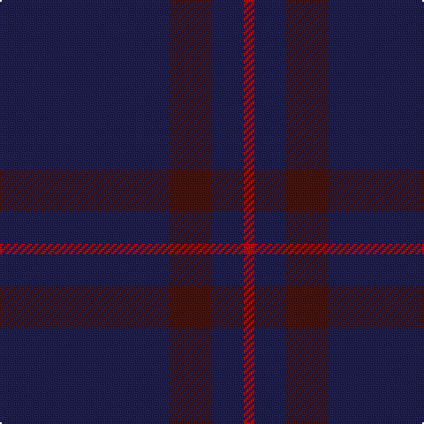

In pattern [BBBR](/patterns/bbbr/).

This was sourced from house-of-tartan.  It is a [4 stripes tartan](/stripes/stripes4/).

Original link http://www.house-of-tartan.scotland.net/house/TartanViewjs.asp?colr=Def&tnam=596

## Thread count
DB/96 DR24 DB18 R/6

## Palette
Each colour and its ΔE from the base-6 reference it is a variant of.

| Colour | Shade | Base | ΔE (OKLab) |
|---|---|---|---|
| DB | <code style="background-color:#202050;">#202050</code> `#202050` | B <code style="background-color:#2C4084;">#2C4084</code> | 0.13 |
| DR | <code style="background-color:#481410;">#481410</code> `#481410` | B <code style="background-color:#2C4084;">#2C4084</code> | 0.21 |
| R | <code style="background-color:#C50000;">#C50000</code> `#C50000` | R <code style="background-color:#C80000;">#C80000</code> | 0.01 |

# Sample pattern

ID: /setts/s4/b96ba24b18r6-b202050-ba481410-rc50000/
