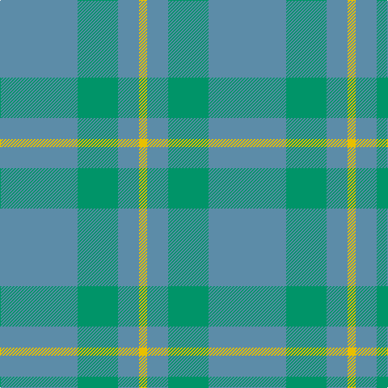

In pattern [BGBY](/patterns/bgby/).

This was sourced from register-of-tartans.  It is a [4 stripes tartan](/stripes/stripes4/).

Original link https://www.tartanregister.gov.uk/tartanDetails.aspx?ref=2059

## Attestations

This cloth appears in 2 source records; the oldest owns this page.

- 01/01/2003 — Laurel Park (register-of-tartans, [record](https://www.tartanregister.gov.uk/tartanDetails.aspx?ref=2059))
- pre 2003 — Laurel Park (Corporate) (tartans-authority, [record](http://www.tartansauthority.com/tartan-ferret/display/6016/))

## Thread count
B/96 Ba50 B26 Y/10

## Palette
Each colour and its ΔE from the base-6 reference it is a variant of.

| Colour | Shade | Base | ΔE (OKLab) |
|---|---|---|---|
| B | <code style="background-color:#5C8CA8;">#5C8CA8</code> `#5C8CA8` | B <code style="background-color:#2C4084;">#2C4084</code> | 0.23 |
| Ba | <code style="background-color:#009468;">#009468</code> `#009468` | G <code style="background-color:#006400;">#006400</code> | 0.16 |
| Y | <code style="background-color:#E8C000;">#E8C000</code> `#E8C000` | Y <code style="background-color:#E8C000;">#E8C000</code> | 0.00 |

# Sample pattern

## Nearest tartans

The nearest existing variants by ΔTartan distance.

1. [Takla Makan #2](/setts/s6/b8y30b8y30b8w4-b5c8ca8-we0e0e0-ya08858/) — ΔT 1.85
1. [Cairns, David (Personal)](/setts/s5/b88r8b32r64ra8-b5c5c5c-r888888-ra880000/) — ΔT 1.89
1. [Ledford (Name)](/setts/s3/g144r64y16-g008c44-r888888-yf0c800/) — ΔT 2.44
1. [McKerrell of Hillhouse Dress (Clan)](/setts/s4/w8r56b96y6-b5c8ca8-r888888-we0e0e0-ye8c000/) — ΔT 2.48
1. [Baker City (District)](/setts/s4/g16b40ga40b4-b5c8ca8-g005044-ga2c6464/) — ΔT 2.50
1. [Spring Morning](/setts/s6/g36ga36y4ga36g36ga4-g74846c-ga006818-yd09800/) — ΔT 2.61
1. [Spring Morning (Fashion)](/setts/s4/g4ga36g36y4-g006818-ga74846c-yd09800/) — ΔT 2.63
1. [Castle Bay (Fashion)](/setts/s5/g80w4ga10gb10ga30-g50a47c-ga5c6428-gb048888-we0e0e0/) — ΔT 2.64
1. [Blue Ridge](/setts/s10/g12b16r4b4y4b32g36b8g8b6-b5c8ca8-g408060-re86000-ye8c000/) — ΔT 2.68
1. [Blue Ridge (District)](/setts/s10/g24b32r8b8y8b64g72b16g16b12-b5c8ca8-g408060-re86000-ye8c000/) — ΔT 2.68

## Neighbour map

Every grey dot is one of 15726 variants placed by the first two principal components of the ΔTartan feature space (44% of its variance). Red is this tartan; blue dots are its nearest — click one to open its page.

<svg viewBox="0 0 640 380" role="img" style="max-width:100%;height:auto;border:1px solid #e0e0e0;border-radius:4px;display:block" xmlns="http://www.w3.org/2000/svg"><image href="/nn/cloud.v1.png" width="640" height="380"/><a href="/setts/s6/b8y30b8y30b8w4-b5c8ca8-we0e0e0-ya08858/"><circle cx="522.4" cy="304.5" r="4" fill="#3465a4"><title>Takla Makan #2</title></circle></a><a href="/setts/s5/b88r8b32r64ra8-b5c5c5c-r888888-ra880000/"><circle cx="504.3" cy="299.5" r="4" fill="#3465a4"><title>Cairns, David (Personal)</title></circle></a><a href="/setts/s3/g144r64y16-g008c44-r888888-yf0c800/"><circle cx="455.8" cy="317.2" r="4" fill="#3465a4"><title>Ledford (Name)</title></circle></a><a href="/setts/s4/w8r56b96y6-b5c8ca8-r888888-we0e0e0-ye8c000/"><circle cx="499.5" cy="279.5" r="4" fill="#3465a4"><title>McKerrell of Hillhouse Dress (Clan)</title></circle></a><a href="/setts/s4/g16b40ga40b4-b5c8ca8-g005044-ga2c6464/"><circle cx="372.7" cy="326.5" r="4" fill="#3465a4"><title>Baker City (District)</title></circle></a><a href="/setts/s6/g36ga36y4ga36g36ga4-g74846c-ga006818-yd09800/"><circle cx="401.3" cy="311.8" r="4" fill="#3465a4"><title>Spring Morning</title></circle></a><a href="/setts/s4/g4ga36g36y4-g006818-ga74846c-yd09800/"><circle cx="412.5" cy="303.5" r="4" fill="#3465a4"><title>Spring Morning (Fashion)</title></circle></a><a href="/setts/s5/g80w4ga10gb10ga30-g50a47c-ga5c6428-gb048888-we0e0e0/"><circle cx="461.0" cy="228.1" r="4" fill="#3465a4"><title>Castle Bay (Fashion)</title></circle></a><a href="/setts/s10/g12b16r4b4y4b32g36b8g8b6-b5c8ca8-g408060-re86000-ye8c000/"><circle cx="413.6" cy="259.4" r="4" fill="#3465a4"><title>Blue Ridge</title></circle></a><a href="/setts/s10/g24b32r8b8y8b64g72b16g16b12-b5c8ca8-g408060-re86000-ye8c000/"><circle cx="413.6" cy="259.4" r="4" fill="#3465a4"><title>Blue Ridge (District)</title></circle></a><circle cx="514.5" cy="322.3" r="5" fill="#c00000"/></svg>

ID: /setts/s4/b96g50b26y10-b5c8ca8-g009468-ye8c000/
