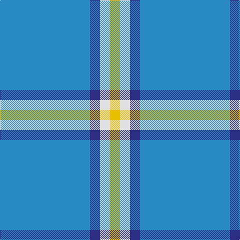

In pattern [BBWY](/patterns/bbwy/).

This was sourced from house-of-tartan.  It is a [4 stripes tartan](/stripes/stripes4/).

Original link http://www.house-of-tartan.scotland.net/house/TartanViewjs.asp?colr=Def&tnam=9113

## Thread count
B/180 DB20 LN20 Y/20

## Palette
Each colour and its ΔE from the base-6 reference it is a variant of.

| Colour | Shade | Base | ΔE (OKLab) |
|---|---|---|---|
| B | <code style="background-color:#2888C4;">#2888C4</code> `#2888C4` | B <code style="background-color:#2A418A;">#2A418A</code> | 0.21 |
| DB | <code style="background-color:#2C2C80;">#2C2C80</code> `#2C2C80` | B <code style="background-color:#2A418A;">#2A418A</code> | 0.06 |
| LN | <code style="background-color:#E0E0E0;">#E0E0E0</code> `#E0E0E0` | W <code style="background-color:#F7F7F7;">#F7F7F7</code> | 0.07 |
| Y | <code style="background-color:#E8C000;">#E8C000</code> `#E8C000` | Y <code style="background-color:#F2BF00;">#F2BF00</code> | 0.02 |

# Sample pattern

## Nearest tartans

The nearest existing variants by ΔTartan distance.

1. [Varrie](/setts/s4/b11ba1w1y1~b2888c4-ba2c2c80-we0e0e0-ye8c000~x20/) — ΔT 0.72
1. [Poulain League (Corporate)](/setts/s3/y6b38k3~b2888c4-k101010-ye8c000~x2/) — ΔT 1.66
1. [Gyle (Corporate)](/setts/s3/b8g1r2~b2888c4-g003820-r880000~x20/) — ΔT 1.67
1. [Gyle](/setts/s4/r2g1b8g1~b2888c4-g003820-r880000~x20/) — ΔT 1.81
1. [Loch Lomond Trade Tartan Tartan Number: 628. Earliest known date: pre 1984 Sent to the Scottish Tartans Society in Comrie by Lumsden of Toronto. See products available Copyright © Blair Urquhart, Comrie, 2015](/setts/s5/b37ba9b3bb9w3~b5c8ca8-ba1870a4-bb202060-we0e0e0~x2/) — ΔT 1.91
1. [Laidlaw's Highland Drovers](/setts/s6/b35k10b4w2b3r2~b1474b4-k101010-rc80000-wf8f8f8~x2/) — ΔT 1.94
1. [Carlisle Ancient](/setts/s5/b11y2r1y2r1~b2474e8-r880000-yd09800~x4/) — ΔT 1.97
1. [Dominion (Fashion)](/setts/s7/y6r1y17b3y3b8y1~b2c2c80-rc80000-y6c9cb4~x2/) — ΔT 2.01
1. [Loch Lomond](/setts/s5/b37w9b3ba9w3~b5480b0-ba000050-we0e0e0~x2/) — ΔT 2.09
1. [Starr](/setts/s7/w1b20wa3ba3b4w4wa1~b1474b4-ba2c2c80-w98c8e8-waf8f8f8~x4/) — ΔT 2.13

## Neighbour map

Every grey dot is one of 15726 variants placed by the first two principal components of the ΔTartan feature space (44% of its variance). Red is this tartan; blue dots are its nearest — click one to open its page.

<svg viewBox="0 0 640 380" role="img" style="max-width:100%;height:auto;border:1px solid #e0e0e0;border-radius:4px;display:block" xmlns="http://www.w3.org/2000/svg"><image href="/nn/cloud.v1.png" width="640" height="380"/><a href="/setts/s4/b11ba1w1y1~b2888c4-ba2c2c80-we0e0e0-ye8c000~x20/"><circle cx="509.9" cy="220.7" r="4" fill="#3465a4"><title>Varrie</title></circle></a><a href="/setts/s3/y6b38k3~b2888c4-k101010-ye8c000~x2/"><circle cx="527.9" cy="253.1" r="4" fill="#3465a4"><title>Poulain League (Corporate)</title></circle></a><a href="/setts/s3/b8g1r2~b2888c4-g003820-r880000~x20/"><circle cx="451.3" cy="282.8" r="4" fill="#3465a4"><title>Gyle (Corporate)</title></circle></a><a href="/setts/s4/r2g1b8g1~b2888c4-g003820-r880000~x20/"><circle cx="403.8" cy="256.3" r="4" fill="#3465a4"><title>Gyle</title></circle></a><a href="/setts/s5/b37ba9b3bb9w3~b5c8ca8-ba1870a4-bb202060-we0e0e0~x2/"><circle cx="415.8" cy="220.1" r="4" fill="#3465a4"><title>Loch Lomond Trade Tartan Tartan Number: 628. Earliest known date: pre 1984 Sent to the Scottish Tartans Society in Comrie by Lumsden of Toronto. See products available Copyright © Blair Urquhart, Comrie, 2015</title></circle></a><a href="/setts/s6/b35k10b4w2b3r2~b1474b4-k101010-rc80000-wf8f8f8~x2/"><circle cx="469.9" cy="177.8" r="4" fill="#3465a4"><title>Laidlaw's Highland Drovers</title></circle></a><a href="/setts/s5/b11y2r1y2r1~b2474e8-r880000-yd09800~x4/"><circle cx="394.3" cy="212.3" r="4" fill="#3465a4"><title>Carlisle Ancient</title></circle></a><a href="/setts/s7/y6r1y17b3y3b8y1~b2c2c80-rc80000-y6c9cb4~x2/"><circle cx="451.9" cy="208.7" r="4" fill="#3465a4"><title>Dominion (Fashion)</title></circle></a><a href="/setts/s5/b37w9b3ba9w3~b5480b0-ba000050-we0e0e0~x2/"><circle cx="380.0" cy="210.1" r="4" fill="#3465a4"><title>Loch Lomond</title></circle></a><a href="/setts/s7/w1b20wa3ba3b4w4wa1~b1474b4-ba2c2c80-w98c8e8-waf8f8f8~x4/"><circle cx="401.0" cy="162.4" r="4" fill="#3465a4"><title>Starr</title></circle></a><circle cx="459.7" cy="226.6" r="5" fill="#c00000"/></svg>

ID: /setts/s4/b9ba1w1y1~b2888c4-ba2c2c80-we0e0e0-ye8c000~x20/
