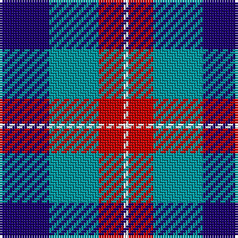

This page is one **sett** — a single exact thread-count. It belongs to the [tartan](/tartans/db10g10r5w1/)
(the same proportion at any scale), whose colour order is pattern [BGRW](/stripes/bgrw/).

Sourced from tartans-authority.  It is a [4 stripe tartan](/stripes/stripes4/).

Original link http://www.tartansauthority.com/tartan-ferret/display/6862/

2 attestations — the source records this cloth was collapsed from (oldest owns this page)

<ul>
<li>2006 January — Thorntons Law (Corporate) (tartans-authority, <a href="http://www.tartansauthority.com/tartan-ferret/display/6862/">record</a>)</li>
<li>undated — Thorntons Law Corporate Tartan Tartan Number: 6862. Earliest known date: 2005 Thorntons WS is a Dundee based solictors, estate agents and investment consultants. See products available Copyright © Blair Urquhart, Comrie, 2015 (house-of-tartan, <a href="http://www.house-of-tartan.scotland.net/house/TartanViewjs.asp?colr=Def&tnam=6862">record</a>)</li>
</ul>

## Thread count
DB/20 B20 R10 W/2

## Palette

Palette: <strong>Tartan Register</strong> <small style="color:#888">(3 of 4 colours)</small>
<table><thead><tr><th>Colour</th><th>Threads</th><th>Shade</th><th>Base</th><th>OKLCh</th></tr></thead><tbody><tr><td>DB/</td><td style="text-align:right;font-variant-numeric:tabular-nums">20</td><td><code style="background-color:#1C0070;">#1C0070</code> <small style="color:#888">#1C0070</small></td><td>B <code style="background-color:#2A418A;">#2A418A</code></td><td><small style="color:#888">oklch(26.3% 0.162 277.1)</small></td></tr><tr><td>B</td><td style="text-align:right;font-variant-numeric:tabular-nums">20</td><td><code style="background-color:#0098A0;">#0098A0</code> <small style="color:#888">#0098A0</small></td><td>G <code style="background-color:#006100;">#006100</code></td><td><small style="color:#888">oklch(61.8% 0.105 201.4)</small></td></tr><tr><td>R</td><td style="text-align:right;font-variant-numeric:tabular-nums">10</td><td><code style="background-color:#C80000;">#C80000</code> <small style="color:#888">#C80000</small></td><td>R <code style="background-color:#CC0000;">#CC0000</code></td><td><small style="color:#888">oklch(52.3% 0.215 29.2)</small></td></tr><tr><td>W/</td><td style="text-align:right;font-variant-numeric:tabular-nums">2</td><td><code style="background-color:#F8F8F8;">#F8F8F8</code> <small style="color:#888">#F8F8F8</small></td><td>W <code style="background-color:#F7F7F7;">#F7F7F7</code></td><td><small style="color:#888">oklch(97.9% 0.000 89.9)</small></td></tr></tbody></table>

# Sample pattern

## Nearest tartans

The nearest existing variants by ΔTartan distance, with this tartan at the top so the swatches line up against it.

ΔTartan

Tartan

Sett

—

<a href="/ttd/edit/#slug=db10g10r5w1~x2">Thorntons Law (Corporate)</a> <a class="nn-out" href="/setts/s4/db10g10r5w1~x2/" title="open its dictionary page">↗</a>

0.97

<a href="/ttd/edit/#slug=r15w10db48t32r6~x2">Lands of Liberty (Fashion)</a> <a class="nn-out" href="/setts/s5/r15w10db48t32r6~x2/" title="open its dictionary page">↗</a>

1.02

<a href="/ttd/edit/#slug=db9ly9db9t23r3~x2">Tilburg (District)</a> <a class="nn-out" href="/setts/s5/db9ly9db9t23r3~x2/" title="open its dictionary page">↗</a>

1.22

<a href="/ttd/edit/#slug=k1db8r6g8k1~x4">Edinburgh Tattoo 50th (Commemorative</a> <a class="nn-out" href="/setts/s5/k1db8r6g8k1~x4/" title="open its dictionary page">↗</a>

1.25

<a href="/ttd/edit/#slug=r10w5db30b20r3~x4">Lands of Liberty</a> <a class="nn-out" href="/setts/s5/r10w5db30b20r3~x4/" title="open its dictionary page">↗</a>

1.29

<a href="/ttd/edit/#slug=db9r12g9db5w2~x4">Battle of Prestonpans (1745) Heritage Trust, The</a> <a class="nn-out" href="/setts/s5/db9r12g9db5w2~x4/" title="open its dictionary page">↗</a>

1.33

<a href="/ttd/edit/#slug=b23dt18w5dt2r14dt18~x2">Pitt (Name)</a> <a class="nn-out" href="/setts/s6/b23dt18w5dt2r14dt18~x2/" title="open its dictionary page">↗</a>

1.34

<a href="/ttd/edit/#slug=k19db18w9r3~x4">Raven (Fashion)</a> <a class="nn-out" href="/setts/s4/k19db18w9r3~x4/" title="open its dictionary page">↗</a>

1.41

<a href="/ttd/edit/#slug=lr2r1t7db7lb1~x8">Bryson (1988) (Name)</a> <a class="nn-out" href="/setts/s5/lr2r1t7db7lb1~x8/" title="open its dictionary page">↗</a>

1.47

<a href="/ttd/edit/#slug=db9k7o5r1o5k1o2~x4">Greyhound Grenadiers (Corporate)</a> <a class="nn-out" href="/setts/s7/db9k7o5r1o5k1o2~x4/" title="open its dictionary page">↗</a>

1.47

<a href="/ttd/edit/#slug=k4w3k4y9r1~x4">Oban Grey</a> <a class="nn-out" href="/setts/s5/k4w3k4y9r1~x4/" title="open its dictionary page">↗</a>

## Neighbour map

Every grey dot is one of 14299 variants placed by the first two principal components of the ΔTartan feature space (44% of its variance). Red is this tartan; blue dots are its nearest — click one to open its page.

<svg viewBox="0 0 640 380" role="img" style="max-width:100%;height:auto;border:1px solid #e0e0e0;border-radius:4px;display:block" xmlns="http://www.w3.org/2000/svg"><image href="/nn/cloud.v1.png" width="640" height="380"/><a href="/setts/s5/r15w10db48t32r6~x2/"><circle cx="186.1" cy="222.9" r="4" fill="#3465a4"><title>Lands of Liberty (Fashion)</title></circle></a><a href="/setts/s5/db9ly9db9t23r3~x2/"><circle cx="194.6" cy="245.3" r="4" fill="#3465a4"><title>Tilburg (District)</title></circle></a><a href="/setts/s5/k1db8r6g8k1~x4/"><circle cx="142.5" cy="232.3" r="4" fill="#3465a4"><title>Edinburgh Tattoo 50th (Commemorative</title></circle></a><a href="/setts/s5/r10w5db30b20r3~x4/"><circle cx="210.6" cy="215.7" r="4" fill="#3465a4"><title>Lands of Liberty</title></circle></a><a href="/setts/s5/db9r12g9db5w2~x4/"><circle cx="120.8" cy="251.7" r="4" fill="#3465a4"><title>Battle of Prestonpans (1745) Heritage Trust, The</title></circle></a><a href="/setts/s6/b23dt18w5dt2r14dt18~x2/"><circle cx="223.8" cy="233.8" r="4" fill="#3465a4"><title>Pitt (Name)</title></circle></a><a href="/setts/s4/k19db18w9r3~x4/"><circle cx="146.2" cy="260.9" r="4" fill="#3465a4"><title>Raven (Fashion)</title></circle></a><a href="/setts/s5/lr2r1t7db7lb1~x8/"><circle cx="161.2" cy="211.8" r="4" fill="#3465a4"><title>Bryson (1988) (Name)</title></circle></a><a href="/setts/s7/db9k7o5r1o5k1o2~x4/"><circle cx="185.6" cy="220.7" r="4" fill="#3465a4"><title>Greyhound Grenadiers (Corporate)</title></circle></a><a href="/setts/s5/k4w3k4y9r1~x4/"><circle cx="187.5" cy="223.6" r="4" fill="#3465a4"><title>Oban Grey</title></circle></a><circle cx="178.3" cy="241.5" r="5" fill="#c00000"/></svg>

ID: /setts/s4/db10g10r5w1~x2/
