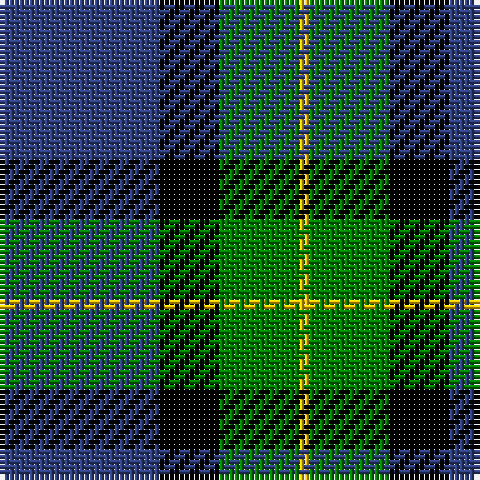

In pattern [BKGY](/stripes/bkgy/).

This was sourced from weddslist.  It is a [4 stripe tartan](/stripes/stripes4/).

Original link http://www.weddslist.com/cgi-bin/tartans/pg.pl?source=sts

## Thread count
B/32 K12 G16 Y/2

## Palette
Each colour and the base-6 reference it is a variant of.

| Colour | Shade | Base |
|---|---|---|
| B | <code style="background-color:#304080;">#304080</code> `oklch(39.4% 0.109 270.2)` <small>#304080</small> | B <code style="background-color:#2A418A;">#2A418A</code> |
| G | <code style="background-color:#008000;">#008000</code> `oklch(52.0% 0.177 142.5)` <small>#008000</small> | G <code style="background-color:#006100;">#006100</code> |
| K | <code style="background-color:#000000;">#000000</code> `oklch(0.0% 0.000 0.0)` <small>#000000</small> | K <code style="background-color:#000000;">#000000</code> |
| Y | <code style="background-color:#F0C000;">#F0C000</code> `oklch(82.7% 0.169 90.5)` <small>#F0C000</small> | Y <code style="background-color:#F2BF00;">#F2BF00</code> |

# Sample pattern

## Nearest tartans

The nearest existing variants by ΔTartan distance.

1. [Hamworthy Association](/setts/s4/k41lg16dg14w2~x2/) — ΔT 0.83
1. [U.S. Border Patrol (Corporate)](/setts/s5/g40k15b10k10ly3~x2/) — ΔT 1.25
1. [Rothesay & Caithness Fencibles (Mil)](/setts/s5/b32k10g15k2ly4~x2/) — ΔT 1.38
1. [Boroughmuir](/setts/s5/dg30w8dt32ly1dt8~x2/) — ΔT 1.41
1. [Fife Ethylene Plant](/setts/s5/dg35t40w11lo3dg7~x2/) — ΔT 1.42
1. [Unidentified Furnishing #2](/setts/s6/r4g40k21lo2k21g2~x2/) — ΔT 1.45
1. [Sinclair of Ulbster (Portrait)](/setts/s4/b12k4g6ly1~x8/) — ΔT 1.46
1. [McNiff, Kevin (Personal)](/setts/s4/g20r7db40w2~x2/) — ΔT 1.48
1. [MacIntyre L](/setts/s6/dg4db12r3db12dg32lb4/) — ΔT 1.51
1. [Wimbledon](/setts/s5/g30w8db32ly1db8~x2/) — ΔT 1.52

## Neighbour map

Every grey dot is one of 14299 variants placed by the first two principal components of the ΔTartan feature space (44% of its variance). Red is this tartan; blue dots are its nearest — click one to open its page.

<svg viewBox="0 0 640 380" role="img" style="max-width:100%;height:auto;border:1px solid #e0e0e0;border-radius:4px;display:block" xmlns="http://www.w3.org/2000/svg"><image href="/nn/cloud.v1.png" width="640" height="380"/><a href="/setts/s4/k41lg16dg14w2~x2/"><circle cx="312.6" cy="213.7" r="4" fill="#3465a4"><title>Hamworthy Association</title></circle></a><a href="/setts/s5/g40k15b10k10ly3~x2/"><circle cx="280.0" cy="216.3" r="4" fill="#3465a4"><title>U.S. Border Patrol (Corporate)</title></circle></a><a href="/setts/s5/b32k10g15k2ly4~x2/"><circle cx="277.0" cy="208.5" r="4" fill="#3465a4"><title>Rothesay &amp; Caithness Fencibles (Mil)</title></circle></a><a href="/setts/s5/dg30w8dt32ly1dt8~x2/"><circle cx="322.7" cy="193.2" r="4" fill="#3465a4"><title>Boroughmuir</title></circle></a><a href="/setts/s5/dg35t40w11lo3dg7~x2/"><circle cx="225.5" cy="203.2" r="4" fill="#3465a4"><title>Fife Ethylene Plant</title></circle></a><a href="/setts/s6/r4g40k21lo2k21g2~x2/"><circle cx="298.8" cy="185.1" r="4" fill="#3465a4"><title>Unidentified Furnishing #2</title></circle></a><a href="/setts/s4/b12k4g6ly1~x8/"><circle cx="278.3" cy="247.8" r="4" fill="#3465a4"><title>Sinclair of Ulbster (Portrait)</title></circle></a><a href="/setts/s4/g20r7db40w2~x2/"><circle cx="346.3" cy="211.5" r="4" fill="#3465a4"><title>McNiff, Kevin (Personal)</title></circle></a><a href="/setts/s6/dg4db12r3db12dg32lb4/"><circle cx="301.3" cy="218.4" r="4" fill="#3465a4"><title>MacIntyre L</title></circle></a><a href="/setts/s5/g30w8db32ly1db8~x2/"><circle cx="305.4" cy="180.3" r="4" fill="#3465a4"><title>Wimbledon</title></circle></a><circle cx="265.8" cy="226.7" r="5" fill="#c00000"/></svg>

ID: /setts/s4/db16k6g8ly1~x2/
