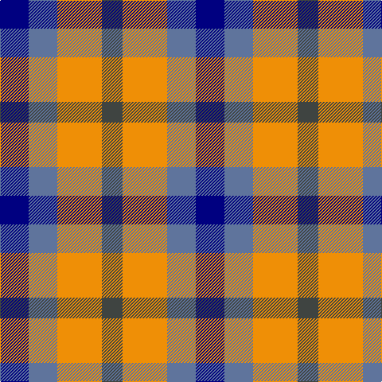

In pattern [BBYB](/stripes/bbyb/).

This was sourced from register-of-tartans.  It is a [4 stripe tartan](/stripes/stripes4/).

Original link https://www.tartanregister.gov.uk/tartanDetails.aspx?ref=10489

## Register references

External register numbers recorded for this tartan.

- Scottish Register of Tartans: [10489](https://www.tartanregister.gov.uk/tartanDetails.aspx?ref=10489)

## Thread count
DB/36 B36 O56 N/26

## Palette
Each colour and its ΔE from the base-6 reference it is a variant of.

| Colour | Shade | Base | ΔE (OKLab) |
|---|---|---|---|
| B | <code style="background-color:#5F749C;">#5F749C</code> `#5F749C` | B <code style="background-color:#2A418A;">#2A418A</code> | 0.17 |
| DB | <code style="background-color:#000080;">#000080</code> `#000080` | B <code style="background-color:#2A418A;">#2A418A</code> | 0.14 |
| N | <code style="background-color:#3F4441;">#3F4441</code> `#3F4441` | B <code style="background-color:#2A418A;">#2A418A</code> | 0.13 |
| O | <code style="background-color:#EF8F06;">#EF8F06</code> `#EF8F06` | Y <code style="background-color:#F2BF00;">#F2BF00</code> | 0.12 |

# Sample pattern

## Nearest tartans

The nearest existing variants by ΔTartan distance.

1. [Equity Vision Ltd](/setts/s4/do12k8t15w8~x2/) — ΔT 0.89
1. [Gold Country (District)](/setts/s4/db18b18lo28n13~x2/) — ΔT 1.06
1. [Kucher, Gregory (Personal)](/setts/s4/n2r1k1lr1~x10/) — ΔT 1.16
1. [Haggis Hostels](/setts/s4/r10t5lb5dt4~x8/) — ΔT 1.41
1. [Wilson's, No 113](/setts/s4/r1g3p3w1~x4/) — ΔT 1.53
1. [Austin / Wilson's No 173](/setts/s5/p3k3p3g6ly2~x2/) — ΔT 1.58
1. [Austin (Wilson's No 173)](/setts/s5/dp3k3dp3dg6ly2~x2/) — ΔT 1.58
1. [Austin / Wilson's No 137](/setts/s5/p3k3p3g6r2~x2/) — ΔT 1.63
1. [Mitchell, Martin (Personal)](/setts/s6/lr12lo8r5k6lr7g5~x4/) — ΔT 1.72
1. [Kazakhstan Relic (Artefact)](/setts/s3/lo5db5k3~x4/) — ΔT 1.77

## Neighbour map

Every grey dot is one of 14299 variants placed by the first two principal components of the ΔTartan feature space (44% of its variance). Red is this tartan; blue dots are its nearest — click one to open its page.

<svg viewBox="0 0 640 380" role="img" style="max-width:100%;height:auto;border:1px solid #e0e0e0;border-radius:4px;display:block" xmlns="http://www.w3.org/2000/svg"><image href="/nn/cloud.v1.png" width="640" height="380"/><a href="/setts/s4/do12k8t15w8~x2/"><circle cx="24.5" cy="332.5" r="4" fill="#3465a4"><title>Equity Vision Ltd</title></circle></a><a href="/setts/s4/db18b18lo28n13~x2/"><circle cx="78.5" cy="346.9" r="4" fill="#3465a4"><title>Gold Country (District)</title></circle></a><a href="/setts/s4/n2r1k1lr1~x10/"><circle cx="104.8" cy="338.8" r="4" fill="#3465a4"><title>Kucher, Gregory (Personal)</title></circle></a><a href="/setts/s4/r10t5lb5dt4~x8/"><circle cx="113.2" cy="304.5" r="4" fill="#3465a4"><title>Haggis Hostels</title></circle></a><a href="/setts/s4/r1g3p3w1~x4/"><circle cx="119.7" cy="284.7" r="4" fill="#3465a4"><title>Wilson's, No 113</title></circle></a><a href="/setts/s5/p3k3p3g6ly2~x2/"><circle cx="71.4" cy="288.6" r="4" fill="#3465a4"><title>Austin / Wilson's No 173</title></circle></a><a href="/setts/s5/dp3k3dp3dg6ly2~x2/"><circle cx="93.6" cy="304.0" r="4" fill="#3465a4"><title>Austin (Wilson's No 173)</title></circle></a><a href="/setts/s5/p3k3p3g6r2~x2/"><circle cx="85.3" cy="293.4" r="4" fill="#3465a4"><title>Austin / Wilson's No 137</title></circle></a><a href="/setts/s6/lr12lo8r5k6lr7g5~x4/"><circle cx="80.1" cy="287.3" r="4" fill="#3465a4"><title>Mitchell, Martin (Personal)</title></circle></a><a href="/setts/s3/lo5db5k3~x4/"><circle cx="94.3" cy="366.0" r="4" fill="#3465a4"><title>Kazakhstan Relic (Artefact)</title></circle></a><circle cx="54.8" cy="329.7" r="5" fill="#c00000"/></svg>

ID: /setts/s4/db18t18lo28dt13~x2/
