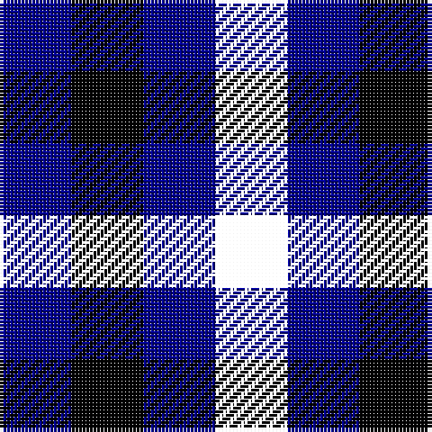

**Bands:** [BKBK](/stripes/bkbk/) · **Stripes:** [DB K DB K](/stripes/stripes4/) DB K DB K

This was sourced from tartans-authority.  It is a [4 band tartan](/bands/bands4/).

Original link http://www.tartansauthority.com/tartan-ferret/display/4202/

## Variants

Other setts woven to the same stripe pattern.

- [Auchincloss (Personal)](/setts/s4/k34db13k7db14~x2/)
- [Loevenstein Castle 2 (Artefact)](/setts/s4/k20db1k4db3~x4/)

## Thread count
DB/20 K20 DBa20 G/20

## Palette
Each colour and its ΔE from the base-6 reference it is a variant of.

| Colour | Shade | Base | ΔE (OKLab) |
|---|---|---|---|
| DB | <code style="background-color:#00008C;">#00008C</code> `#00008C` | B <code style="background-color:#2A418A;">#2A418A</code> | 0.13 |
| DBa | <code style="background-color:#00008C;">#00008C</code> `#00008C` | B <code style="background-color:#2A418A;">#2A418A</code> | 0.13 |
| K | <code style="background-color:#000000;">#000000</code> `#000000` | K <code style="background-color:#000000;">#000000</code> | 0.00 |

# Sample pattern

## Nearest tartans

The nearest existing variants by ΔTartan distance.

1. [Glenlyon](/setts/s3/db8dg7k8~x2/) — ΔT 2.97
1. [Antonello (Personal)](/setts/s6/db1g1db1r1t1k1~x24/) — ΔT 3.18
1. [Bell, Siobhan (Personal)](/setts/s10/dp1k1db1k1db1k1db1g1r1k1~x10/) — ΔT 3.28
1. [Wilson's No.185](/setts/s3/k11g9dp10~x2/) — ΔT 3.34
1. [Glen Lyon](/setts/s3/db8g7k8~x2/) — ΔT 3.62
1. [Wilson's, No 185](/setts/s3/k11p10g9~x2/) — ΔT 3.86
1. [Bowater (Estate Check)](/setts/s4/dp1k1dy1r1~x4/) — ΔT 3.91
1. [Wandering Shepherd (Personal)](/setts/s5/db2k2g2db1k1~x20/) — ΔT 3.94
1. [Antonelli (Oklahoma), John (Personal)](/setts/s6/db1g1db1r1lt1k1~x25/) — ΔT 4.01
1. [Weston Family Tartan Tartan Number: 5777. Earliest known date: Feb 2002 For their wedding. See products available Copyright © Blair Urquhart, Comrie, 2015](/setts/s8/db4db4dp4k4w1k4dp4db4~x10/) — ΔT 4.07

## Neighbour map

Every grey dot is one of 14313 variants placed by the first two principal components of the ΔTartan feature space (44% of its variance). Red is this tartan; blue dots are its nearest — click one to open its page.

<svg viewBox="0 0 640 380" role="img" style="max-width:100%;height:auto;border:1px solid #e0e0e0;border-radius:4px;display:block" xmlns="http://www.w3.org/2000/svg"><image href="/nn/cloud.v1.png" width="640" height="380"/><a href="/setts/s3/db8dg7k8~x2/"><circle cx="109.7" cy="366.0" r="4" fill="#3465a4"><title>Glenlyon</title></circle></a><a href="/setts/s6/db1g1db1r1t1k1~x24/"><circle cx="14.0" cy="366.0" r="4" fill="#3465a4"><title>Antonello (Personal)</title></circle></a><a href="/setts/s10/dp1k1db1k1db1k1db1g1r1k1~x10/"><circle cx="14.0" cy="366.0" r="4" fill="#3465a4"><title>Bell, Siobhan (Personal)</title></circle></a><a href="/setts/s3/k11g9dp10~x2/"><circle cx="77.6" cy="366.0" r="4" fill="#3465a4"><title>Wilson's No.185</title></circle></a><a href="/setts/s3/db8g7k8~x2/"><circle cx="22.4" cy="366.0" r="4" fill="#3465a4"><title>Glen Lyon</title></circle></a><a href="/setts/s3/k11p10g9~x2/"><circle cx="35.6" cy="366.0" r="4" fill="#3465a4"><title>Wilson's, No 185</title></circle></a><a href="/setts/s4/dp1k1dy1r1~x4/"><circle cx="14.0" cy="366.0" r="4" fill="#3465a4"><title>Bowater (Estate Check)</title></circle></a><a href="/setts/s5/db2k2g2db1k1~x20/"><circle cx="154.5" cy="366.0" r="4" fill="#3465a4"><title>Wandering Shepherd (Personal)</title></circle></a><a href="/setts/s6/db1g1db1r1lt1k1~x25/"><circle cx="14.0" cy="366.0" r="4" fill="#3465a4"><title>Antonelli (Oklahoma), John (Personal)</title></circle></a><a href="/setts/s8/db4db4dp4k4w1k4dp4db4~x10/"><circle cx="63.5" cy="303.7" r="4" fill="#3465a4"><title>Weston Family Tartan Tartan Number: 5777. Earliest known date: Feb 2002 For their wedding. See products available Copyright © Blair Urquhart, Comrie, 2015</title></circle></a><circle cx="14.0" cy="366.0" r="5" fill="#c00000"/></svg>

ID: /setts/s4/db1k1db1k1~x20/
