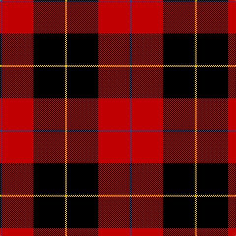

In pattern [BRKY](/stripes/brky/).

This was sourced from weddslist.  It is a [4 stripe tartan](/stripes/stripes4/).

Original link http://www.weddslist.com/cgi-bin/tartans/pg.pl?source=sts

## Thread count
Y/4 K64 R64 B/4

## Palette
Each colour and the base-6 reference it is a variant of.

| Colour | Shade | Base |
|---|---|---|
| B | <code style="background-color:#304080;">#304080</code> `oklch(39.4% 0.109 270.2)` <small>#304080</small> | B <code style="background-color:#2A418A;">#2A418A</code> |
| K | <code style="background-color:#000000;">#000000</code> `oklch(0.0% 0.000 0.0)` <small>#000000</small> | K <code style="background-color:#000000;">#000000</code> |
| R | <code style="background-color:#C00000;">#C00000</code> `oklch(50.7% 0.208 29.2)` <small>#C00000</small> | R <code style="background-color:#CC0000;">#CC0000</code> |
| Y | <code style="background-color:#F0C000;">#F0C000</code> `oklch(82.7% 0.169 90.5)` <small>#F0C000</small> | Y <code style="background-color:#F2BF00;">#F2BF00</code> |

# Sample pattern

## Nearest tartans

The nearest existing variants by ΔTartan distance.

1. [Templar Grand Priory USA](/setts/s4/db3k32r27w2~x2/) — ΔT 1.01
1. [Brodie](/setts/s6/k2r16k8ly1k8r2~x2/) — ΔT 1.23
1. [Brodie Dress](/setts/s6/k2r16k8ly1k8r2/) — ΔT 1.24
1. [Billy Apple](/setts/s4/g1r8k13ly1~x6/) — ΔT 1.26
1. [Connel](/setts/s4/w1r8k8ly1~x2/) — ΔT 1.28
1. [Munro VS](/setts/s5/k18r4k18r32lb3/) — ΔT 1.31
1. [Munro VS](/setts/s5/k18r4k18r32lr3~x2/) — ΔT 1.33
1. [Munro VS](/setts/s5/k18r4k18r32lr3/) — ΔT 1.33
1. [Klymson (Chicago) (Personal)](/setts/s4/k70lo16lt3r45/) — ΔT 1.34
1. [Ramsay](/setts/s6/k4w2k28r30dp1r3~x2/) — ΔT 1.42

## Neighbour map

Every grey dot is one of 14299 variants placed by the first two principal components of the ΔTartan feature space (44% of its variance). Red is this tartan; blue dots are its nearest — click one to open its page.

<svg viewBox="0 0 640 380" role="img" style="max-width:100%;height:auto;border:1px solid #e0e0e0;border-radius:4px;display:block" xmlns="http://www.w3.org/2000/svg"><image href="/nn/cloud.v1.png" width="640" height="380"/><a href="/setts/s4/db3k32r27w2~x2/"><circle cx="315.6" cy="199.6" r="4" fill="#3465a4"><title>Templar Grand Priory USA</title></circle></a><a href="/setts/s6/k2r16k8ly1k8r2~x2/"><circle cx="322.2" cy="194.0" r="4" fill="#3465a4"><title>Brodie</title></circle></a><a href="/setts/s6/k2r16k8ly1k8r2/"><circle cx="320.5" cy="192.3" r="4" fill="#3465a4"><title>Brodie Dress</title></circle></a><a href="/setts/s4/g1r8k13ly1~x6/"><circle cx="332.4" cy="206.9" r="4" fill="#3465a4"><title>Billy Apple</title></circle></a><a href="/setts/s4/w1r8k8ly1~x2/"><circle cx="231.3" cy="217.9" r="4" fill="#3465a4"><title>Connel</title></circle></a><a href="/setts/s5/k18r4k18r32lb3/"><circle cx="289.3" cy="225.1" r="4" fill="#3465a4"><title>Munro VS</title></circle></a><a href="/setts/s5/k18r4k18r32lr3~x2/"><circle cx="296.9" cy="232.4" r="4" fill="#3465a4"><title>Munro VS</title></circle></a><a href="/setts/s5/k18r4k18r32lr3/"><circle cx="296.9" cy="232.4" r="4" fill="#3465a4"><title>Munro VS</title></circle></a><a href="/setts/s4/k70lo16lt3r45/"><circle cx="285.6" cy="179.5" r="4" fill="#3465a4"><title>Klymson (Chicago) (Personal)</title></circle></a><a href="/setts/s6/k4w2k28r30dp1r3~x2/"><circle cx="339.2" cy="137.2" r="4" fill="#3465a4"><title>Ramsay</title></circle></a><circle cx="299.3" cy="192.3" r="5" fill="#c00000"/></svg>

ID: /setts/s4/db1r16k16ly1~x4/
