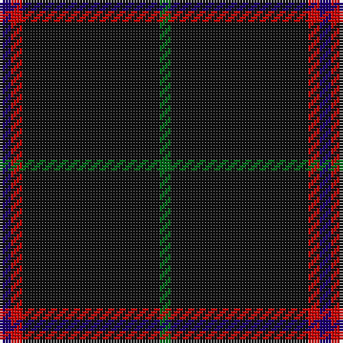

**Bands:** [BRKG](/stripes/brkg/) · **Stripes:** [DB R K G](/stripes/stripes4/) DB R K G

This was sourced from tartans-authority.  It is a [4 band tartan](/bands/bands4/).

Original link http://www.tartansauthority.com/tartan-ferret/display/3497/

## Attestations

This cloth appears in 2 source records; the oldest owns this page.

- pre 2002 — MacNathair Sgianach (tartans-authority, [record](http://www.tartansauthority.com/tartan-ferret/display/3497/))
- undated — MacNathair Sgianach (Personal) (register-of-tartans, [record](https://www.tartanregister.gov.uk/tartanDetails.aspx?ref=5204))

## Register references

External register numbers recorded for this tartan.

- Scottish Register of Tartans: [5204](https://www.tartanregister.gov.uk/tartanDetails.aspx?ref=5204)
- Scottish Tartans Authority (ITI): 3497

## Thread count
DB/4 R4 K48 G/4

## Palette
Each colour and its ΔE from the base-6 reference it is a variant of.

| Colour | Shade | Base | ΔE (OKLab) |
|---|---|---|---|
| DB | <code style="background-color:#1C0070;">#1C0070</code> `#1C0070` | B <code style="background-color:#2A418A;">#2A418A</code> | 0.14 |
| G | <code style="background-color:#006818;">#006818</code> `#006818` | G <code style="background-color:#006100;">#006100</code> | 0.02 |
| K | <code style="background-color:#101010;">#101010</code> `#101010` | K <code style="background-color:#000000;">#000000</code> | 0.17 |
| R | <code style="background-color:#C80000;">#C80000</code> `#C80000` | R <code style="background-color:#CC0000;">#CC0000</code> | 0.01 |

# Sample pattern

## Nearest tartans

The nearest existing variants by ΔTartan distance.

1. [MacLaine of Lochbuie Hunting](/setts/s5/dt32r3dt4k2lo3~x2/) — ΔT 1.11
1. [Langhein, Alex (Personal)](/setts/s7/k40dg15k10r2k10lo2k10~x2/) — ΔT 1.69
1. [Rikaco Vintage](/setts/s8/dt74m9dt4r5dt4m9dt37db9~x2/) — ΔT 1.78
1. [Unidentified #45](/setts/s7/k24dg3r3k24r2k2r2/) — ΔT 1.80
1. [Laird Abdullah (Personal)](/setts/s8/k10n2k2n8k40r4k5r2~x2/) — ΔT 1.81
1. [Langhein, Alex (Personal)](/setts/s8/k40dg15k10r2k10lo2k10lo2~x2/) — ΔT 1.93
1. [Dunnotar (School)](/setts/s4/k72w3k11db9/) — ΔT 1.95
1. [Langhein Family Tartan Tartan Number: 3235. Earliest known date: April 2002 Based on Black Watch Sett See products available Copyright © Blair Urquhart, Comrie, 2015](/setts/s7/k40dg15k10r2k10ly2k10~x2/) — ΔT 1.99
1. [Burnetts & Struth](/setts/s5/dt68t7dt16k16lo4~x2/) — ΔT 2.02
1. [Freedom of Scotland](/setts/s6/k15n7k6n11k50n4~x2/) — ΔT 2.02

## Neighbour map

Every grey dot is one of 14313 variants placed by the first two principal components of the ΔTartan feature space (44% of its variance). Red is this tartan; blue dots are its nearest — click one to open its page.

<svg viewBox="0 0 640 380" role="img" style="max-width:100%;height:auto;border:1px solid #e0e0e0;border-radius:4px;display:block" xmlns="http://www.w3.org/2000/svg"><image href="/nn/cloud.v1.png" width="640" height="380"/><a href="/setts/s5/dt32r3dt4k2lo3~x2/"><circle cx="585.8" cy="213.0" r="4" fill="#3465a4"><title>MacLaine of Lochbuie Hunting</title></circle></a><a href="/setts/s7/k40dg15k10r2k10lo2k10~x2/"><circle cx="548.3" cy="220.5" r="4" fill="#3465a4"><title>Langhein, Alex (Personal)</title></circle></a><a href="/setts/s8/dt74m9dt4r5dt4m9dt37db9~x2/"><circle cx="539.7" cy="182.9" r="4" fill="#3465a4"><title>Rikaco Vintage</title></circle></a><a href="/setts/s7/k24dg3r3k24r2k2r2/"><circle cx="578.4" cy="225.5" r="4" fill="#3465a4"><title>Unidentified #45</title></circle></a><a href="/setts/s8/k10n2k2n8k40r4k5r2~x2/"><circle cx="538.7" cy="174.2" r="4" fill="#3465a4"><title>Laird Abdullah (Personal)</title></circle></a><a href="/setts/s8/k40dg15k10r2k10lo2k10lo2~x2/"><circle cx="544.6" cy="213.1" r="4" fill="#3465a4"><title>Langhein, Alex (Personal)</title></circle></a><a href="/setts/s4/k72w3k11db9/"><circle cx="626.0" cy="233.5" r="4" fill="#3465a4"><title>Dunnotar (School)</title></circle></a><a href="/setts/s7/k40dg15k10r2k10ly2k10~x2/"><circle cx="568.7" cy="233.4" r="4" fill="#3465a4"><title>Langhein Family Tartan Tartan Number: 3235. Earliest known date: April 2002 Based on Black Watch Sett See products available Copyright © Blair Urquhart, Comrie, 2015</title></circle></a><a href="/setts/s5/dt68t7dt16k16lo4~x2/"><circle cx="551.3" cy="244.9" r="4" fill="#3465a4"><title>Burnetts &amp; Struth</title></circle></a><a href="/setts/s6/k15n7k6n11k50n4~x2/"><circle cx="565.2" cy="266.2" r="4" fill="#3465a4"><title>Freedom of Scotland</title></circle></a><circle cx="567.4" cy="237.9" r="5" fill="#c00000"/></svg>

ID: /setts/s4/db1r1k12g1~x4/
