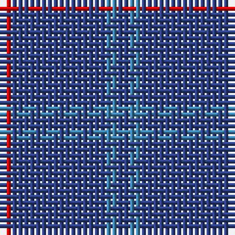

In pattern [BBBR](/stripes/bbbr/).

This was sourced from register-of-tartans.  It is a [4 stripe tartan](/stripes/stripes4/).

Original link https://www.tartanregister.gov.uk/tartanDetails.aspx?ref=2161

## Also known as

This cloth is also recorded under:

- Lochaber #3

## Attestations

This cloth appears in 2 source records; the oldest owns this page.

- undated — Lochaber #3 (register-of-tartans, [record](https://www.tartanregister.gov.uk/tartanDetails.aspx?ref=2161))
- undated — Lochaber (weddslist, [record](http://www.weddslist.com/cgi-bin/tartans/pg.pl?source=sts))

## Register references

External register numbers recorded for this tartan.

- Scottish Register of Tartans: [2161](https://www.tartanregister.gov.uk/tartanDetails.aspx?ref=2161)
- Scottish Tartans World Register: 41

## Thread count
R/2 B16 Ba2 B/2

## Palette
Each colour and the base-6 reference it is a variant of.

| Colour | Shade | Base |
|---|---|---|
| B | <code style="background-color:#2C4084;">#2C4084</code> `oklch(39.4% 0.117 268.3)` <small>#2C4084</small> | B <code style="background-color:#2A418A;">#2A418A</code> |
| Ba | <code style="background-color:#3C82AF;">#3C82AF</code> `oklch(58.1% 0.099 239.8)` <small>#3C82AF</small> | B <code style="background-color:#2A418A;">#2A418A</code> |
| R | <code style="background-color:#DC0000;">#DC0000</code> `oklch(56.2% 0.230 29.2)` <small>#DC0000</small> | R <code style="background-color:#CC0000;">#CC0000</code> |

# Sample pattern

## Nearest tartans

The nearest existing variants by ΔTartan distance.

1. [Hebridean, (Old..)](/setts/s7/db10r1db10r2db10r1g2~x2/) — ΔT 1.56
1. [Brooks Brothers Tattersall Blue](/setts/s5/r1db9lo2db9lo1~x4/) — ΔT 1.74
1. [Lynch](/setts/s6/r19db6r7db101dg6db7~x2/) — ΔT 1.80
1. [Elliot (Clan)](/setts/s4/db44dy12db9r3~x2/) — ΔT 1.86
1. [GulfMark](/setts/s5/dt72b6dt12b17w6~x2/) — ΔT 1.87
1. [MacLaine of Lochbuie](/setts/s4/db32r3db4ly3~x2/) — ΔT 1.96
1. [Lynch](/setts/s6/r3db2r1db18g1db2~x4/) — ΔT 1.99
1. [Elliott](/setts/s4/db16dr4db3r1~x2/) — ΔT 2.07
1. [Gulfmark (Corporate)](/setts/s5/db72t6db12t17w6~x2/) — ΔT 2.10
1. [Burnett's & Struth (Corporate)](/setts/s5/dt68b7dt16k16lo4~x2/) — ΔT 2.20

## Neighbour map

Every grey dot is one of 14299 variants placed by the first two principal components of the ΔTartan feature space (44% of its variance). Red is this tartan; blue dots are its nearest — click one to open its page.

<svg viewBox="0 0 640 380" role="img" style="max-width:100%;height:auto;border:1px solid #e0e0e0;border-radius:4px;display:block" xmlns="http://www.w3.org/2000/svg"><image href="/nn/cloud.v1.png" width="640" height="380"/><a href="/setts/s7/db10r1db10r2db10r1g2~x2/"><circle cx="578.6" cy="267.0" r="4" fill="#3465a4"><title>Hebridean, (Old..)</title></circle></a><a href="/setts/s5/r1db9lo2db9lo1~x4/"><circle cx="543.9" cy="269.1" r="4" fill="#3465a4"><title>Brooks Brothers Tattersall Blue</title></circle></a><a href="/setts/s6/r19db6r7db101dg6db7~x2/"><circle cx="594.7" cy="211.2" r="4" fill="#3465a4"><title>Lynch</title></circle></a><a href="/setts/s4/db44dy12db9r3~x2/"><circle cx="612.0" cy="290.5" r="4" fill="#3465a4"><title>Elliot (Clan)</title></circle></a><a href="/setts/s5/dt72b6dt12b17w6~x2/"><circle cx="512.1" cy="236.8" r="4" fill="#3465a4"><title>GulfMark</title></circle></a><a href="/setts/s4/db32r3db4ly3~x2/"><circle cx="590.7" cy="239.4" r="4" fill="#3465a4"><title>MacLaine of Lochbuie</title></circle></a><a href="/setts/s6/r3db2r1db18g1db2~x4/"><circle cx="602.2" cy="204.9" r="4" fill="#3465a4"><title>Lynch</title></circle></a><a href="/setts/s4/db16dr4db3r1~x2/"><circle cx="603.0" cy="279.8" r="4" fill="#3465a4"><title>Elliott</title></circle></a><a href="/setts/s5/db72t6db12t17w6~x2/"><circle cx="496.7" cy="232.9" r="4" fill="#3465a4"><title>Gulfmark (Corporate)</title></circle></a><a href="/setts/s5/dt68b7dt16k16lo4~x2/"><circle cx="548.1" cy="240.6" r="4" fill="#3465a4"><title>Burnett's &amp; Struth (Corporate)</title></circle></a><circle cx="590.7" cy="279.5" r="5" fill="#c00000"/></svg>

ID: /setts/s4/db1t1db8r1~x2/
