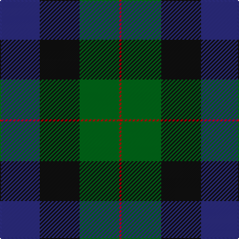

In pattern [BKGR](/stripes/bkgr/).

This was sourced from tartans-authority.  It is a [4 stripe tartan](/stripes/stripes4/).

Original link http://www.tartansauthority.com/tartan-ferret/display/10460/

## Thread count
DB/40 K40 G40 R/2

## Palette
Each colour and the base-6 reference it is a variant of.

| Colour | Shade | Base |
|---|---|---|
| DB | <code style="background-color:#2C2C80;">#2C2C80</code> `oklch(35.0% 0.138 276.6)` <small>#2C2C80</small> | B <code style="background-color:#2A418A;">#2A418A</code> |
| G | <code style="background-color:#006818;">#006818</code> `oklch(45.0% 0.142 145.0)` <small>#006818</small> | G <code style="background-color:#006100;">#006100</code> |
| K | <code style="background-color:#101010;">#101010</code> `oklch(17.3% 0.000 89.9)` <small>#101010</small> | K <code style="background-color:#000000;">#000000</code> |
| R | <code style="background-color:#C80000;">#C80000</code> `oklch(52.3% 0.215 29.2)` <small>#C80000</small> | R <code style="background-color:#CC0000;">#CC0000</code> |

# Sample pattern

## Nearest tartans

The nearest existing variants by ΔTartan distance.

1. [Gunn (2011) Personal Tartan Tartan Number: 10459. Earliest known date: 17th July 2011 This is a variation on the original Gunn tartan, created in memory of the designer's grandfather, William Jesse Gunn and intended principally for the designer and his immediate family. See products available Copyright © Blair Urquhart, Comrie, 2015](/setts/s4/b20k20g20r1~x2/) — ΔT 1.01
1. [Wilson's Folio 131](/setts/s5/db12k17dg19w2k5~x2/) — ΔT 1.40
1. [Landels (Personal)](/setts/s5/db31g2k20ly2g24~x2/) — ΔT 1.54
1. [Gunn](/setts/s6/r2g12k12g1db12g2~x2/) — ΔT 1.57
1. [Glenturret Distillery](/setts/s6/lo4db24g3k21g23k1~x2/) — ΔT 1.58
1. [Graham of Montrose](/setts/s6/k4dg19k16w2db15dg4~x2/) — ΔT 1.62
1. [Dundas #2](/setts/s7/k4db16k12g12r1g2k2~x2/) — ΔT 1.66
1. [Louisville Spaulding (Personal)](/setts/s5/k20db50g50r3k3~x2/) — ΔT 1.69
1. [Corey in Balachuirn](/setts/s5/b32do16dg3o4k28~x2/) — ΔT 1.71
1. [Ferguson of Balquhidder](/setts/s6/k2dg12k12r1db12dg2~x2/) — ΔT 1.72

## Neighbour map

Every grey dot is one of 14299 variants placed by the first two principal components of the ΔTartan feature space (44% of its variance). Red is this tartan; blue dots are its nearest — click one to open its page.

<svg viewBox="0 0 640 380" role="img" style="max-width:100%;height:auto;border:1px solid #e0e0e0;border-radius:4px;display:block" xmlns="http://www.w3.org/2000/svg"><image href="/nn/cloud.v1.png" width="640" height="380"/><a href="/setts/s4/b20k20g20r1~x2/"><circle cx="201.8" cy="247.5" r="4" fill="#3465a4"><title>Gunn (2011) Personal Tartan Tartan Number: 10459. Earliest known date: 17th July 2011 This is a variation on the original Gunn tartan, created in memory of the designer's grandfather, William Jesse Gunn and intended principally for the designer and his immediate family. See products available Copyright © Blair Urquhart, Comrie, 2015</title></circle></a><a href="/setts/s5/db12k17dg19w2k5~x2/"><circle cx="222.6" cy="268.2" r="4" fill="#3465a4"><title>Wilson's Folio 131</title></circle></a><a href="/setts/s5/db31g2k20ly2g24~x2/"><circle cx="218.7" cy="213.6" r="4" fill="#3465a4"><title>Landels (Personal)</title></circle></a><a href="/setts/s6/r2g12k12g1db12g2~x2/"><circle cx="216.6" cy="230.6" r="4" fill="#3465a4"><title>Gunn</title></circle></a><a href="/setts/s6/lo4db24g3k21g23k1~x2/"><circle cx="226.1" cy="198.5" r="4" fill="#3465a4"><title>Glenturret Distillery</title></circle></a><a href="/setts/s6/k4dg19k16w2db15dg4~x2/"><circle cx="222.9" cy="254.1" r="4" fill="#3465a4"><title>Graham of Montrose</title></circle></a><a href="/setts/s7/k4db16k12g12r1g2k2~x2/"><circle cx="248.7" cy="216.6" r="4" fill="#3465a4"><title>Dundas #2</title></circle></a><a href="/setts/s5/k20db50g50r3k3~x2/"><circle cx="255.6" cy="220.7" r="4" fill="#3465a4"><title>Louisville Spaulding (Personal)</title></circle></a><a href="/setts/s5/b32do16dg3o4k28~x2/"><circle cx="199.4" cy="229.4" r="4" fill="#3465a4"><title>Corey in Balachuirn</title></circle></a><a href="/setts/s6/k2dg12k12r1db12dg2~x2/"><circle cx="250.1" cy="250.9" r="4" fill="#3465a4"><title>Ferguson of Balquhidder</title></circle></a><circle cx="227.0" cy="259.3" r="5" fill="#c00000"/></svg>

ID: /setts/s4/db20k20g20r1~x2/
