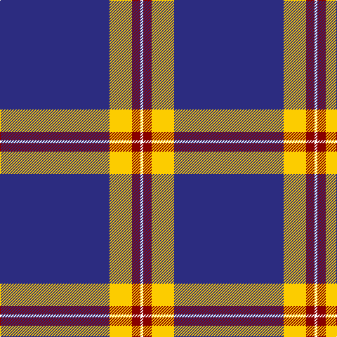

**Bands:** [BYRW](/stripes/byrw/) · **Stripes:** [DB LY R W](/stripes/stripes4/) DB LY R W

This was sourced from tartans-authority.  It is a [4 band tartan](/bands/bands4/).

Original link http://www.tartansauthority.com/tartan-ferret/display/10631/

## Attestations

This cloth appears in 2 source records; the oldest owns this page.

- 04/06/2012 — Norwich University (Corporate) (tartans-authority, [record](http://www.tartansauthority.com/tartan-ferret/display/10631/))
- undated — Norwich University Regimental Tartan Tartan Number: 10631. Earliest known date: 2012 The tartan was designed for use by the Norwich University Pipes and Drums Band primarily in kilts. The blue is from the Corps of Cadets formal attire coatee and the University colors are maroon and gold See products available Copyright © Blair Urquhart, Comrie, 2015 (house-of-tartan, [record](http://www.house-of-tartan.scotland.net/house/TartanViewjs.asp?colr=Def&tnam=10631))

## Thread count
DB/156 Y32 DR12 W/4

## Palette
Each colour and its ΔE from the base-6 reference it is a variant of.

| Colour | Shade | Base | ΔE (OKLab) |
|---|---|---|---|
| DB | <code style="background-color:#2C2C80;">#2C2C80</code> `#2C2C80` | B <code style="background-color:#2A418A;">#2A418A</code> | 0.06 |
| DR | <code style="background-color:#880000;">#880000</code> `#880000` | R <code style="background-color:#CC0000;">#CC0000</code> | 0.15 |
| W | <code style="background-color:#FCFCFC;">#FCFCFC</code> `#FCFCFC` | W <code style="background-color:#F7F7F7;">#F7F7F7</code> | 0.01 |
| Y | <code style="background-color:#FCCC00;">#FCCC00</code> `#FCCC00` | Y <code style="background-color:#F2BF00;">#F2BF00</code> | 0.04 |

# Sample pattern

## Nearest tartans

The nearest existing variants by ΔTartan distance.

1. [Auchtermuchty Tartan Army (Corp)](/setts/s6/db80r7w1r7ly20db15~x2/) — ΔT 1.09
1. [Auchtermuchty Tartan Army](/setts/s6/db80r8w1r8ly20db15~x2/) — ΔT 1.18
1. [St. John (Corporate?)](/setts/s5/db67w10ly14db10w2/) — ΔT 1.28
1. [Norwich University](/setts/s4/db39lo8r3w1~x4/) — ΔT 1.29
1. [Special Air Service](/setts/s5/db26lb6g1r1w2~x2/) — ΔT 1.40
1. [Balmer (Personal)](/setts/s6/ly2r5ly2r5db49w2~x2/) — ΔT 1.55
1. [Talisker](/setts/s7/db16w4db1w2db24w1lo4~x2/) — ΔT 1.66
1. [Hsu (Personal)](/setts/s4/db60g16w8ly3~x2/) — ΔT 1.67
1. [Special Air Service](/setts/s5/db26t6dg1o1w2~x2/) — ΔT 1.73
1. [MacLaine of Lochbuie, hunting](/setts/s5/db32r3db4k1ly3~x2/) — ΔT 1.81

## Neighbour map

Every grey dot is one of 14313 variants placed by the first two principal components of the ΔTartan feature space (44% of its variance). Red is this tartan; blue dots are its nearest — click one to open its page.

<svg viewBox="0 0 640 380" role="img" style="max-width:100%;height:auto;border:1px solid #e0e0e0;border-radius:4px;display:block" xmlns="http://www.w3.org/2000/svg"><image href="/nn/cloud.v1.png" width="640" height="380"/><a href="/setts/s6/db80r7w1r7ly20db15~x2/"><circle cx="487.3" cy="125.4" r="4" fill="#3465a4"><title>Auchtermuchty Tartan Army (Corp)</title></circle></a><a href="/setts/s6/db80r8w1r8ly20db15~x2/"><circle cx="476.8" cy="125.7" r="4" fill="#3465a4"><title>Auchtermuchty Tartan Army</title></circle></a><a href="/setts/s5/db67w10ly14db10w2/"><circle cx="483.0" cy="164.9" r="4" fill="#3465a4"><title>St. John (Corporate?)</title></circle></a><a href="/setts/s4/db39lo8r3w1~x4/"><circle cx="520.3" cy="164.6" r="4" fill="#3465a4"><title>Norwich University</title></circle></a><a href="/setts/s5/db26lb6g1r1w2~x2/"><circle cx="440.1" cy="137.4" r="4" fill="#3465a4"><title>Special Air Service</title></circle></a><a href="/setts/s6/ly2r5ly2r5db49w2~x2/"><circle cx="509.0" cy="140.8" r="4" fill="#3465a4"><title>Balmer (Personal)</title></circle></a><a href="/setts/s7/db16w4db1w2db24w1lo4~x2/"><circle cx="482.6" cy="155.5" r="4" fill="#3465a4"><title>Talisker</title></circle></a><a href="/setts/s4/db60g16w8ly3~x2/"><circle cx="411.3" cy="190.3" r="4" fill="#3465a4"><title>Hsu (Personal)</title></circle></a><a href="/setts/s5/db26t6dg1o1w2~x2/"><circle cx="453.7" cy="149.3" r="4" fill="#3465a4"><title>Special Air Service</title></circle></a><a href="/setts/s5/db32r3db4k1ly3~x2/"><circle cx="597.6" cy="164.6" r="4" fill="#3465a4"><title>MacLaine of Lochbuie, hunting</title></circle></a><circle cx="504.4" cy="153.2" r="5" fill="#c00000"/></svg>

ID: /setts/s4/db39ly8r3w1~x4/
