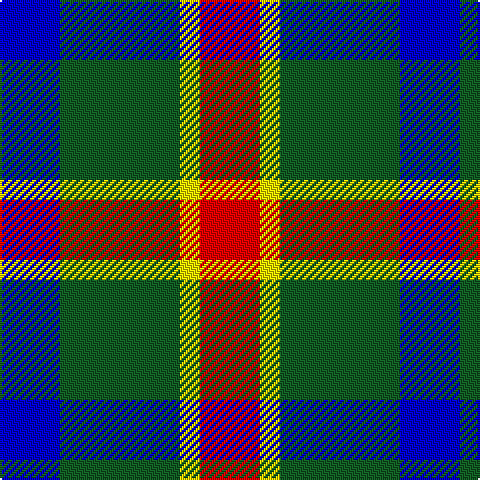

**Bands:** [BGYR](/stripes/bgyr/) · **Stripes:** [DB DG LY R](/stripes/stripes4/) DB DG LY R

This was sourced from register-of-tartans.  It is a [4 band tartan](/bands/bands4/).

Original link https://www.tartanregister.gov.uk/tartanDetails.aspx?ref=10654

## Register references

External register numbers recorded for this tartan.

- Scottish Register of Tartans: [10654](https://www.tartanregister.gov.uk/tartanDetails.aspx?ref=10654)

## Thread count
B/30 G60 Y10 R/30

## Palette
Each colour and its ΔE from the base-6 reference it is a variant of.

| Colour | Shade | Base | ΔE (OKLab) |
|---|---|---|---|
| B | <code style="background-color:#0000CD;">#0000CD</code> `#0000CD` | B <code style="background-color:#2A418A;">#2A418A</code> | 0.14 |
| G | <code style="background-color:#125D24;">#125D24</code> `#125D24` | G <code style="background-color:#006100;">#006100</code> | 0.03 |
| R | <code style="background-color:#FF0000;">#FF0000</code> `#FF0000` | R <code style="background-color:#CC0000;">#CC0000</code> | 0.11 |
| Y | <code style="background-color:#FFE600;">#FFE600</code> `#FFE600` | Y <code style="background-color:#F2BF00;">#F2BF00</code> | 0.10 |

# Sample pattern

## Nearest tartans

The nearest existing variants by ΔTartan distance.

1. [Harbison (2015)](/setts/s4/db21g34r14w6~x2/) — ΔT 0.58
1. [Harbison (2015)](/setts/s4/g21db34r14w6~x2/) — ΔT 0.74
1. [Oban Grey District Tartan Tartan Number: 1237. Earliest known date: pre 2003 Not an official district but a name chosen by the weavers. See products available Copyright © Blair Urquhart, Comrie, 2015](/setts/s5/k4w3k4o9r1~x4/) — ΔT 0.97
1. [Oban Grey](/setts/s5/k4w3k4y9r1~x4/) — ΔT 0.97
1. [Thompson, Dress (Clan)](/setts/s4/lb3k16o16r3~x4/) — ΔT 1.03
1. [Delroeux (Personal)](/setts/s4/db3g6ly1r3~x10/) — ΔT 1.06
1. [Loganair Uniform Skirt Corporate Tartan Tartan Number: 1629. Earliest known date: c.1985 Half actual count for display. Used until 1988 See products available Copyright © Blair Urquhart, Comrie, 2015](/setts/s4/r5o32k31w5/) — ΔT 1.09
1. [Loganair](/setts/s4/r5o32k31w5~x2/) — ΔT 1.11
1. [MacLeod, of Argentina](/setts/s5/db10w3db12ly14r4~x2/) — ΔT 1.21
1. [MacKinnon Dress](/setts/s4/dg9dy7w7r1~x4/) — ΔT 1.22

## Neighbour map

Every grey dot is one of 14313 variants placed by the first two principal components of the ΔTartan feature space (44% of its variance). Red is this tartan; blue dots are its nearest — click one to open its page.

<svg viewBox="0 0 640 380" role="img" style="max-width:100%;height:auto;border:1px solid #e0e0e0;border-radius:4px;display:block" xmlns="http://www.w3.org/2000/svg"><image href="/nn/cloud.v1.png" width="640" height="380"/><a href="/setts/s4/db21g34r14w6~x2/"><circle cx="178.5" cy="268.2" r="4" fill="#3465a4"><title>Harbison (2015)</title></circle></a><a href="/setts/s4/g21db34r14w6~x2/"><circle cx="175.9" cy="265.7" r="4" fill="#3465a4"><title>Harbison (2015)</title></circle></a><a href="/setts/s5/k4w3k4o9r1~x4/"><circle cx="185.8" cy="222.6" r="4" fill="#3465a4"><title>Oban Grey District Tartan Tartan Number: 1237. Earliest known date: pre 2003 Not an official district but a name chosen by the weavers. See products available Copyright © Blair Urquhart, Comrie, 2015</title></circle></a><a href="/setts/s5/k4w3k4y9r1~x4/"><circle cx="187.6" cy="223.8" r="4" fill="#3465a4"><title>Oban Grey</title></circle></a><a href="/setts/s4/lb3k16o16r3~x4/"><circle cx="192.7" cy="253.1" r="4" fill="#3465a4"><title>Thompson, Dress (Clan)</title></circle></a><a href="/setts/s4/db3g6ly1r3~x10/"><circle cx="194.7" cy="269.3" r="4" fill="#3465a4"><title>Delroeux (Personal)</title></circle></a><a href="/setts/s4/r5o32k31w5/"><circle cx="209.3" cy="239.6" r="4" fill="#3465a4"><title>Loganair Uniform Skirt Corporate Tartan Tartan Number: 1629. Earliest known date: c.1985 Half actual count for display. Used until 1988 See products available Copyright © Blair Urquhart, Comrie, 2015</title></circle></a><a href="/setts/s4/r5o32k31w5~x2/"><circle cx="210.3" cy="241.1" r="4" fill="#3465a4"><title>Loganair</title></circle></a><a href="/setts/s5/db10w3db12ly14r4~x2/"><circle cx="187.1" cy="255.3" r="4" fill="#3465a4"><title>MacLeod, of Argentina</title></circle></a><a href="/setts/s4/dg9dy7w7r1~x4/"><circle cx="143.5" cy="247.1" r="4" fill="#3465a4"><title>MacKinnon Dress</title></circle></a><circle cx="170.9" cy="256.8" r="5" fill="#c00000"/></svg>

ID: /setts/s4/db3dg6ly1r3~x10/
