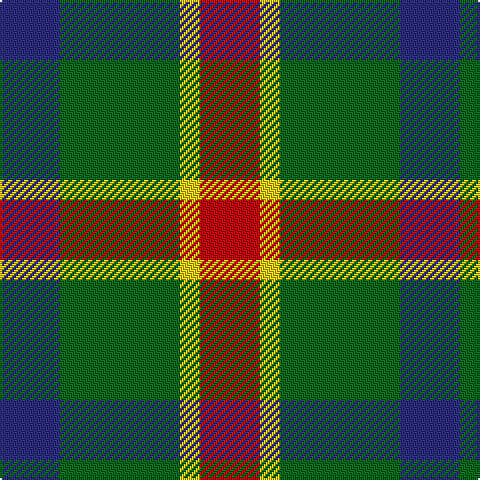

**Bands:** [BGYR](/stripes/bgyr/) · **Stripes:** [DB G LY R](/stripes/stripes4/) DB G LY R

This was sourced from tartans-authority.  It is a [4 band tartan](/bands/bands4/).

Original link http://www.tartansauthority.com/tartan-ferret/display/10654/

## Attestations

This cloth appears in 2 source records; the oldest owns this page.

- 25/06/1985 — Delroeux (Personal) (tartans-authority, [record](http://www.tartansauthority.com/tartan-ferret/display/10654/))
- undated — Delroeux, John Michael Name Tartan Tartan Number: 10654. Earliest known date: 25/06/1985 Designed by Jean Michael Delroeux to show his affinity with Scotland. Colours: red, yellow and blue appear in the Delroeux coat of arms; green is for the landscapes of Scotland. See products available Copyright © Blair Urquhart, Comrie, 2015 (house-of-tartan, [record](http://www.house-of-tartan.scotland.net/house/TartanViewjs.asp?colr=Def&tnam=10654))

## Thread count
DB/30 G60 Y10 R/30

## Palette
Each colour and its ΔE from the base-6 reference it is a variant of.

| Colour | Shade | Base | ΔE (OKLab) |
|---|---|---|---|
| DB | <code style="background-color:#2C2C80;">#2C2C80</code> `#2C2C80` | B <code style="background-color:#2A418A;">#2A418A</code> | 0.06 |
| G | <code style="background-color:#006818;">#006818</code> `#006818` | G <code style="background-color:#006100;">#006100</code> | 0.02 |
| R | <code style="background-color:#C80000;">#C80000</code> `#C80000` | R <code style="background-color:#CC0000;">#CC0000</code> | 0.01 |
| Y | <code style="background-color:#FCCC00;">#FCCC00</code> `#FCCC00` | Y <code style="background-color:#F2BF00;">#F2BF00</code> | 0.04 |

# Sample pattern

## Nearest tartans

The nearest existing variants by ΔTartan distance.

1. [Harbison (2015)](/setts/s4/db21g34r14w6~x2/) — ΔT 0.65
1. [Wilson's No.195](/setts/s4/r5g7k2t1~x4/) — ΔT 0.81
1. [Wilson's No.203](/setts/s4/t2r4g5ly1~x4/) — ΔT 0.87
1. [Creek Indian Nation](/setts/s5/db2g4ly1db1r2~x12/) — ΔT 0.98
1. [Delroeux, John Michael (Personal)](/setts/s4/db3dg6ly1r3~x10/) — ΔT 1.06
1. [MacNab 7](/setts/s4/g15r3p11t2~x2/) — ΔT 1.08
1. [Harbison (2015)](/setts/s4/g21db34r14w6~x2/) — ΔT 1.27
1. [Wilson's, No 193](/setts/s5/g6k1r1t2r2~x4/) — ΔT 1.30
1. [Dohmen (Personal)](/setts/s4/g30ly3db8r25~x2/) — ΔT 1.33
1. [MacKinnon Dress](/setts/s4/dg9dy7w7r1~x4/) — ΔT 1.35

## Neighbour map

Every grey dot is one of 14313 variants placed by the first two principal components of the ΔTartan feature space (44% of its variance). Red is this tartan; blue dots are its nearest — click one to open its page.

<svg viewBox="0 0 640 380" role="img" style="max-width:100%;height:auto;border:1px solid #e0e0e0;border-radius:4px;display:block" xmlns="http://www.w3.org/2000/svg"><image href="/nn/cloud.v1.png" width="640" height="380"/><a href="/setts/s4/db21g34r14w6~x2/"><circle cx="178.5" cy="268.2" r="4" fill="#3465a4"><title>Harbison (2015)</title></circle></a><a href="/setts/s4/r5g7k2t1~x4/"><circle cx="232.8" cy="258.9" r="4" fill="#3465a4"><title>Wilson's No.195</title></circle></a><a href="/setts/s4/t2r4g5ly1~x4/"><circle cx="177.5" cy="277.1" r="4" fill="#3465a4"><title>Wilson's No.203</title></circle></a><a href="/setts/s5/db2g4ly1db1r2~x12/"><circle cx="144.5" cy="273.4" r="4" fill="#3465a4"><title>Creek Indian Nation</title></circle></a><a href="/setts/s4/db3dg6ly1r3~x10/"><circle cx="170.9" cy="256.8" r="4" fill="#3465a4"><title>Delroeux, John Michael (Personal)</title></circle></a><a href="/setts/s4/g15r3p11t2~x2/"><circle cx="252.2" cy="248.8" r="4" fill="#3465a4"><title>MacNab 7</title></circle></a><a href="/setts/s4/g21db34r14w6~x2/"><circle cx="175.9" cy="265.7" r="4" fill="#3465a4"><title>Harbison (2015)</title></circle></a><a href="/setts/s5/g6k1r1t2r2~x4/"><circle cx="225.2" cy="236.7" r="4" fill="#3465a4"><title>Wilson's, No 193</title></circle></a><a href="/setts/s4/g30ly3db8r25~x2/"><circle cx="263.0" cy="246.6" r="4" fill="#3465a4"><title>Dohmen (Personal)</title></circle></a><a href="/setts/s4/dg9dy7w7r1~x4/"><circle cx="143.5" cy="247.1" r="4" fill="#3465a4"><title>MacKinnon Dress</title></circle></a><circle cx="194.7" cy="269.3" r="5" fill="#c00000"/></svg>

ID: /setts/s4/db3g6ly1r3~x10/
